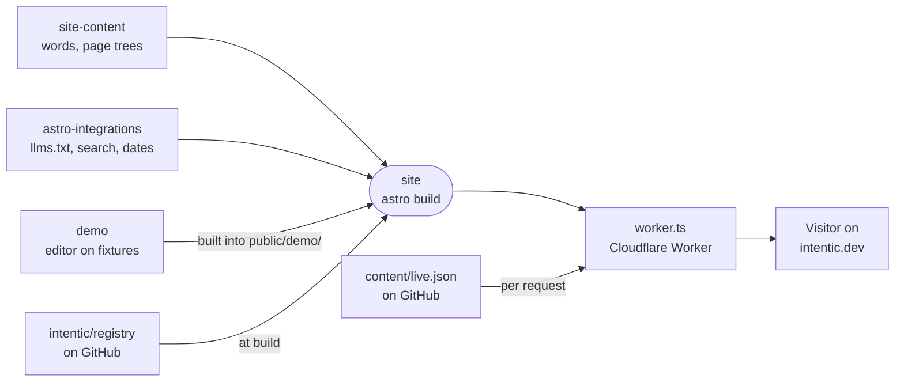

# The public site

The public website intentic.dev: its pages, the words and page trees they render, the build-time integrations, and the interactive demo that runs the real editor on fixture data.

| Package | Role |
| --- | --- |
| [site](site) | The Astro site and the Worker that serves intentic.dev. |
| [site-content](site-content) | Typed copy, documentation trees and page metadata the site renders. |
| [astro-integrations](astro-integrations) | Build hooks: llms.txt, Markdown mirrors, docs search, sitemap dates, build-time figures. |
| [demo](demo) | The real editor against an in-browser fixture, served at `/demo/`. |
