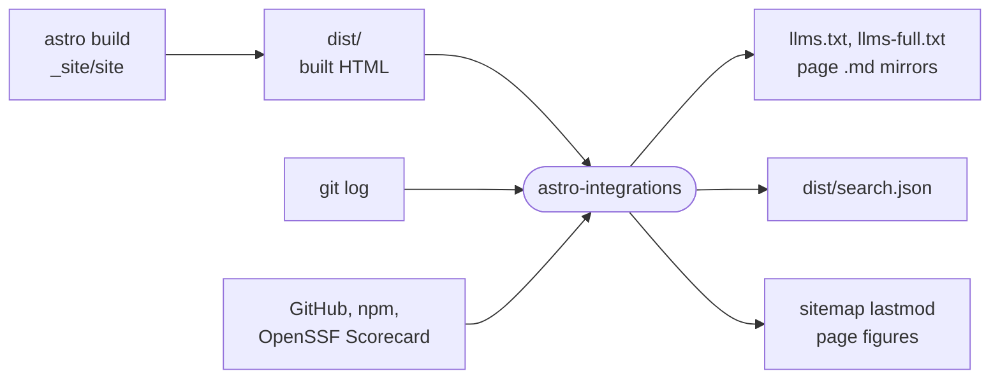

# astro-integrations

Build-time Astro integrations and helpers for intentic.dev that write Markdown mirrors, llms.txt and the docs search index, date the sitemap from git, and fetch the figures its pages quote.

- Runs in Node during the site's build, never in the browser. Plain `.mjs` with JSDoc and `src/index.d.ts` for types, so `build` and `check` only syntax-check.
- `llmsText` and `docsSearch` read the HTML Astro just wrote to `dist/`, so tables rendered from expressions are indexed as a reader sees them. Pages marked `noindex` stay out of llms.txt. Both use the parser in `html-to-markdown.mjs`, which handles Astro's own well-formed output and nothing wider.
- `gitStats`, `latestRelease`, `npmDownloads` and `scorecard` return `null` on any failure, so a page leaves a figure out instead of printing a wrong one; the network readers say so in the build log. `gitStats` counts commits authored by `agent@intentic.dev` and needs a full clone.
- `lastModForUrl` maps a URL back to its source page and returns that file's last commit date. Paths resolve from `process.cwd()`, the site being built.

## Key files

- [src/index.d.ts](src/index.d.ts) — every export with its types and a one-line contract.
- [src/llms-text.mjs](src/llms-text.mjs) — llms.txt, llms-full.txt and the per-page `.md` mirrors.
- [src/docs-search.mjs](src/docs-search.mjs) — splits built docs pages into heading-led search blocks.
- [src/html-to-markdown.mjs](src/html-to-markdown.mjs) — the HTML parser and Markdown writer both integrations share.
- [src/git-lastmod.mjs](src/git-lastmod.mjs) — URL to source file to last commit date.
