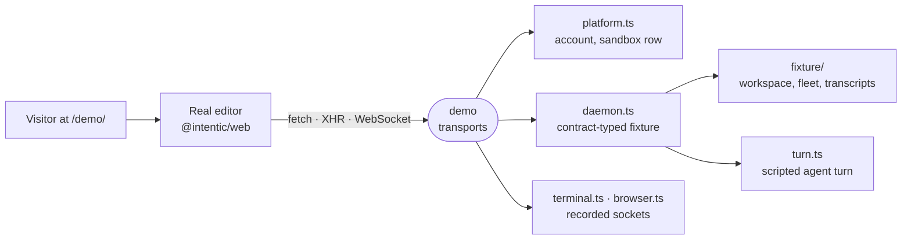

# demo

The interactive demo at intentic.dev/demo/: the real editor built from `@intentic/web` source, with its network replaced by an in-browser fixture of the platform and a sandbox daemon.



- Runs entirely in the visitor's browser. `main.ts` swaps `fetch`, `XMLHttpRequest` and `WebSocket` for handlers bound to `*.demo.invalid` origins, seeds a session and open chat tabs into the storage keys the app already reads, then imports the app's own `main.ts`. No app module knows the demo exists, and a request that escapes the handlers dies on the reserved `.invalid` TLD.
- The fixture daemon is typed by `@intentic/sandbox-contract`. `router.ts` resolves a request with the contract's own route matcher and parses its input, so a contract change breaks this package's typecheck before it breaks the landing page. Anything unserved answers 404, and the console boot line reports how many procedures are covered.
- The switcher chrome picks a mode: `Minimal`, `Curated`, `Everything` or `Desk`, a documents-instead-of-code workspace (`?mode=minimal|default|full|desk`). `?as=maintainer|collaborator|viewer|guest` shows the app as a lesser grant. Both stick per tab, and switching reloads.
- `vite.config.ts` reuses the app's `vite.shared.ts` and builds into `_site/site/public/demo/` (gitignored), so the demo ships same-origin with the site. The marketing screenshots (`_tools/e2e/shots/capture.mts`) and the promo recording (`_tools/e2e/promo/record.mjs`) are taken from the demo.

## Key files

- [src/main.ts](src/main.ts) — boot order: transports, seeded storage, switcher, then the app.
- [src/transport.ts](src/transport.ts) — which requests the demo claims and which pass through.
- [src/daemon.ts](src/daemon.ts) — every served procedure and raw route, plus the live state `/events` re-broadcasts.
- [src/router.ts](src/router.ts) — the dispatcher standing in for the daemon's OpenAPI handler.
- [src/mode.ts](src/mode.ts) — the modes, the viewer tier and the extension override.
- [vite.config.ts](vite.config.ts) — shared app build, base path, port and output directory.

## Layout

| Path | Role |
| --- | --- |
| `src/platform.ts` | Platform API: session, sandbox list, billing plan |
| `src/turn.ts` | Scripted agent turns streamed on `/agent/attach`, parking on plans and questions |
| `src/sse.ts` | oRPC event-iterator wire format for streamed answers |
| `src/terminal.ts`, `src/browser.ts` | Recorded terminal and browser-view sockets |
| `src/switcher.ts` | The mode buttons, plain DOM, mounted before the app |
| `src/fixture/` | The data: files, repos, fleet, transcripts, automations, the desk workspace |
| `scripts/smoke-daemon.ts` | One request per served procedure, answers parsed by the contract schemas |
| `vendor/` | [Pinned first-party extensions](vendor) the demo runs |

## Commands

```sh
pnpm -C _site/demo dev        # http://127.0.0.1:47146/demo/, syncs vendor/ first
pnpm -C _site/demo build      # into _site/site/public/demo/
pnpm -C _site/demo smoke
pnpm -C _site/demo typecheck
```
