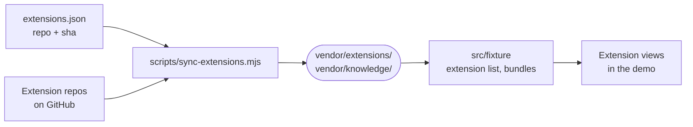

# vendor

Pinned copies of the first-party registry extensions the demo runs, so their views in the demo execute the same bytes an install would.



- `extensions.json` pins each listed extension to its repository and a full commit sha, the same commit the registry lists. A pin that is not a sha leaves that extension out of the demo with a warning.
- The sync writes each pin's `intentic-extension.json` and `dist/extension.js` into `extensions/<id>/`, which is gitignored and refetched by the demo's `dev` and `build` scripts. `--local <dir>` reads sibling checkouts instead of GitHub.
- `knowledge/` is committed: the filesystem-free half of the knowledge extension's engine and its `wire-types.ts`, so `src/fixture/knowledge.ts` can answer the knowledge backend and type-check offline. `source.json` names the commit it holds, and the sync refetches it only when the pin moves.
- Every synced file carries a "do not edit" header. Change the pin and re-run the sync instead.

## Key files

- [extensions.json](extensions.json) — which extensions the demo runs, at which commit.
- [knowledge/source.json](knowledge/source.json) — the commit the committed engine copy came from.
- [knowledge/wire-types.ts](knowledge/wire-types.ts) — the knowledge backend's response shapes the fixture answers in.
- [../scripts/sync-extensions.mjs](../scripts/sync-extensions.mjs) — fetches bundles and the engine at the pins.
- [../src/fixture/sandbox.ts](../src/fixture/sandbox.ts) — globs the vendored manifests and serves their bundles.

## Commands

```sh
pnpm -C _site/demo sync                                   # from GitHub at the pins
cd _site/demo && node scripts/sync-extensions.mjs --local <dir>   # one checkout per extension
```
