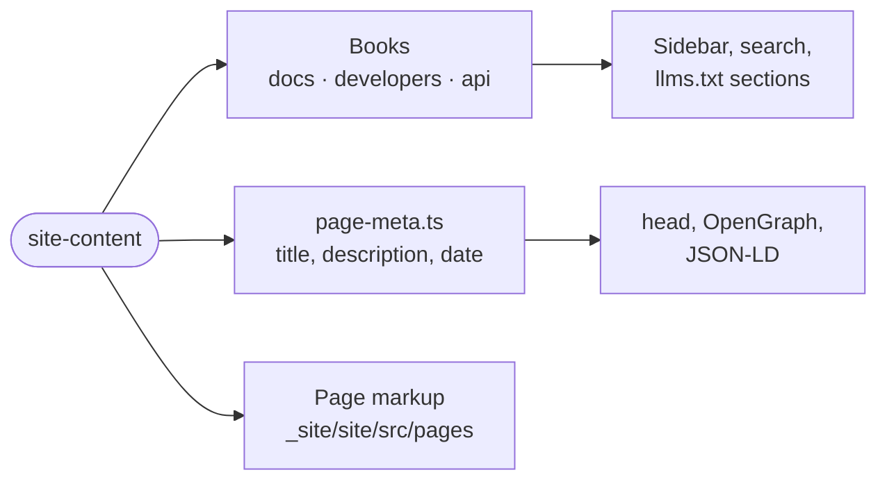

# site-content

The words, documentation trees and page metadata of intentic.dev as typed TypeScript data, kept apart from the Astro markup that lays them out.



- Read only by `_site/site`, at build. Each module is exported as raw source by subpath (`@intentic/site-content/docs`), so there is no build step.
- A `Book` (`book.ts`) is one documentation tree with its own root, sidebar and search scope: `docs.ts` for users, `developers.ts` for extension authors, and `reference.ts` for the sandbox HTTP API, generated from `@intentic/sandbox-openapi` behind a few hand-written pages. A new docs page is an entry in its tree plus an `.astro` page under `_site/site/src/pages/`.
- `page-meta.ts` maps every indexable path to its title, description and `datePublished`; `dateModified` comes from git at build.
- Prices, tiers, origins and legal specifics are imported from `@intentic/constants`, so the site cannot state a figure the product does not use.

## Key files

- [src/book.ts](src/book.ts) — the `Book` shape and the helpers every tree shares.
- [src/docs.ts](src/docs.ts) — the `/docs` tree: shelves, order, blurbs and page meta.
- [src/page-meta.ts](src/page-meta.ts) — title, description and publish date per path.
- [src/nav.ts](src/nav.ts) — the nav bar, phone menu and footer as data.
- [src/site.ts](src/site.ts) — site URL, app URL, demo path and organisation facts.
- [src/landing.ts](src/landing.ts) — the home page and desk page copy.

## Commands

```sh
pnpm --filter @intentic/site-content check
```
