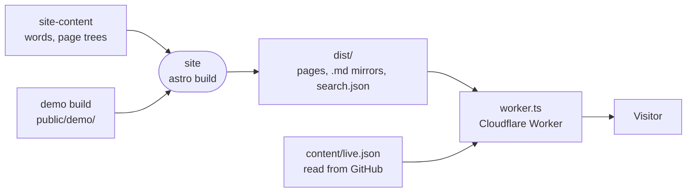

# site

The Astro site behind intentic.dev, prerendered to static pages and served by a Cloudflare Worker that adds redirects, versionless downloads and a live notice.



- Pages are `.astro` files under `src/pages/`; their words, navigation and metadata come from `@intentic/site-content`. `/docs`, `/developers` and `/api` share one layout, sidebar and search index (`src/components/docs/`), and `/api` is generated from `@intentic/sandbox-openapi`.
- Every build also writes a Markdown mirror of each page, `llms.txt`, `search.json`, a sitemap dated from git (all via `@intentic/astro-integrations`) and OpenGraph cards. The cards are skipped when the Inter fonts under `scripts/fonts/` are missing.
- `worker.ts` runs before static assets (`run_worker_first`). It redirects http and moved paths, serves the install scripts at vanity paths (`INSTALL_SCRIPTS` in `@intentic/constants`) from `public/scripts/`, resolves `/desktop/*` to the latest GitHub release asset, falls back to the demo's shell under `/demo/`, and applies [content/live.json](content/live.json) to every HTML page outside `/demo/`.
- The `/extensions/` gallery reads the registry repository at build and falls back to `src/lib/registry.fallback.json` when GitHub is unreachable.
- The Worker name `intentic` in `wrangler.jsonc` is the Worker bound to intentic.dev, so a deploy under any other name never reaches the live site.

## Key files

- [astro.config.mjs](astro.config.mjs) — integrations, sitemap priorities, llms.txt sections and the dev proxy for `/demo`.
- [worker.ts](worker.ts) — request-time routing and the live-content rewrite in production.
- [wrangler.jsonc](wrangler.jsonc) — Worker name, build command (demo first, then Astro) and the asset binding.
- [src/layouts/BaseLayout.astro](src/layouts/BaseLayout.astro) — the head, JSON-LD, OpenGraph tags and notice strip every page shares.
- [src/components/Landing.astro](src/components/Landing.astro) — the home page.
- [src/lib/live.ts](src/lib/live.ts) — the schema, limits and link allowlist for the live document.

## Commands

```sh
pnpm -C _site/site dev          # astro dev; /demo proxies to the demo's dev server
pnpm -C _site/demo dev          # start it alongside to see /demo in dev
pnpm -C _site/site build
pnpm -C _site/site test         # desk palette and mark alignment checks
pnpm -C _site/site run deploy   # wrangler deploy, then IndexNow submission
```
