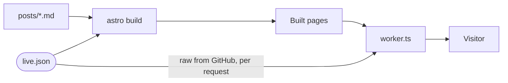

# content

The site's file-edited content: blog posts in Markdown, and the live document that changes the running site without a deploy.

- `posts/<slug>.md` is one blog post; the filename is the slug (`/blog/<slug>/`). Frontmatter needs `title`, `description` and `date` (`YYYY-MM-DD`), and may carry `tags` and `draft: true`. A missing field fails the build. A post builds like any page (sitemap, RSS, `.md` mirror, llms.txt), so publishing one is a deploy.
- `live.json` holds the notice strip and the download and workspace switches. `LiveNotice.astro` bakes it into every page at build, and `worker.ts` re-reads it from the default branch on GitHub, so a push changes the live site within the Worker's cache window. When the fetch fails, pages stay as built.
- Every `live.json` field is parsed, trimmed and length-capped, and a notice link must point at an allowlisted host.
- Documentation pages live elsewhere: `.astro` pages under `../src/pages/docs/`, with their order, titles and metadata in `@intentic/site-content`.

## Key files

- [live.json](live.json) — the live notice and switches.
- [../src/lib/posts.ts](../src/lib/posts.ts) — post loading, frontmatter rules, ordering and drafts.
- [../src/lib/live.ts](../src/lib/live.ts) — what `live.json` may contain and how it is parsed.
- [../scripts/post-slugs.mjs](../scripts/post-slugs.mjs) — the post list `astro.config.mjs` reads for llms.txt.
