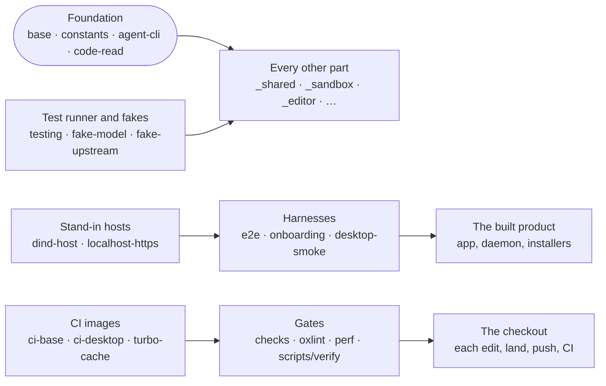

# Tools

The foundation every other part stands on: shared runtime primitives and config, test harnesses and stand-ins, the repository's gates and maintainer scripts, and seeds copied into other projects.

`_tools/` holds what every part needs, so any part may depend on it, `_shared/` included. A `_tools/` member that
itself depends on a package outside `_shared/` and `_tools/` loses that standing, and
[checks/shared-boundary.mjs](checks/shared-boundary.mjs) refuses a `_shared/` package that leans on it.

| Package | Role |
| --- | --- |
| [agent-cli](agent-cli) | Process contract and budgeted output shared by `iq`, `fileq` and `webq` |
| [base](base) | Runtime primitives every tier shares: when-expressions, disposal, async schedulers |
| [checks](checks) | The repository's invariant checks, run per edit, land, push and CI |
| [ci-base](ci-base) | The image every CI job runs in |
| [ci-desktop](ci-desktop) | CI image with the Tauri, Rust and Windows cross toolchains |
| [code-read](code-read) | Grammar resolution and the token walk behind code-only line counts |
| [constants](constants) | Ports, paths, origins and tables several packages must agree on |
| [desktop-smoke](desktop-smoke) | Bare Debian image that installs the Linux desktop build and deep-links it |
| [desktop-smoke-windows](desktop-smoke-windows) | Installs the shipped Windows installer on a real machine and drives it |
| [dind-host](dind-host) | Docker-in-Docker plus sshd, standing in for a deploy host |
| [e2e](e2e) | Browser tiers against a local stack, plus screenshots, mobile gate, promo |
| [examples](examples) | Example intent files for the deploy engine, type-checked by the build |
| [extension-example](extension-example) | Seed of the reference extension, one contribution of every kind |
| [fake-model](fake-model) | A scripted model that drives a provider's real CLI offline |
| [fake-upstream](fake-upstream) | Local deterministic stand-in for the model the free trial spends |
| [localhost-https](localhost-https) | Mints a per-machine dev CA and localhost certificate |
| [nav](nav) | Measures what the tree costs an agent to navigate, gates refactors |
| [onboarding](onboarding) | Nightly journey from sign-in to a connected sandbox, per path |
| [oxlint](oxlint) | Repository lint plugins and the per-edit lint runner |
| [perf](perf) | Counts instructions and editor render work against checked-in baselines |
| [registry-scan](registry-scan) | Nightly scan proposing extension registry listings as pull requests |
| [scripts](scripts) | Build, CI, desktop, image, release and verify scripts |
| [selfhost](selfhost) | Compose files to self-host the platform |
| [testing](testing) | The `suites` test runner and the fakes every package's tests share |
| [tsconfig](tsconfig) | Base TypeScript configs every package extends |
| [turbo-cache](turbo-cache) | Compose file for the fleet's turbo remote cache |
