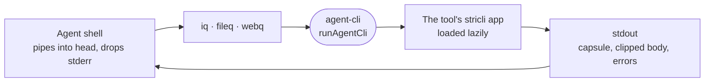

# agent-cli

The process contract, budgeted output and in-process test runner that the agent-facing CLIs `iq`, `fileq` and `webq` share, so a failure never reads as an empty answer.



- The reader is an agent: it pipes into `head`, sends stderr to `/dev/null` and cannot tell a crash from an empty
  answer. So `runAgentCli` treats EPIPE as a clean stop, writes errors to stdout, reports a module graph that will
  not load as a broken install, and clamps the exit code to 0 content, 1 none, 2 anything else.
- The app is passed as a `load` thunk, never a static import, so an engine or native module that fails to load
  fails inside the contract's catch and gets reported.
- `capsule` prints the line an agent reads first plus one `note:` per caveat; `clip` cuts markdown to a token budget
  on a line boundary and always names the file that holds the whole answer.
- `toolHome` gives each tool its own directory: `<NAME>_HOME`, else `$XDG_CACHE_HOME/<name>`, else `~/.cache/<name>`.
- Each tool's end-to-end suites use `captureCli` from `./testing`, which runs the app in process and returns what
  a shell would see.

## Key files

- [src/run.ts](src/run.ts) — `runAgentCli`: the process contract every rule above lives in.
- [src/output.ts](src/output.ts) — `capsule` and `clip`, the capsule-then-content shape these CLIs print.
- [src/env.ts](src/env.ts) — `toolHome` and `toolOutDir`, where a tool's own files go.
- [src/testing.ts](src/testing.ts) — `captureCli`, the in-process runner the tools' suites drive.
- [src/flags.ts](src/flags.ts) — `countParser`, which refuses negative, infinite and NaN budgets.

## Commands

```sh
pnpm --filter @intentic/agent-cli test
```
