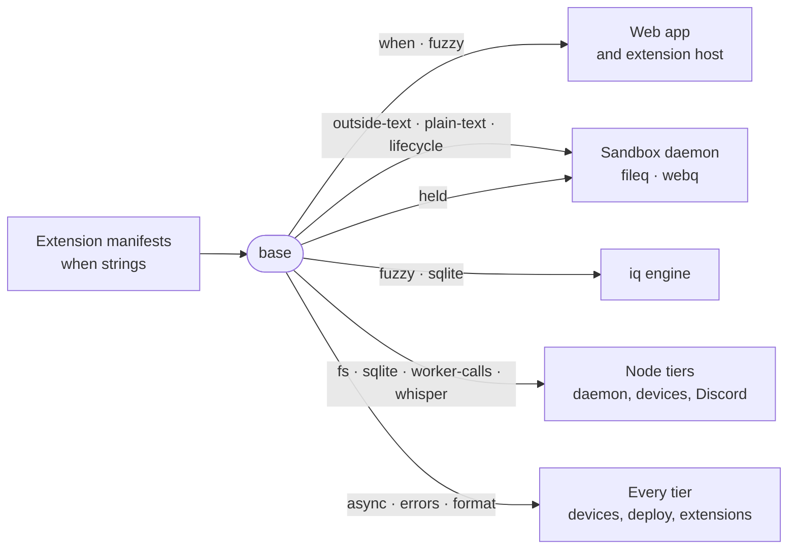

# base

Runtime primitives that every tier, from the daemon to the browser, must run identically: when-expressions, disposal, async schedulers, untrusted-content tags, size and token formatting, fuzzy path scoring, and the file, SQLite, worker-thread and whisper plumbing the Node tiers share.



- One implementation per rule that more than one tier applies: two copies of a condition, a size label or a
  quick-open ranking disagree on screen. Anything only one surface renders belongs next to that surface.
- Subpath exports only, with no index, so a browser bundle pulls nothing it does not use. `outside-text` uses Web
  Crypto, so it does not tie a caller to Node; `fs`, `sqlite`, `worker-calls`, `whisper`, `web-stream` and `acme` are Node's.
- `when.ts` is a closed grammar with no arithmetic, calls or property access, because its strings arrive from
  installed extensions.
- `outside-text.ts` wraps chat, pages and tool results in `<untrusted-content>` tags whose close carries a fresh id,
  so content cannot forge its own end. It marks taint and does not defend against a hostile model.
- `lifecycle.ts` is teardown as a store: whatever needs undoing registers when it is created, a member that throws
  does not stop the rest, and failures surface together. Every scheduler in `async.ts` is disposable.
- `held.ts` is how a reading kept between asks states its two limits: the change feed that makes it stale, and
  `maxAgeMs`, how late a change that feed missed may show. `freshness` is one reading, `held` is readings by key. The
  daemon's directory reads and compiled `.gitignore` matchers, land standings and history index use it.
- `errors.ts` lets a catch name the failure it expects: `isMissing` is ENOENT or ENOTDIR only, and
  `undefinedIfMissing` answers undefined for "not there" while EACCES, EIO and a bug's TypeError still arrive.
- `node/fs.ts` is the one atomic write: staged beside the target and renamed over it, a given mode exact rather than cut
  by the umask, the rename retried while Windows holds the target open. `queueOnFile` serializes one path's
  read-modify-write across every handle in the process.
- `sqlite.ts` has two doors. A cache store holds the `SqliteDb` seam, whose `transaction` is a plain BEGIN that does
  not nest. A store holding a `DatabaseSync` opens it with `openSqlite` (WAL, a busy timeout, foreign keys) and
  groups writes with `immediateTransaction`, which takes the write lock at BEGIN and joins a transaction already open.
- `workers/worker-calls.ts` is a call-and-answer channel to a worker thread, spawned on first call and again after a
  crash, and `workerPool` spreads independent calls over a few of them.
- `node/whisper.ts` runs whisper-cli the one way the daemon's speech route and Discord voice share, and stores a
  downloaded model so a partial one never reads as present. Reading what whisper prints stays in the contract.

## Key files

- [src/when.ts](src/when.ts) — `parseWhen` and `evaluateWhen`, the condition language manifests carry.
- [src/async.ts](src/async.ts) — `Delayer`, `Coalescer`, `SingleFlight`, `keyedLock`, `retry`, `pollUntil`, `createBackoff`.
- [src/lifecycle.ts](src/lifecycle.ts) — `IDisposable`, `DisposableStore` and `MutableDisposable`.
- [src/outside-text.ts](src/outside-text.ts) — `wrapOutsideContent`, the envelope for outside text.
- [src/held.ts](src/held.ts) — `freshness` and `held`: a change feed and a time bound for anything kept.
- [src/fuzzy.ts](src/fuzzy.ts) — `fuzzyScore`, `rankByFuzzy` and the per-keystroke `fuzzyRanker` both quick-open ends share.
- [src/node/fs.ts](src/node/fs.ts) — `writeFileAtomic`, `queueOnFile`, `pathExists` and `freePort`, the file primitives of every Node tier.

## Commands

```sh
pnpm --filter @intentic/base test
```
