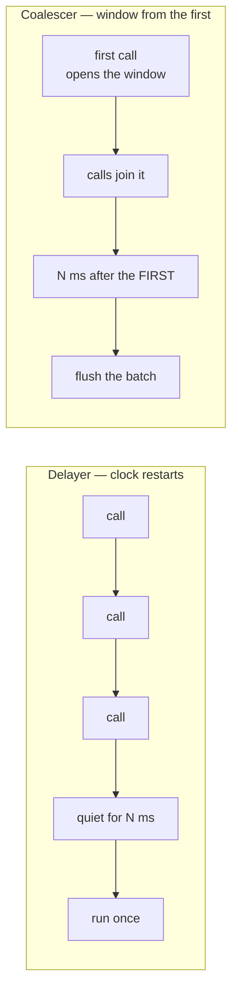

# @intentic/base

The runtime primitives every tier shares: the `when` condition language, disposal, and the async schedulers.

Nothing in here knows what this product is. That is the point — each of the three modules replaced a decision
that had been made independently, and differently, in the daemon and in the web app, where the copies could
only ever drift apart. There is no barrel export: a consumer imports the module it needs
(`@intentic/base/when`), because these three have nothing to do with each other and a package that offers them
as one thing invites being treated as a junk drawer.

## Responsibilities

- **`when`** — parse and evaluate a condition written as a string, against a bag of named values the caller
  supplies. This is what lets a condition live in a JSON manifest an extension ships, and be evaluated the same
  way on both sides of the wire. Deliberately not a general expression language: no arithmetic, no calls, no
  reaching past the context object, because these strings arrive from installed extensions.
- **`lifecycle`** — teardown as structure rather than as a list somebody maintains. A store is registered into
  where things are created and disposed once; it keeps going past a member that throws and reports the failures
  together, so one bad stop cannot strand the ports and child processes queued behind it.
- **`async`** — the four shapes of "don't do that again yet", named so the choice between them is visible:
  `Delayer` restarts its clock on every call, `Coalescer` opens a window on the first call and lets later ones
  join it, `SingleFlight` shares one run per key among concurrent callers, and `retry` is the loop with the
  delay in it.

## Delayer or Coalescer

The two debouncers differ by one character when they are written by hand (`timer = setTimeout(…)` versus
`timer ??= setTimeout(…)`) and by everything in behaviour. Choosing wrong is not a style mistake: a source that
never goes quiet starves a `Delayer` forever.

A search box wants the Delayer: the user stops typing, and stopping is the signal. A file watcher under a
working agent wants the Coalescer: the agent never stops, and a batch that only arrives once it does arrives
when nobody needs it any more.

## Key files

- [src/when.ts](src/when.ts) — the grammar, the parser, and what a condition means against a context.
- [src/lifecycle.ts](src/lifecycle.ts) — `DisposableStore` and the two things built on it.
- [src/async.ts](src/async.ts) — the schedulers, each with the case that made it a separate name.
- [src/when.test.ts](src/when.test.ts) — the evaluation rules that are decisions rather than syntax: an absent
  key is false, ordering refuses anything but numbers, comparison crosses the type boundary by string form.
- [src/async.test.ts](src/async.test.ts) — the Delayer/Coalescer distinction pinned as behaviour.
