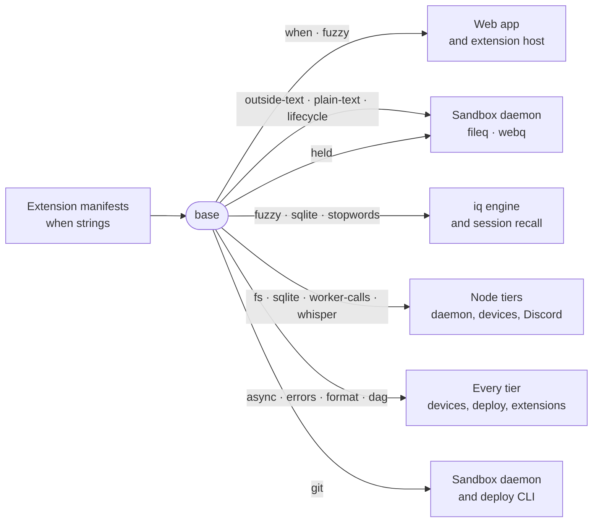

# base

Runtime primitives that every tier, from the daemon to the browser, must run identically: when-expressions, disposal, async schedulers, untrusted-content tags, size and token formatting, fuzzy path scoring, the stopwords every full-text query drops, and the file, SQLite, worker-thread, whisper and git-runner plumbing the Node tiers share.


```mermaid
flowchart LR
    manifest["Extension manifests<br/>when strings"] --> base(["base"])
    base -->|"when · fuzzy"| web["Web app<br/>and extension host"]
    base -->|"outside-text · plain-text · lifecycle"| daemon["Sandbox daemon<br/>fileq · webq"]
    base -->|"fuzzy · sqlite · stopwords"| iq["iq engine<br/>and session recall"]
    base -->|"fs · sqlite · worker-calls · whisper"| node["Node tiers<br/>daemon, devices, Discord"]
    base -->|"async · errors · format · dag"| rest["Every tier<br/>devices, deploy, extensions"]
    base -->|"held"| daemon
    base -->|"git"| gitusers["Sandbox daemon<br/>and deploy CLI"]
```

- One implementation per rule that more than one tier applies: two copies of a condition, a size label or a
  quick-open ranking disagree on screen. Anything only one surface renders belongs next to that surface.
- Subpath exports only, with no index, so a browser bundle pulls nothing it does not use. `outside-text` uses Web
  Crypto, so it does not tie a caller to Node; `fs`, `sqlite`, `worker-calls`, `whisper`, `web-stream`, `ws-tcp-pump`, `acme` and `git` are Node's.
- `when.ts` is a closed grammar with no arithmetic, calls or property access, because its strings arrive from
  installed extensions.
- `outside-text.ts` wraps chat, pages and tool results in `<untrusted-content>` tags whose close carries a fresh id,
  so content cannot forge its own end. It marks taint and does not defend against a hostile model.
- `lifecycle.ts` is teardown as a store: whatever needs undoing registers when it is created, a member that throws
  does not stop the rest, and failures surface together. Every scheduler in `async.ts` is disposable.
- `ssh-config.ts` is the one reading of a managed `Include` line in someone's `~/.ssh/config`: only a live line counts
  (a commented-out one is not an include), ours goes first, and every other line is left byte for byte. The daemon's
  ssh hosts and the machine agent's sync aliases both write theirs through it, with `writeFileAtomic`.
- `utf8-text.ts` cuts a UTF-8 file into text windows and says when one is lossy (any window that is not UTF-8), the
  twin of `utf16-text.ts`; the daemon's /work reads and the desktop folder server both use it, so a Latin-1 file opens
  read-only from either.
- `node/ws-tcp-pump.ts` is desktop sync's SSH byte pump, run by both ends of the WebSocket: binary frames only, a chunk
  copied before an async send, backpressure each way, and a ceiling on a WebSocket that cannot pause.
- `held.ts` is how a reading kept between asks states its two limits: the change feed that makes it stale, and
  `maxAgeMs`, how late a change that feed missed may show. `freshness` is one reading, `held` is readings by key. The
  daemon's directory reads and compiled `.gitignore` matchers, land standings and history index use it.
- `dag.ts` layers a dependency graph by generation for the two graphs extensions draw, workflows and CI pipelines,
  so a cycle or a self-need is handled one way in both: a cycle lands in one final layer.
- `cloudflare.ts` is the Cloudflare v4 client the platform and the deploy engine's providers both call: a bearer, the
  success envelope checked by hand (no schema library here; each caller validates `result` with its own), 30 seconds per
  call, and the zone list's paging. A 401/403 is a `CloudflareTokenError` and a zone out of DNS records (81045) a
  `CloudflareZoneFullError`, so each caller words those for its own reader (2026-10-06; the two used to keep a copy each,
  and only the platform's knew 81045).
- `errors.ts` lets a catch name the failure it expects: `isMissing` is ENOENT or ENOTDIR only, and
  `undefinedIfMissing` answers undefined for "not there" while EACCES, EIO and a bug's TypeError still arrive.
- `node/fs.ts` is the one atomic write: staged beside the target and renamed over it, a given mode exact rather than cut
  by the umask, the rename retried while Windows holds the target open. `queueOnFile` serializes one path's
  read-modify-write across every handle in the process.
- `sqlite.ts` has two doors. A cache store holds the `SqliteDb` seam, whose `transaction` is a plain BEGIN that does
  not nest. A store holding a `DatabaseSync` opens it with `openSqlite` (WAL, a busy timeout, foreign keys) and
  groups writes with `immediateTransaction`, which takes the write lock at BEGIN and joins a transaction already open.
- `workers/worker-calls.ts` is a call-and-answer channel to a worker thread, spawned on first call and again after a
  crash, and `workerPool` spreads independent calls over a few of them.
- `node/whisper.ts` runs whisper-cli the one way the daemon's speech route and Discord voice share, and stores a
  downloaded model so a partial one never reads as present. Reading what whisper prints stays in the contract.

- `acme/acme.ts` orders a certificate over DNS-01 and tells the CA to look only once the zone's own nameservers serve the
  challenge (`authoritative-dns.ts`), since an early look fails the authorization for good. When that never shows —
  the host's network blocks direct DNS, or the nameservers answer without the value because something on the network
  answers in their place (the interception production hit) — a caller's `confirmChallenge` (the DNS provider reading
  the record back) plus `PROVIDER_SETTLE_MS` stands in for it, with a warning that says which of the two it saw;
  without one the wait's deadline fails the order.
- `git` (`git/`) is how the sandbox daemon and the deploy CLI run git and other short commands. `defaultGit` is the
  `GitRunner` behind almost every git call the daemon makes: it forks git from a small resident child (`forker.ts`,
  kept beside `runner.ts` so `new URL("./forker.js", import.meta.url)` finds it in `dist/`) rather than from the
  large daemon process, retries only on `index.lock` contention, and marks pathspecs literal so a file named `[slug]`
  matches only itself. `forkedExec` runs the daemon's other polled commands (tmux, status probes) from the same child:
  a spawn from a large process first copies its page tables, 52 ms at 778 MB, where a request to the child costs
  0.04 ms. `politeGit` runs bulk agent work under `nice` and `ionice`. `commands.ts` holds the generic verbs over an
  injectable `GitRunner`, and `locks.ts` clears a lock only while no git process runs. (2026-10-06: moved here from
  `@intentic/scaffold`, which is named for the workspace skeleton; a new package was rejected because a name npm has
  never seen fails the release plan until it is registered by hand.)

## Key files

- [src/when.ts](src/when.ts) — `parseWhen` and `evaluateWhen`, the condition language manifests carry.
- [src/async.ts](src/async.ts) — `Delayer`, `Coalescer`, `SingleFlight`, `keyedLock`, `withTimeout`, `pollUntil`, `createBackoff`.
- [src/lifecycle.ts](src/lifecycle.ts) — `IDisposable`, `DisposableStore` and `MutableDisposable`.
- [src/text/outside-text.ts](src/text/outside-text.ts) — `wrapOutsideContent`, the envelope for outside text.
- [src/held.ts](src/held.ts) — `freshness` and `held`: a change feed and a time bound for anything kept.
- [src/fuzzy.ts](src/fuzzy.ts) — `fuzzyScore`, `rankByFuzzy` and the per-keystroke `fuzzyRanker` both quick-open ends share.
- [src/node/fs.ts](src/node/fs.ts) — `writeFileAtomic` (and its synchronous twin for a write on the way out), `queueOnFile`, `pathExists` and `freePort`, the file primitives of every Node tier.

## Commands

```sh
pnpm --filter @intentic/base test
```
