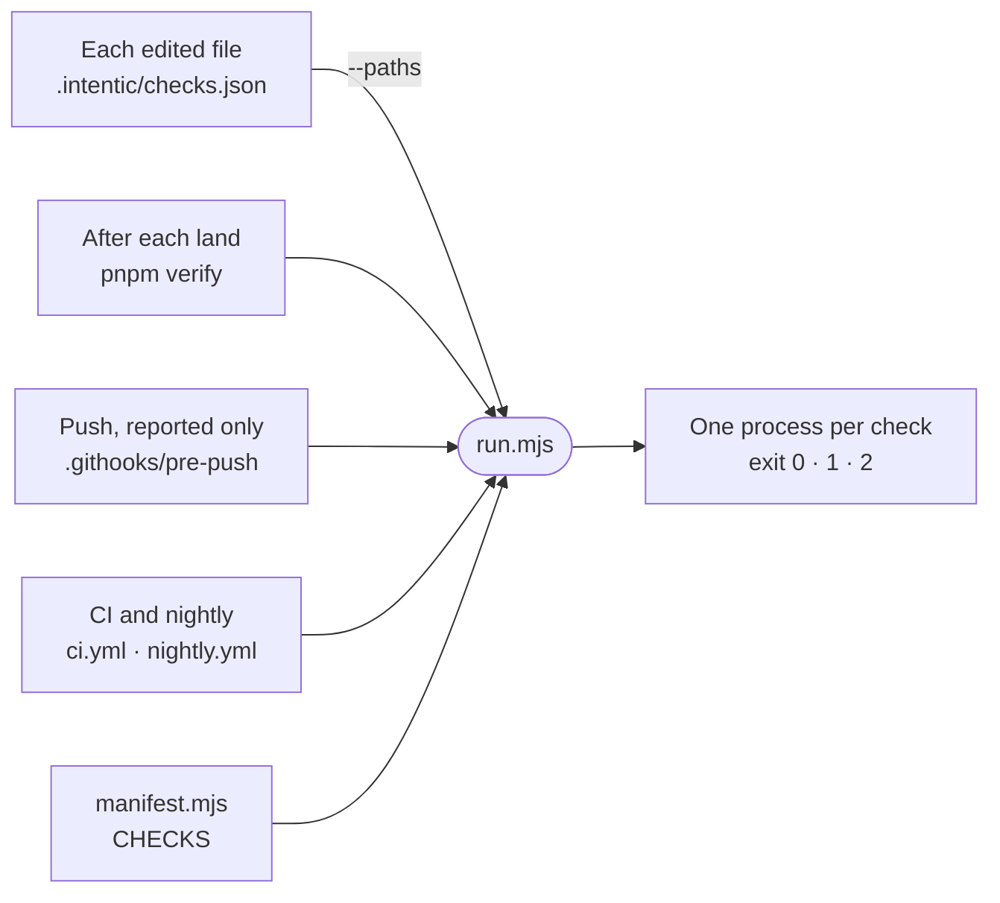

# checks

The repository's invariant checks: one Node script per rule, listed once in `manifest.mjs` and run by `run.mjs` after each edit, after each land, at push and in CI.



- Checks run before `pnpm install`, so they read the tree by shape (regex, `lib/repo.mjs`) instead of importing the
  code they judge, and each runs as its own process.
- To add one, write `<name>.mjs` and answer through `lib/report.mjs`: `finish` prints problems to stderr and exits
  1, or prints what it vouched for and exits 0; `cannotMeasure` exits 2 when the check could not look. Then add an
  entry to `CHECKS` in `manifest.mjs`.
- An entry's `needs` says what it may read (`checkout`, `git` history, or `node_modules` when installed). A `code`
  gate fails every run that reads it. A `tidy` gate fails only what a land or a push adds, and fails the nightly
  tidy job on main. A new check enters as `tidy`.
- `scoped: true` means the check takes `--paths a,b` and reaches the same verdict on those files as on the whole
  tree. `fix` names the arguments that let it repair the tree itself.
- After each edit, `.intentic/checks.json` runs `run.mjs --paths {file}`: scoped checks only, silent unless one
  fails. What it prints returns with the edit and never stops the turn. After each land, `pnpm verify` applies each
  failing check's `fix` and each ratchet's `--tighten` in the main tree, then runs them all and counts the tidy lines
  the land added as failures (`land-tiers.mjs`). At push `.githooks/pre-push` runs them all through `verify-push.mjs`, which reports and never
  refuses, and keeps what the push added for later in the editor's Main line (`push-report.mjs`). CI runs
  `--tidy=warn`, the nightly `--gate=tidy`.
- Ratcheted checks (`ratchet: true`) keep their standing backlog in `baselines/` (`lib/ratchet.mjs`), which may
  shrink and never grow unasked. A check run never writes one: it fails on growth and only says where the tree beats
  it. After each land, `pnpm verify` runs each ratcheted check with `--tighten <the land's paths>`, which lowers only
  the entries those paths touch. Growth is declared with a reason, which the baseline records:
  `layout.mjs --allow <dir> --reason "<why>"` for one entry, from any checkout, or
  `<check>.mjs --write-baseline --reason "<why>"` to adopt every finding, which runs only in the primary checkout.
- A land and a push are judged against the commit they left, as a multiset of findings keyed by path, rule and the
  source line each anchors to (`_tools/scripts/verify/turn-findings.mjs`), so a second copy of a standing finding is
  the change's. The count baselines stay: the per-edit run and the nightly tidy job judge a tree, not a change, and on
  a sample of 15 recent lands, judging with the baselines removed changed 5 verdicts (an edited line carrying a
  standing finding, and the per-file totals the checks print, both read as new).

## Exceptions

A finding that is right where it stands is excused in one of two forms, each read by `lib/allow.mjs` (parsed in
`@intentic/constants/allow`, so a guard suite such as `_editor/web/src/moduleState.guard.test.ts` reads it the same way):

- `// allow(<check>): <reason>` at the site, on its line or in the comment block right above it. It sits on the
  declaration it excuses, so a rename carries it and a deletion takes it away. `silent-catch` and the editor's
  `module-state` guard read it; `silent-catch` still reads its older `// silent-catch: <reason>` for one release.
- `Allow: <check> — <reason>` as a commit trailer, for a whole change: the check after a land (`land-tiers.mjs`) and the
  push (`verify-push.mjs`) accept what that range adds to a tidy check with that manifest id.

A reason is required in both. `Test-Note:` and `Breaking-Note:` are not check exceptions: they are declarations the
land writes into its commit and the push, the release notes and the assertion ratchet read (a weakened test, a removed
behaviour), and they keep their own names. A standing backlog lives in `baselines/` instead, with a reason on each entry
that grew.

## Commands

```sh
node _tools/checks/run.mjs --list            # every check: needs, gate, per-file or whole-tree
node _tools/checks/run.mjs --only paths,md-links
node _tools/checks/run.mjs --paths _tools/README.md
pnpm checks                                  # all of them; pnpm checks:tidy for the tidy gate
```

## The checks

| Check | Refuses |
| --- | --- |
| [control-chars](control-chars.mjs) | literal control bytes in tracked text |
| [skill-descriptions](skill-descriptions.mjs) | a skill description over its catalog budget |
| [lockfile](lockfile-drift.mjs) | a lockfile that has drifted from the manifests |
| [peer-deps](peer-deps.mjs) | an unmet, missing or conflicting peer dependency |
| [licences](licences.mjs) | a shipped dependency whose licence forbids handing it on |
| [test-programs](test-programs.mjs) | a test outside a type-check program, its budget or build order |
| [workflows](workflow-policy.mjs) | a workflow crossing the fork boundary or a permission ceiling |
| [release-notes](release-headings.mjs) | release headings the writer and parsers spell differently |
| [contract-shrink](contract-shrink.mjs) | a shrunk wire contract with no breaking-change declaration |
| [hooks-armed](hooks-armed.mjs) | a non-executable git hook, re-armed in place |
| [invariant-registry](invariant-registry.mjs) | a daemon subsystem with no runtime invariant or stated reason |
| [daemon-boundaries](daemon-boundaries.mjs) | a new whole-`Services` taker or cycle between daemon subsystems |
| [shared-boundary](shared-boundary.mjs) | a `_shared/` package depending on another part |
| [contract-paths](contract-paths.mjs) | a contract route called by spelling its path |
| [publish-set](publish-set.mjs) | a publish list that is not dependency-closed and ordered |
| [publish-retry](publish-retry.mjs) | retry patterns that ride out the wrong release failures |
| [release-api](release-api.mjs) | a `github.sh` helper that masks a failed write |
| [engines](engines-blessed.mjs) | an `engines.json` version this repository does not pin |
| [build-cache](build-cache-mounts.mjs) | a sandbox image fragment without BuildKit cache mounts |
| [mirror-roots](mirror-roots.mjs) | replacing a directory an agent turn overlays instead of emptying it |
| [paths](path-literals.mjs) | hand-spelled roots and `../..`-counted ones |
| [vocabulary](vocabulary.mjs) | a retired word spelled again |
| [silent-catch](silent-catch.mjs) | a new handler that throws an error away unnarrowed |
| [time-zones](time-zones.mjs) | a cron, date format or day bucket with no zone |
| [layout](layout.mjs) | ghost, over-full, twin, colliding or dead directories |
| [md-links](md-links.mjs) | a relative documentation link that does not resolve |
| [metaphor-home](metaphor-home.mjs) | the four-noun picture defined twice or on the home page |
| [alias-targets](alias-targets.mjs) | a resolver alias pointing at a missing path |
| [i18n](i18n-catalogs.mjs) | translation keys, placeholders or plurals English lacks |
| [i18n-literals](i18n-literals.mjs) | English typed into a Vue template |
| [i18n-keys](i18n-keys.mjs) | a missing `t()` key, an unused message, a message that does not compile |
| [tailwind](tailwind-bypass.mjs) | arbitrary colours or pixel sizes in class attributes |
| [display](display-descenders.mjs) | clipped display type without descender clearance |
| [marks](mark-alignment.mjs) | a mark placed by a hand-tuned offset instead of `.mark` |
| [rows](row-tiers.mjs) | a list row that sets its own density or padding |
| [buttons](button-tiers.mjs) | a hand-styled action button instead of `<Button>` |
| [inputs](input-tiers.mjs) | a hand-styled field instead of `ui-field-box` |
| [run-settings](run-settings-tier.mjs) | effort, thinking or speed controls drawn outside `PickerRunSettings.vue` |
| [model-labels](model-labels.mjs) | a model named by its raw id |
| [astro-scripts](astro-scripts.mjs) | a `<script` inside an `.astro` frontmatter |
| [vue-templates](vue-templates.mjs) | a `.vue` template that does not compile |
| [submit-guards](submit-guards.mjs) | an Enter-bound async handler that accepts a second press |
| [extension-siblings](extension-siblings.mjs) | an unlisted repository under the workspace's `extensions/` |
