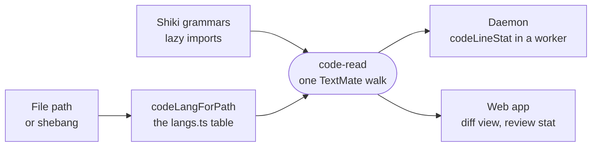

# code-read

Resolves a path to its grammar and walks its tokens once, so the daemon's code-only line counts and the app's comment-free diff read source the same way.



- A review row's added and removed counts skip comments, and the diff pane beside it hides them. Both come from
  `analyzeCode`, so the two numbers cannot disagree.
- The app passes the grammars its own renderer already loaded. `./grammars` is for a process with no screen: it
  builds its own Shiki core on the JavaScript RegExp engine (no WASM asset) and loads each grammar once.
- `langs.ts` is the one table of grammars the app ships, and `_editor/web`'s Vite config derives its dependency
  pre-bundling from it, so its import specifiers stay literal.
- An id missing from the table is a compile error. Files over `HIGHLIGHT_MAX_BYTES` render as plain text, since
  the regex tokenizer chokes on huge or minified input.

## Key files

- [src/index.ts](src/index.ts) — the shared surface: `analyzeCode`, `codeLangForPath`, `codeLineStat`.
- [src/langs.ts](src/langs.ts) — `LANGS`, the Shiki grammars the app ships, imported lazily.
- [src/lang-for-path.ts](src/lang-for-path.ts) — which grammar a path, extension or shebang resolves to.
- [src/analysis.ts](src/analysis.ts) — the comment-free text and import spans from one walk.
- [src/stat.ts](src/stat.ts) — code-only added and removed counts; `rememberAnalyses` re-tokenizes only the side that moved.
- [src/grammars.ts](src/grammars.ts) — the daemon's own lazily loaded tokenizer.

## Commands

```sh
pnpm --filter @intentic/code-read test
```
