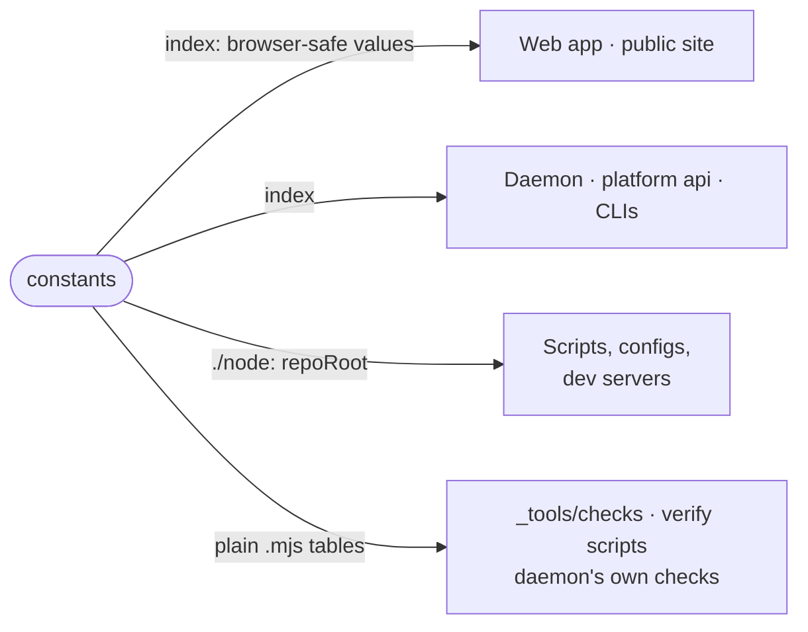

# constants

The values several packages must agree on (ports, workspace paths, origins, install-script URLs, the sign-in client id, the hosted price ladder), defined once so no copy drifts.



- The index has no Node imports, so the web app and the public site bundle the same values the daemon reads.
  It also carries the provider logos, the arrival profiles (`profile.ts`) and the hosted machine ladder
  (`hosted-tiers.ts`), whose prices the site, the Billing page and the platform config all state.
- `./node` holds `repoRoot` and `packageRoot`, which find the monorepo by walking up to `pnpm-workspace.yaml`
  instead of counting `../..`. The `paths` check refuses counted roots.
- The `.mjs` modules (`control-bytes`, `contract-shrink`, `assertion-measure`, `mirror-roots`, `test-suites`,
  `vocabulary`, `ci-infra-steps`, `memory-room`) are plain JavaScript with `.d.mts` types, so the checks and the verify
  scripts import them by path before any install or build, and the daemon applies the same rule from the same file.
- `memory-room` is the one formula for whether the sandbox has room (limit, used, free, stall, and what each workload
  class costs). The daemon's resource budget judges by it, and it is also the `memory-room` command `queue-run` asks:
  it asks the daemon's room socket, and applies the formula itself where no daemon answers.
- `WORKSPACE_ROOT` and `HISTORY_ROOT` are defaults only: a running daemon reads its real roots from config.

## Key files

- [src/index.ts](src/index.ts) — ports, workspace paths, origins, install scripts and the Google client id.
- [src/node.mjs](src/node.mjs) — `repoRoot` and `packageRoot`, the found-not-counted roots.
- [src/hosted-tiers.ts](src/hosted-tiers.ts) — every hosted machine rung, what it costs to run and what it sells for.
- [src/profile.ts](src/profile.ts) — the named arrival profiles the site, the app and the platform share.
- [src/vocabulary.mjs](src/vocabulary.mjs) — the words this repository retired and what each became.

## Commands

```sh
pnpm --filter @intentic/constants test
```
