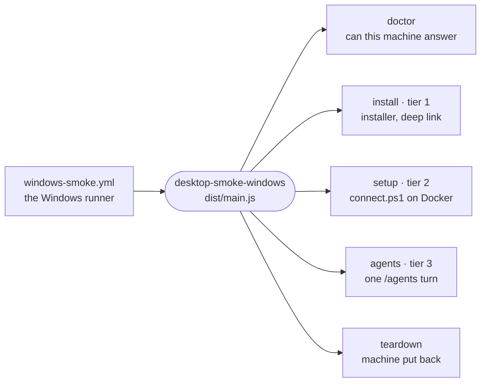

# desktop-smoke-windows

Installs the shipped NSIS installer on a real Windows machine, runs the sandbox setup it ships and drives one `/agents` turn, one tier per subcommand.



- Runs on the one self-hosted Windows runner through `windows-smoke.yml`, which CI, the release and the nightly
  call. Every assertion reads a real window, so the runner must run in a logged-in desktop session
  ([docs/ops/ci-runner-windows.md](../../docs/ops/ci-runner-windows.md)); `doctor` names that and other machine
  faults before any tier runs.
- Tier 1 needs no Docker and no credentials, so it gates every release. Tiers 2 and 3 need a Windows Docker daemon
  and a shared agent-auth volume, so they run nightly.
- Each assertion polls to its own deadline, a failure does not stop the run, and the exit code is the failure
  count. `parse.ts` keeps what the machine answers pure, so it is tested off Windows.
- `constants.ts` holds the strings this tier shares with the Linux tier's `_tools/desktop-smoke/smoke.sh`.

## Usage

Build with `pnpm turbo run build --filter=@intentic/desktop-smoke-windows...`, then from the repository root:

```sh
node _tools/desktop-smoke-windows/dist/main.js doctor [--needs-docker]
node _tools/desktop-smoke-windows/dist/main.js install --installer <Intentic-<version>-x64-setup.exe> \
    [--expected-version <version>] [--app-url <origin>] [--keep-installed]
node _tools/desktop-smoke-windows/dist/main.js setup [--sandbox-image <ref>] [--ic-bin <ic.exe>] [--web-origin <url>]
node _tools/desktop-smoke-windows/dist/main.js agents [--turn-seconds <n>]
node _tools/desktop-smoke-windows/dist/main.js teardown
```

`--keep-installed` leaves the app for tiers 2 and 3, which run the scripts the installer put on disk. `agents`
reads `INTENTIC_AGENT_AUTH_VOLUME` and stands the turn down without it. `teardown` always exits 0.

## Key files

- [src/main.ts](src/main.ts) — one subcommand per tier, and the flags each takes.
- [src/tier-install.ts](src/tier-install.ts) — tier 1: install, files on disk, `intentic://` before and after launch.
- [src/tier-setup.ts](src/tier-setup.ts) — tier 2: the installed `connect.ps1` brings a sandbox up.
- [src/tier-agents.ts](src/tier-agents.ts) — tier 3: the sandbox is reachable, gated, and runs a turn.
- [src/doctor.ts](src/doctor.ts) — whether this machine can answer what the tiers ask.
- [src/harness.ts](src/harness.ts) — per-assertion deadlines and the failure count.
