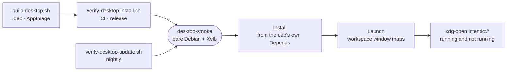

# desktop-smoke

A bare Debian image that installs a built Linux desktop artifact, launches it under Xvfb and fires a real `intentic://` deep link at it.



- The image carries no GUI libraries, so the `.deb` must pull everything it links against through the `Depends`
  field Tauri's bundler writes, which nothing else in the pipeline reads. The AppImage meets the same bare host,
  plus only the libraries its excludelist leaves to the host.
- Assertions read window titles with `xdotool`; the app has no test hook. The deep link is fired at a running
  app (the single-instance plugin forwards it) and at one that is not running (the link arrives in argv).
- Hermetic: `INTENTIC_APP_URL` points at a stub page baked into the image and `INTENTIC_DISABLE_UPDATE_CHECK=1`
  keeps the updater off.
- `update.sh`, reached by overriding the entrypoint, runs two AppImages built with a throwaway signing key and a
  loopback release endpoint, and asserts the app replaces itself with the newer release and still starts.
- The `FROM` tracks `_tools/ci-base`'s Debian release, because the binary needs at least the glibc it is built
  with. Bump the two together.

## Key files

- [Dockerfile](Dockerfile) — the bare host and why each package on it is there.
- [smoke.sh](smoke.sh) — the install, launch and deep-link assertions, per artifact kind.
- [update.sh](update.sh) — the self-update drill.

## Commands

Both need only Docker; the install tier reads `_editor/desktop-app/dist-bin` unless given a directory.

```sh
bash _tools/scripts/desktop/verify-desktop-install.sh
bash _tools/scripts/desktop/verify-desktop-update.sh
```
