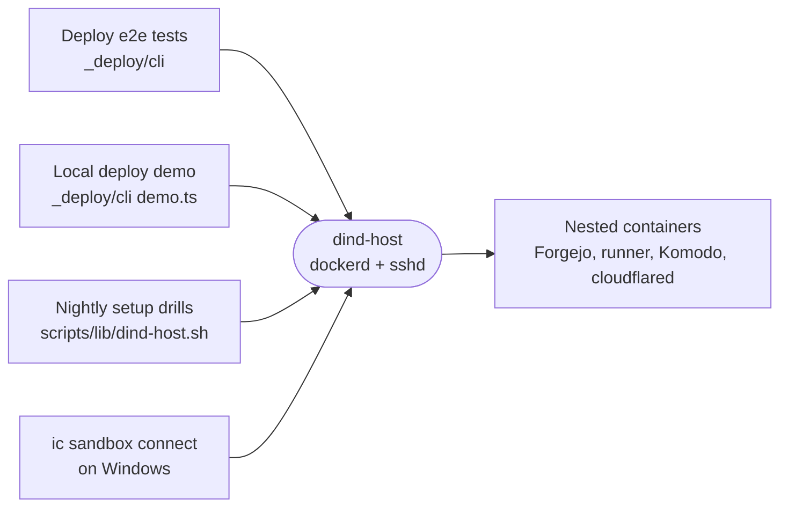

# dind-host

A Docker-in-Docker image with sshd that plays the SSH-reachable Docker host a deployment targets, for the deploy tests, the local demo and Windows machines with no server.

- The deploy engine reaches it over SSH and drives `docker` in that session, as it would on a real owned box. The
  providers' nested containers run inside it, off the developer's own Docker daemon.
- The caller copies in the authorized public key before start and runs it privileged with an empty
  `DOCKER_TLS_CERTDIR`. `entrypoint.sh` starts dockerd, waits until it answers, then runs sshd in the foreground.
- It carries `openssl`, `iproute2` and `docker compose` because the host and Komodo providers call them.
- Published as `ghcr.io/intentic/dind-host`, a single amd64 image: `ic sandbox connect` pulls it on Windows as the
  local deploy target, and CI hands it to the deploy tests. Everything else builds it from this directory.

## Key files

- [Dockerfile](Dockerfile) — the dind base plus sshd and the tools the providers call.
- [entrypoint.sh](entrypoint.sh) — dockerd in the background, sshd in the foreground.
- [package.json](package.json) — ships the build context to `@intentic/cli`, which finds it in its `node_modules`.
