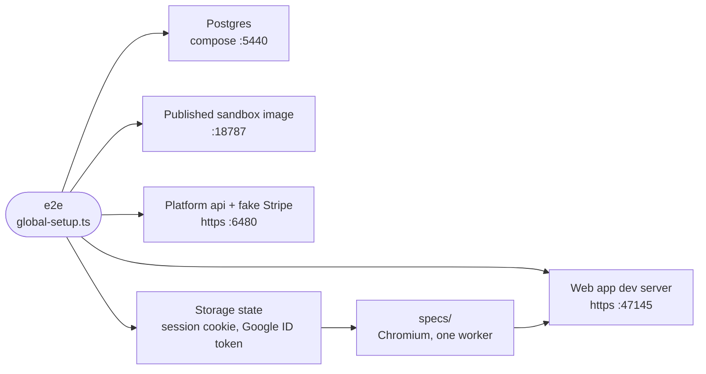

# e2e

Playwright harnesses that drive the real web app in Chromium: the local-stack browser tier, the post-deploy sign-in smoke, the mobile geometry gate, the site's screenshots and the promo take.



- The browser tier (`playwright.config.ts`, `specs/`) tests the browser-daemon contract. Its stack lives on
  localhost, where a CI job cannot reach it, so it runs on a developer machine. `global-setup.ts` reuses anything
  already running and `global-teardown.ts` stops only what it started.
- Sign-in is seeded: the setup writes a signed Better Auth session cookie and a fake Google ID token in
  `localStorage` into Playwright's storage state, and the daemon runs with `SANDBOX_ALLOW_UNAUTHENTICATED=1`.
- `smoke-signin.mjs` is the one gate that meets Google's real origin check: after each platform deploy, CI opens
  `/login` on app.intentic.dev and asserts the Google button renders.
- `mobile/audit.mts` walks the hermetic demo build at a phone viewport and fails on blank routes, overflow, small
  targets and scrollers that do not move. `shots/capture.mts` photographs the same build into
  `_site/site/src/assets/product/` (and `product-light/`). Both need only Chromium.
- `window-sync/` runs the app's floating-window hand-off modules in a bare page; [promo](promo) records the
  product video.

## Key files

- [stack.ts](stack.ts) — origins, ports, seeded rows and the Better Auth cookie recipe.
- [global-setup.ts](global-setup.ts) — boots the stack in order and writes the storage state.
- [playwright.config.ts](playwright.config.ts) — the browser tier: serial, one retry, seeded session.
- [smoke-signin.mjs](smoke-signin.mjs) — the post-deploy check against Google's real origin check.
- [mobile/audit.mts](mobile/audit.mts) — the phone geometry gate.
- [shots/capture.mts](shots/capture.mts) — the site's screenshots, dark and `--light`, plus `--desk`.

## Commands

```sh
pnpm e2e:browser                                  # SANDBOX_E2E_IMAGE picks the daemon image
pnpm e2e:mobile                                   # builds the demo first
node --experimental-strip-types _tools/e2e/shots/capture.mts [--light | --desk] [shot names]
pnpm --filter @intentic/e2e smoke:signin https://app.intentic.dev
cd _tools/e2e && pnpm exec playwright test -c window-sync/window-sync.playwright.config.ts
```
