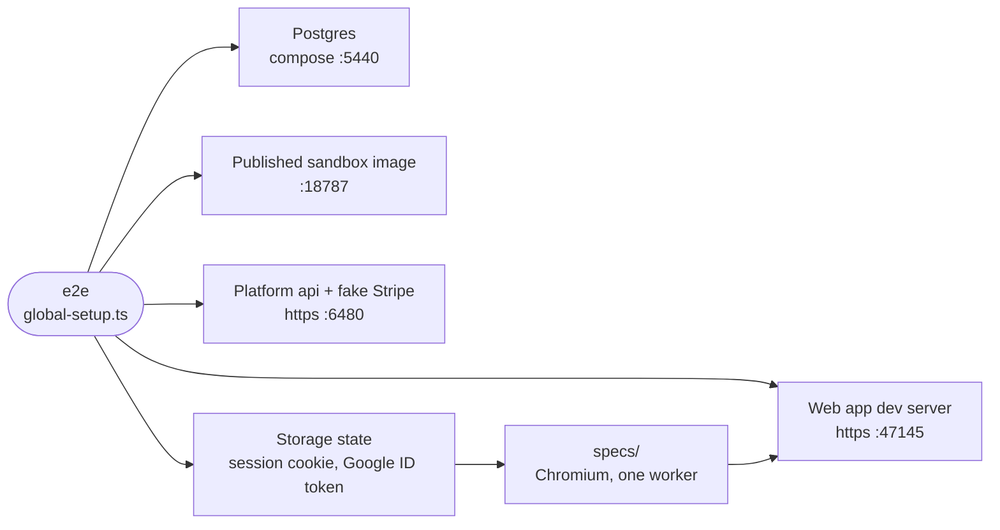

# e2e

Playwright harnesses that drive the real web app in Chromium: the sign-in gate, the local-stack browser tier, the post-deploy sign-in smoke, the mobile geometry gate, the desktop app's local face, the site's screenshots and the promo take.


```mermaid
flowchart LR
    setup(["e2e<br/>global-setup.ts"]) --> pg["Postgres<br/>compose :5440"]
    setup --> daemon["Published sandbox image<br/>:18787"]
    setup --> api["Platform api + fake Stripe<br/>https :6480"]
    setup --> web["Web app dev server<br/>https :47145"]
    setup --> state["Storage state<br/>session cookie, Google ID token"]
    state --> specs["specs/<br/>Chromium, one worker"]
    specs --> web
```

- `signin/` is the sign-in gate, and the platform deploy waits on it (`e2e-signin` in ci.yml). A new person signs in
  four ways: on the web, through the desktop app from a signed-out browser, from a browser already signed in (no
  press), and after "Ask an agent about this" on a file. Everything it runs is what ships: the `vite build` output
  served as the web image serves it (`serve-web.ts`), the api's own app from `_platform/api/src/e2e/browser-api.ts`,
  and Postgres through testcontainers with the migrations replayed. Google is replaced at its two edges only
  (`google.ts`): a fake Identity Services script whose button returns an RS256 ID token, and the matching JWKS
  answered inside the api's process, so Better Auth's real one-tap verification accepts it. The desktop app's half
  (`desktop.ts`) is `auth.rs` in TypeScript: the state and verifier, the `intentic://` links read off Chrome
  DevTools, and the landing the app points its window at. `SIGNIN_E2E_REUSE_BUILD=1` serves the `dist` already there;
  `SIGNIN_E2E_DATABASE_URL` skips the container.
  - 2026-09-30: written after 1.318.0 shipped a router guard that took `handoff` off the desktop sign-in's landing.
    Each piece passed its own tests, and nothing ran the chain. It is Chromium-only and hermetic because it gates a
    deploy: a real Google account in CI would make the gate fail for reasons that are not ours (the smoke below is
    what checks Google itself).
- The browser tier (`playwright.config.ts`, `specs/`) tests the browser-daemon contract. Its stack lives on
  localhost, where a CI job cannot reach it, so it runs on a developer machine. `global-setup.ts` reuses anything
  already running and `global-teardown.ts` stops only what it started.
- Sign-in is seeded: the setup writes a signed Better Auth session cookie and a fake Google ID token in
  `localStorage` into Playwright's storage state, and the daemon runs with `SANDBOX_ALLOW_UNAUTHENTICATED=1`.
- `smoke-signin.mjs` is the one gate that meets Google's real origin check: after each platform deploy, CI opens
  `/login` on app.intentic.dev and asserts the Google button renders. It also opens the desktop sign-in's landing
  with a made-up handoff and asserts the page reaches the api's redeem call instead of stopping on "link is
  incomplete".
- `mobile/audit.mts` walks the hermetic demo build at a phone viewport and fails on blank routes, overflow, small
  targets and scrollers that do not move. `shots/capture.mts` photographs the same build into
  `_site/site/src/assets/product/` (and `product-light/`): the demo's quiet `showcase` recording, wearing the Mist
  wallpaper over Sanctum and over the light look. Both need only Chromium.
- `local-face/` boots the desktop app's local face (`_editor/desktop-app`, `dist/files`, built by its global setup) the
  way a window on a folder boots it, without Tauri: the bundle behind a server that resolves paths as the app's asset
  protocol does, the real `intentic-files` sidecar from source granted a temp folder on its stdin, and
  `__INTENTIC_LOCAL__` injected before any script. It lists, opens, edits and saves, and fails on an uncaught error,
  a console error, a request leaving loopback, or any sidecar request answering 404, printing the unserved paths.
  CI runs it as `local-face` whenever the desktop app's graph moves. `LOCAL_FACE_REUSE_BUILD=1` skips the rebuild.
- `window-sync/` runs the app's floating-window hand-off modules in a bare page; [promo](promo) records the
  product video.

## Key files

- [signin/signin.spec.ts](signin/signin.spec.ts) — the sign-in gate: web and desktop sign-in, end to end.
- [stack.ts](stack.ts) — origins, ports, seeded rows and the Better Auth cookie recipe.
- [global-setup.ts](global-setup.ts) — boots the stack in order and writes the storage state.
- [playwright.config.ts](playwright.config.ts) — the browser tier: serial, one retry, seeded session.
- [smoke-signin.mjs](smoke-signin.mjs) — the post-deploy check against Google's real origin check.
- [mobile/audit.mts](mobile/audit.mts) — the phone geometry gate.

## Commands

```sh
pnpm e2e:signin                                   # builds the web first; needs Docker
pnpm e2e:browser                                  # SANDBOX_E2E_IMAGE picks the daemon image
pnpm e2e:mobile                                   # builds the demo first
pnpm e2e:local                                    # builds the local face first
node --experimental-strip-types _tools/e2e/shots/capture.mts [--light | --desk] [shot names]
pnpm --filter @intentic/e2e smoke:signin https://app.intentic.dev
cd _tools/e2e && pnpm exec playwright test -c window-sync/window-sync.playwright.config.ts
```
