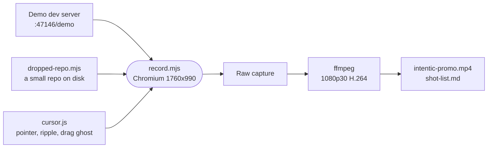

# promo

Records the product video: one unedited take of the web app on the demo fixture, from dropping a repository in to landing an agent's work, encoded with a shot list.



- Nothing is mocked or sped up: the page is the `@intentic/web` source served by `_site/demo`, whose in-memory
  fixture stands in for a sandbox. A reload would rewind the fixture, so the take never reloads.
- The fixture's scripted turn starts when the chat attaches and parks until the script answers, so the recording
  sets the pace.
- A headless browser draws no cursor, so `cursor.js` runs as an init script and draws the pointer, click ripples and
  the drag ghost for the dropped folder. `dropped-repo.mjs` writes that folder, a small Go service, to
  `/tmp/promo-drop`.
- Output lands in `PROMO_OUT` (default `/tmp/intentic-promo`): the master MP4, `shot-list.md` with each beat's
  start time, and the raw capture. `DEMO_URL` points it at another demo server. Needs `ffmpeg` and `ffprobe`.

## Key files

- [record.mjs](record.mjs) — the take, beat by beat, and the encode.
- [cursor.js](cursor.js) — the visible pointer and drag ghost.
- [dropped-repo.mjs](dropped-repo.mjs) — the repository dropped in on the first beat.

## Commands

```sh
pnpm --filter @intentic/demo dev     # serves the demo on :47146
node _tools/e2e/promo/record.mjs
```
