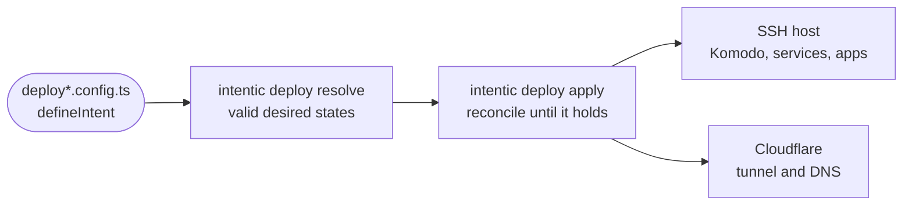

# examples

Complete intent files for the deploy engine, one self-hosted and two backed by GitHub or GitLab, compiled by the build so they stay valid against the current SDK.



- Each file exports `intent`, built with `defineIntent` from `@intentic/sdk`: what you have (`i.have.host`,
  `i.have.cloudflare`, a GitHub or GitLab token) and what you want (`i.want.app`, a database, auth, observability).
  Secrets are `env("NAME")` references from `@intentic/graph`, never values.
- `deploy.config.ts` is the canonical example: Forgejo and Komodo on your own host, with users, teams and an app
  shipped to two environments. `deploy.github.config.ts` and `deploy.gitlab.config.ts` hand source, CI and the
  registry to GitHub or GitLab while Komodo still rolls out on the host.
- `pnpm build` type-checks them with `tsgo`, so an SDK change that breaks an example breaks the build. The deploy
  packages' test fixtures mirror `deploy.config.ts`.
- Nothing imports these files: they are for reading and copying.

## Key files

- [deploy.config.ts](deploy.config.ts) — the canonical intent: every kind of want, on one host.
- [deploy.github.config.ts](deploy.github.config.ts) — GitHub repos, Actions and GHCR as the source pipeline.
- [deploy.gitlab.config.ts](deploy.gitlab.config.ts) — GitLab projects, CI and registry, gitlab.com or self-hosted.

## Commands

```sh
pnpm --filter @intentic/examples build
```
