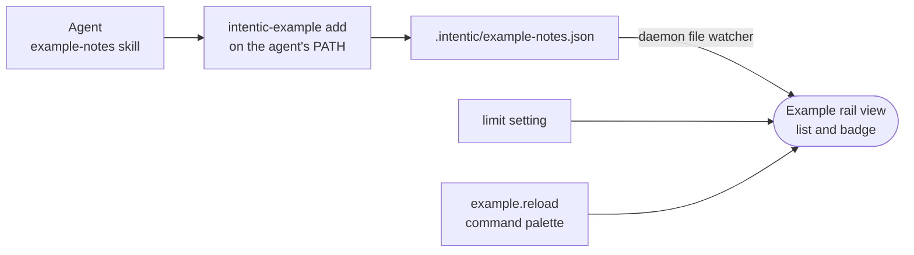

# Example extension

A working intentic extension with one contribution of every kind (rail view, watched file, setting, command, CLI, agent skill), built to be copied and reshaped into your own.



- The agent leaves short notes with `intentic-example add "…"`; the Example tile in the owner's rail lists the
  newest ones and badges the unread count.
- [intentic-extension.json](intentic-extension.json) declares everything the code registers, plus the one daemon
  route it may call (`GET /workspace/file`). The host refuses an undeclared view or command and `api.sandbox`
  throws outside `permissions.sandbox`, so the manifest is exactly what the install dialog shows the owner.
- `contributes.files` makes a write to the notes file invalidate the `example-notes` query, so the view updates
  without polling. The query key in [src/useNotes.ts](src/useNotes.ts) must keep that name.
- `contributes.bin` puts [bin/intentic-example](bin/intentic-example) on the agent's PATH, and `contributes.agent`
  ships [plugin/](plugin), whose skill tells the agent when to use it.
- The view uses the host's classes only: name a role (`text-muted`, `bg-card`), size against the container
  (`@lg:`), and skip one-off values like `w-[37px]`, which render as nothing.

## Key files

- [src/extension.ts](src/extension.ts) — `activate`: every registration, each declared in the manifest.
- [src/notes.ts](src/notes.ts) — reads the notes file through the typed sandbox client.
- [src/badge.ts](src/badge.ts) — the unread count, refreshed when the file is written.
- [src/ExampleView.vue](src/ExampleView.vue) — the rail view.
- [test/activate.test.mjs](test/activate.test.mjs) — runs the built bundle against a host stub that enforces the manifest.

## Build, test, publish

```sh
pnpm install
pnpm build        # one ES module: dist/extension.js
pnpm typecheck
pnpm test         # needs the build
```

- Rename `publisher`, `name` and the ids in the manifest and the code before anything else.
- Commit `dist/`: a sandbox runs the commit its owner approved as it is, with no install or build step.
- Install it in your own sandbox by pinned commit. To list it, keep `intentic-extension.json` at the root of a
  public GitHub repository and add the `intentic-extension` topic: the registry's nightly scan opens the listing
  pull request. The guides are at <https://intentic.dev/developers/build/> and
  <https://intentic.dev/developers/publish/>.
