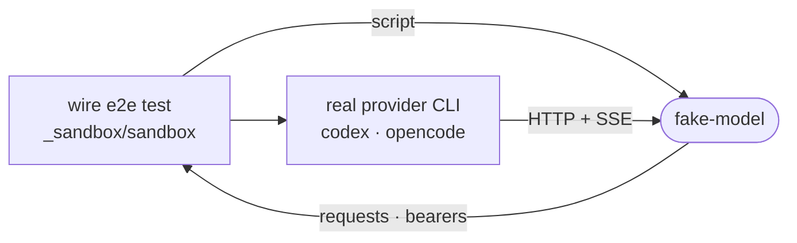

# fake-model

A local model endpoint that answers from a test's script, so a provider's real CLI runs end to end with no token, network or vendor.



- The CLI reads its real config and builds its real prompt, then posts here. `requests` keeps every body that reached the wire, so a test asserts on what the CLI actually sent instead of trusting a canned event list.
- Serves the OpenAI Responses (`/v1/responses`), Chat Completions (`/v1/chat/completions`) and Anthropic Messages (`/v1/messages`) surfaces plus a `/models` listing. Any other path gets a 404 that names the served surfaces. Chat bodies are recorded in Responses shape, so one set of readers works for both.
- A `ScriptedStep` answers with text, a shell call, a function call or an HTTP failure; steps are consumed in order and the last one repeats. `respond` picks a step by request content instead, which survives retries.
- Codex has two tool shapes: `shell` is the `exec_command` tool of `codex app-server`, `execScript` the JS `exec` tool of `codex exec`.
- Its consumer is the provider conformance tier (`e2e:providers`), which gates releases because it spends nothing and no vendor outage can fail it.

## Key files

- [src/server.ts](src/server.ts) — `startFakeModel`, `ScriptedStep`, and the per-surface routing.
- [src/responses.ts](src/responses.ts) — Responses wire frames and readers such as `userMessages` and `toolNames`.
- [src/server.test.ts](src/server.test.ts) — the script machine and readers, by example.

## Commands

```sh
pnpm --filter @intentic/fake-model test
pnpm --filter @intentic/sandbox e2e:providers   # needs the pinned provider CLIs on PATH
```
