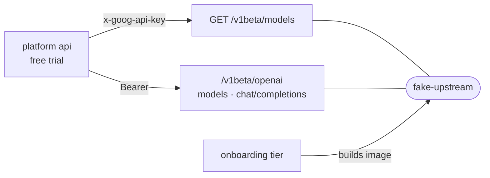

# fake-upstream

A local stand-in for the two Google Gemini surfaces the platform's free trial calls, so trial tests hit a real HTTP wire with deterministic replies.



- Mirrors Google's URL shape: `baseUrl` ends in `/openai`, which is what `TRIAL_BASE_URL` is set to, and the native listing sits one segment up.
- Each surface refuses the other's credential with a 401 in the real surface's shape, since mixing them up is the bug it exists to catch. Model ids come back prefixed `models/` like Google's.
- `refuseKeys` answer 429, so a test can drive the platform's walk through its key pool. `received` records every chat body, refused ones included.
- Chat answers stream as SSE when asked, because the trial route pipes that stream straight to an agent.
- Runs in-process through `startFakeUpstream`, or as a container from the [Dockerfile](Dockerfile) on port 8099; the [onboarding](../onboarding) tier builds that image and puts it on its network. The image copies only `package.json` and `src/` and lets node strip the types, so `src/` may import only node builtins and its own siblings.

## Key files

- [src/server.ts](src/server.ts) — `startFakeUpstream`, the routes and the credential checks.
- [src/main.ts](src/main.ts) — the container entrypoint, configured by `FAKE_UPSTREAM_*` variables.
- [src/image-contract.test.ts](src/image-contract.test.ts) — fails when `src/` imports anything the image cannot resolve.
- [src/server.test.ts](src/server.test.ts) — the refusals and replies, by example.

## Commands

```sh
pnpm --filter @intentic/fake-upstream test
```
