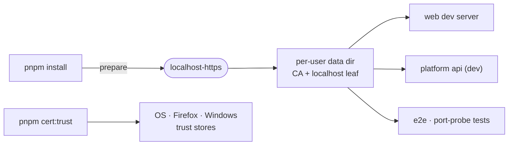

# localhost-https

Mints a per-machine development certificate authority and a localhost certificate, so the dev web app and api serve HTTPS that the browser trusts.



- `generate.mjs` runs on every install and re-mints only what is missing, broken or near expiry. The root and the leaf renew separately, so re-signing the leaf keeps the browser's trust in the root.
- The pair lives in the OS's per-user data directory (`paths.mjs`), outside the repository, so a container mounted on the same workspace cannot overwrite the host's pair and no private key can be committed.
- The root carries name constraints: a validator that honours them accepts its signature only for `localhost`, `localhost.com` and loopback addresses.
- `trust.mjs` adds the root to the current user's stores, including Windows' store from inside WSL and each Firefox profile. It is safe to re-run; restart the browser afterwards.
- Needs `openssl` on `PATH`. On Windows, Git for Windows ships one.

## Key files

- [paths.mjs](paths.mjs) — where the CA and leaf live; Vite, the api and tests import these paths.
- [generate.mjs](generate.mjs) — mints or renews the CA and the leaf.
- [trust.mjs](trust.mjs) — installs the root into every trust store the browser reads.

## Commands

```sh
pnpm cert:trust
```
