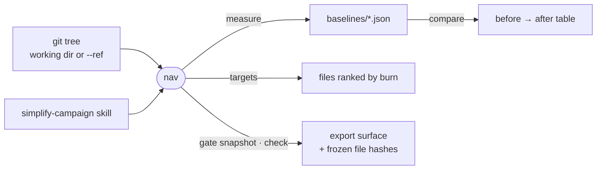

# nav

Measures what the codebase costs an agent to read, in tokens, and checks that a refactor removed no export, so a decomposition round is judged by numbers.



- Offline and deterministic. Tokens come from a character-based estimator in `lib/tokens.mjs`: an absolute count is order-of-magnitude, a delta is real. `calibrate` checks the estimator's chars-per-token band; `NAV_TOKENIZER=real` uses `gpt-tokenizer` when installed, and `compare` refuses to mix the two.
- `targets` ranks files by burn: the tokens spent on a file across every lookup that lands in it.
- `gate.mjs check` fails when an export that existed at the snapshot is gone or a frozen file (SQL, Prisma, migrations, locales, schemas, OpenAPI, the api and sandbox contracts) changed. Moving an export is free and growth is expected.
- `baselines/` holds recorded measurements of older trees, so the repo's naming checks skip it.
- `structure-stats.mjs` reads conversation transcripts under `HISTORY_ROOT` to measure what finding a symbol costs, where `bench.mjs` measures opening one.

## What the numbers mean

| Section | Measures | Better is |
| --- | --- | --- |
| Size | physical, code, and comment+blank lines, plus tokens; read the rows together | lower |
| Can an agent load it | files over 32k and 128k tokens | lower |
| Shape | file and function length, complexity, if/else chains, nesting; tests excluded | lower |
| Naive lookup (`bench.mjs`) | tokens to read the defining file of every first-party import in the tests | lower |
| Skilled lookup (`lookup.mjs`) | grep plus a read window over a seeded sample, paired by symbol name | lower |
| What it cost | modules, import edges, fan-out, largest cycle | expected to rise; judge by how much |

## Key files

- [run.mjs](run.mjs) — `measure`, `targets`, `compare` and `calibrate`.
- [gate.mjs](gate.mjs) — `snapshot` and `check` of the export surface and frozen files.
- [metrics.mjs](metrics.mjs) — the size, shape and cost numbers.
- [lib/tokens.mjs](lib/tokens.mjs) — the token estimator and the optional real tokenizer.

## Commands

```sh
node _tools/nav/run.mjs measure --label baseline
node _tools/nav/gate.mjs snapshot --out _tools/nav/baselines/surface.json
node _tools/nav/run.mjs targets --top 20
node _tools/nav/gate.mjs check _tools/nav/baselines/surface.json
node _tools/nav/run.mjs compare _tools/nav/baselines/baseline.json _tools/nav/baselines/head.json
```
