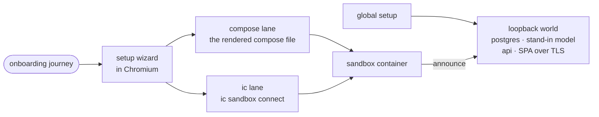

# onboarding

A Playwright tier that stands up the whole platform from the branch's own images and walks a new account through the setup wizard to a connected sandbox, once per provisioning path.



- One journey runs per Playwright project (`compose`, `ic`); a provisioner in `src/provisioners/` owns only the step of getting a connected sandbox. "Connected" means the platform's sandbox row records a sighting from this run (`announce.ts`).
- Runs in the nightly workflow. It stands down with a reason, and stays green, when not asked for (`INTENTIC_E2E_ONBOARDING`), when there is no Docker, or when no `ic` binary can be found or built. An `IC_BIN` that names no executable fails the lane instead.
- Sign-in is seeded: `seed.ts` writes a session row, a cookie and an unsigned Google token. `SIGN_IN_IS_SEEDED` marks the part a real Google sign-in would still have to cover.
- The world lives on `127.0.0.1` ports because the SPA's CSP allows plain http only there, so the Docker daemon must run where the test process runs. Inside a container, give it a dockerd of its own; `requireLoopback` says so when it cannot reach a published port.
- The api and SPA speak HTTPS with a certificate minted per run that nothing verifies: global setup turns Node's certificate check off and Playwright ignores HTTPS errors. A probe added without the same bypass gets a certificate refusal, which is easy to misread as "the platform is down".

## Key files

- [src/global-setup.ts](src/global-setup.ts) — builds images, starts the world, seeds the session, or stands the tier down.
- [src/world.ts](src/world.ts) — the containers every path shares, on a private network.
- [src/provisioner.ts](src/provisioner.ts) — the interface each provisioning path implements.
- [specs/journey.spec.ts](specs/journey.spec.ts) — the journey, run once per provisioner.
- [src/docker.ts](src/docker.ts) — why the world is on loopback, and the check that enforces it.

## Commands

```sh
pnpm --filter @intentic/onboarding e2e:onboarding                 # both lanes
pnpm --filter @intentic/onboarding e2e:onboarding --project ic    # one lane; ONBOARDING_KEEP=1 leaves the world up
```
