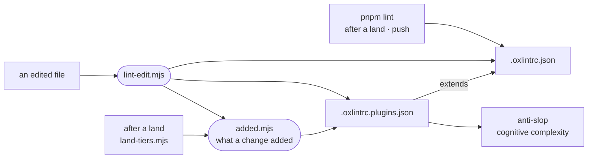

# oxlint

The repository's lint setup: the per-edit linter hook, the added-only tier for rules with a backlog, and the vendored anti-slop rules, all driving oxlint from configs at the repo root.



- `.oxlintrc.json` is the rule set: `pnpm lint` runs it with `--deny-warnings`. The check after each land lints the files that land changed and counts what it finds as the land's failures (`land-tiers.mjs`). The push lints the whole tree and reports. CI does not lint. Beyond the correctness, suspicious and perf categories, rules are enumerated one by one, which pins the rule set across oxlint upgrades.
- `lint-edit.mjs` runs after every agent edit (`.intentic/checks.json`). It autofixes the file silently with the root rules, then reports only diagnostics the HEAD version lacked under the root rules and the plugin tier, matched by rule and message with numbers blanked, so an old finding is never blamed on the edit. It exits 2 with a report and 0 whenever it cannot measure. The report rides back with the edit and never stops the turn. `no-unused-vars` is left to `pnpm lint`, since a file mid-edit trips it.
- `.oxlintrc.plugins.json` adds the JS plugins (anti-slop, cognitive complexity), whose backlog on main is about 13,700 findings. It is a tidy tier: `added.mjs` holds it to what a change adds. The per-edit hook reports that, and the check after a land counts what the land added to its own files as the land's failures (`land-tiers.mjs`). `pnpm lint:plugins` lists the whole backlog. A file the root config ignores is not judged. `@oxlint/plugins` must match the `oxlint` version exactly.
- There is no type-aware tier: `.oxlintrc.json` says why and what bringing one back takes.
- `anti-slop/` is upstream source from dmmulroy/anti-slop under its MIT licence. The root config ignores it, so it stays byte-identical and diffable against upstream.

## Key files

- [lint-edit.mjs](lint-edit.mjs) — the per-edit hook: fix, then report what the edit introduced.
- [../../.oxlintrc.json](../../.oxlintrc.json) — the enforced rule set, with the reasoning for each exception in comments.
- [../../.oxlintrc.plugins.json](../../.oxlintrc.plugins.json) — the plugin rules and their thresholds.
- [added.mjs](added.mjs) — what a change added to the lint, read against the file as it was.
- [anti-slop/index.ts](anti-slop/index.ts) — the vendored anti-slop plugin and its rule list.

## Commands

```sh
node _tools/oxlint/lint-edit.mjs <file>
pnpm lint
pnpm lint:plugins    # the plugin tier's whole backlog
```
