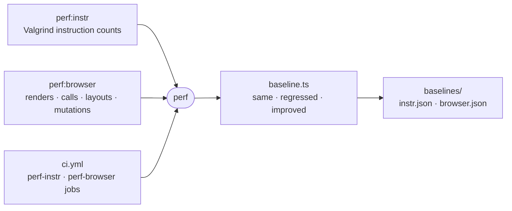

# perf

Performance checks that count work instead of timing it, judging each run against a baseline checked into this package.



- `perf:instr` runs each pure-JS hot path (`code-read`'s line counts, the workspace ignore walk, fuzzy ranking,
  the transcript fold) under `valgrind --tool=cachegrind` twice, setup only and setup plus work, and keeps the
  difference. `node --predictable`, fixed heap sizes and seeded fixtures make the count repeat.
- `perf:browser` starts `_site/demo` with its own Vite and counts Vue renders, V8 calls, layouts, style recalcs and
  DOM mutations per interaction, under a paused Playwright clock and a forced flush after every step.
- A count that moves in either direction fails, an improvement included, so slack never goes unrecorded. When the
  change is intended, re-record with `--update` and commit the baseline diff with the change that caused it.
- The baseline records the host it was taken on. A different Node, V8 flags, architecture or browser version refuses
  the run instead of judging it. Valgrind is Linux-only, so run the instruction track in a sandbox or in CI.
- To add an instruction scenario, add a file to `src/instr/scenarios/` exporting `scenario`. Its work must throw when
  its result is wrong, so a count never comes from work that stopped early.

## Key files

- [src/baseline.ts](src/baseline.ts) — judges a run against a baseline or re-records it, for both tracks.
- [src/instr/counted-process.ts](src/instr/counted-process.ts) — the process Valgrind counts, in its two phases.
- [src/instr/scenarios](src/instr/scenarios) — one file per instruction scenario, found by name.
- [src/browser/session.ts](src/browser/session.ts) — the fresh context, paused clock and flush that make counts exact.
- [src/browser/page-probe.ts](src/browser/page-probe.ts) — the page-side counters and seeded randomness.
- [src/browser/scenarios.ts](src/browser/scenarios.ts) — the interactions the browser counts cover.

## Commands

```sh
pnpm perf:instr                      # judge every scenario; --only <name>, --runs 3 for the spread
pnpm perf:instr --update             # re-record the baseline
pnpm perf:browser                    # same flags
```
