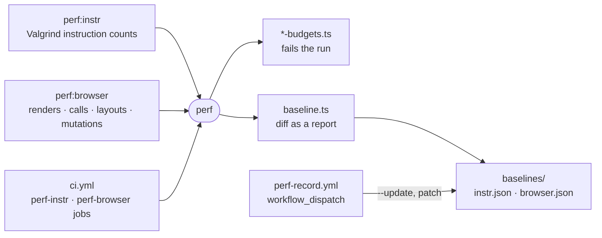

# perf

Performance checks that count work instead of timing it, failing only on a few declared budgets and reporting every other count against a baseline checked into this package.



- `perf:instr` runs each pure-JS hot path (`code-read`'s line counts, the workspace ignore walk, fuzzy ranking,
  the transcript fold) under `valgrind --tool=cachegrind` twice, setup only and setup plus work, and keeps the
  difference. `node --predictable`, fixed heap sizes and seeded fixtures make the count repeat.
- `perf:browser` starts `_site/demo` with its own Vite and counts Vue renders, V8 calls, layouts, style recalcs and
  DOM mutations per interaction, under a paused Playwright clock and a forced flush after every step.
- A run fails only on a budget (`src/instr/instr-budgets.ts`, `src/browser/browser-budgets.ts`): a one-directional
  claim about what an event costs, set well above today's reading, with the claim and the reason for its limit beside
  it. Today they are renders per idle clock tick, renders per keystroke in the composer, a repeat ignore walk at most a
  tenth of the first, and incremental quick-open ranking at most 60% of re-ranking from scratch. A new budget encodes a property
  someone would defend, not a number that happened to be measured.
- Every other count is a report: the diff against `baselines/` goes to stdout and, in CI, to the job summary, and
  never fails the job. A baseline that failed on every move was re-recorded four times in its first 28 hours by
  whoever the red run landed on, which is what a golden master turns into.
- The baseline records the host it was taken on. A different Node, V8 flags, architecture or CPU (instruction track),
  or browser version (browser track), shows the diff without comparing it. Budgets are judged on any host.
- A baseline is re-recorded only by `.github/workflows/perf-record.yml`, dispatched by hand, on the runner class the
  CI jobs judge on. It uploads the diff as a patch, which is committed with the change the numbers describe.
  `--update` refuses to run anywhere else. Valgrind is Linux-only, so run the instruction track in a sandbox or in CI.
- To add an instruction scenario, add a file to `src/instr/scenarios/` exporting `scenario`. Its work must throw when
  its result is wrong, so a count never comes from work that stopped early.

## Key files

- [src/baseline.ts](src/baseline.ts) — judges a run's budgets and reports its diff against a baseline, for both tracks.
- [src/browser/browser-budgets.ts](src/browser/browser-budgets.ts) — the browser track's budgets, each with its claim.
- [src/instr/counted-process.ts](src/instr/counted-process.ts) — the process Valgrind counts, in its two phases.
- [src/instr/scenarios](src/instr/scenarios) — one file per instruction scenario, found by name.
- [src/browser/session.ts](src/browser/session.ts) — the fresh context, paused clock and flush that make counts exact.
- [src/browser/scenarios.ts](src/browser/scenarios.ts) — the interactions the browser counts cover.

## Commands

```sh
pnpm perf:instr                      # every scenario; --only <name>, --runs 3 for the spread
pnpm perf:browser                    # same flags
gh workflow run perf-record.yml -f track=browser   # re-record (instr, browser or both), then apply its patch
```
