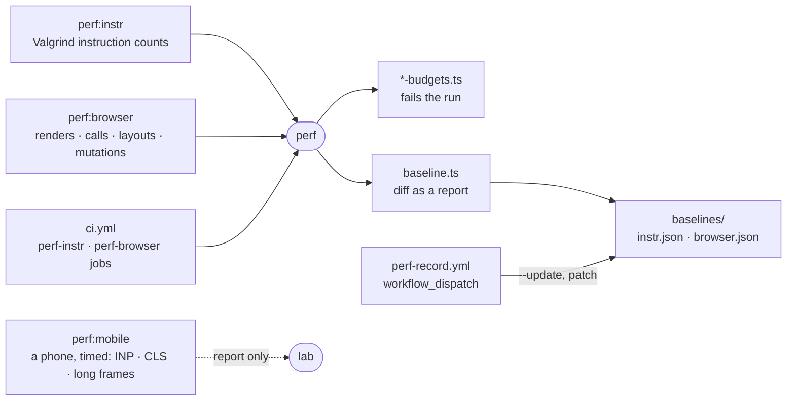

# perf

Performance checks that count work instead of timing it, failing only on a few declared budgets and reporting every other count against a baseline checked into this package, beside a timed phone lab that finds what a phone pays and never fails anything.


```mermaid
flowchart LR
    instr["perf:instr<br/>Valgrind instruction counts"] --> perf(["perf"])
    browser["perf:browser<br/>renders · calls · layouts · mutations"] --> perf
    mobile["perf:mobile<br/>a phone, timed: INP · CLS · long frames"] -.->|"report only"| lab(["lab"])
    perf --> budgets["*-budgets.ts<br/>fails the run"]
    perf --> judge["baseline.ts<br/>diff as a report"]
    judge --> files["baselines/<br/>instr.json · browser.json"]
    ci["ci.yml<br/>perf-instr · perf-browser jobs"] --> perf
    record["perf-record.yml<br/>workflow_dispatch"] -->|"--update, patch"| files
```

- `perf:instr` runs each pure-JS hot path (`code-read`'s line counts, the workspace ignore walk, fuzzy ranking,
  the transcript fold) under `valgrind --tool=cachegrind` twice, setup only and setup plus work, and keeps the
  difference. `node --predictable`, fixed heap sizes and seeded fixtures make the count repeat.
- `perf:browser` starts `_site/demo` with its own Vite and counts Vue renders, V8 calls, layouts, style recalcs and
  DOM mutations per interaction, under a paused Playwright clock and a forced flush after every step.
- A run fails only on a budget (`src/instr/instr-budgets.ts`, `src/browser/browser-budgets.ts`): a one-directional
  claim about what an event costs, set well above today's reading, with the claim and the reason for its limit beside
  it. Today they are renders per idle clock tick, renders per keystroke in the composer, a repeat ignore walk at most a
  tenth of the first, and incremental quick-open ranking at most 60% of re-ranking from scratch. A new budget encodes a property
  someone would defend, not a number that happened to be measured.
- Every other count is a report: the diff against `baselines/` goes to stdout and, in CI, to the job summary, and
  never fails the job. A baseline that failed on every move was re-recorded four times in its first 28 hours by
  whoever the failed run landed on, which is what a golden master turns into.
- The baseline records the host it was taken on. A different Node, V8 flags, architecture or CPU (instruction track),
  or browser version (browser track), shows the diff without comparing it. Budgets are judged on any host.
- A baseline is re-recorded only by `.github/workflows/perf-record.yml`, dispatched by hand, on the runner class the
  CI jobs judge on. It uploads the diff as a patch, which is committed with the change the numbers describe.
  `--update` refuses to run anywhere else. Valgrind is Linux-only, so run the instruction track in a sandbox or in CI.
- To add an instruction scenario, add a file to `src/instr/scenarios/` exporting `scenario`. Its work must throw when
  its result is wrong, so a count never comes from work that stopped early.

## The phone lab (`perf:mobile`)

The two tracks above count; this one times, which is why it is a lab and never a gate. It answers "what does a phone
pay": the demo built for production (`vite build`, sourcemaps on, into a temp directory, never the dev server's one
module per file), served with brotli and immutable assets, and driven in Chromium as a Galaxy S10-class Android — a
412×869 touch viewport at DPR 2.625, the width PostHog's web vitals report for the owner's phone — with the CPU slowed
four times (`--cpu`), Lighthouse's own mobile setting. The network is not throttled: what a run shows is the CPU's
share, the part the app decides.

- Scenarios (`src/mobile/scenarios.ts`): a cold start on the board, a returning one (reloaded with what the first
  visit stored and cached, which is the start a phone's owner mostly has), the board left idle, a tap on a card into a long
  conversation (the fixture's rows copied up to `--rows`, 140 by default, with markdown, a table and TypeScript in every
  second answer), flinging through it, and typing in its composer.
- Each reports what a reader feels, read off the page's own observers: first and largest paint; each interaction's
  INP with its input delay, processing and presentation; layout shift with the nodes that moved; long tasks; and long
  animation frames with the scripts that ran in them. Event timings under 16ms are not reported by the browser, so a
  quick keystroke is not in the count.
- `--profile` records a V8 CPU profile of each measured action, writes it where DevTools opens it (`--out`), and
  attributes its self time through the build's sourcemaps to packages and source lines (`src/mobile/attribution.ts`).
- `--replay` runs the app's real PostHog SDK and session recorder against a local stand-in (`src/mobile/wire.ts`), so
  what recording costs the page is measured and nothing leaves the machine.
- `--dist DIR` measures a build made elsewhere, which is how two revisions are compared: build each, measure both on the
  same machine in the same sitting. Timings move with the machine and its load; `--runs N` reports the median.

2026-09-30: built to chase a Galaxy S10's field INP of 842ms (p75) and CLS of 0.93. Its first runs found SMIL spinners
holding the main thread half busy on an idle board, a chat opening as one multi-second task, a forced layout per prompt,
and a header that re-laid itself out after the first paint; a timed lab was chosen over another counted budget because
those costs are a phone's CPU time, which only a throttled clock shows.

## Key files

- [src/baseline.ts](src/baseline.ts) — judges a run's budgets and reports its diff against a baseline, for both tracks.
- [src/browser/browser-budgets.ts](src/browser/browser-budgets.ts) — the browser track's budgets, each with its claim.
- [src/mobile/scenarios.ts](src/mobile/scenarios.ts) — what the phone lab times, and how each run reads its numbers.
- [src/instr/scenarios](src/instr/scenarios) — one file per instruction scenario, found by name.
- [src/browser/session.ts](src/browser/session.ts) — the fresh context, paused clock and flush that make counts exact.
- [src/browser/scenarios.ts](src/browser/scenarios.ts) — the interactions the browser counts cover.

## Commands

```sh
pnpm perf:instr                      # every scenario; --only <name>, --runs 3 for the spread
pnpm perf:browser                    # same flags
pnpm perf:mobile                     # the phone lab; --only, --runs, --cpu, --rows, --replay, --profile, --dist
gh workflow run perf-record.yml -f track=browser   # re-record (instr, browser or both), then apply its patch
```
