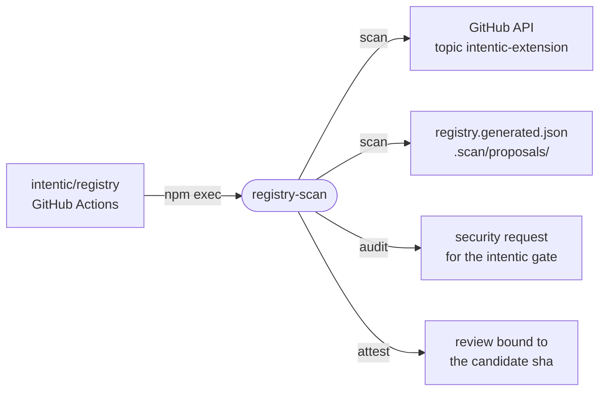

# registry-scan

The CLI behind the extension registry: it finds topic-tagged extension repos, refreshes their facts, proposes listings, and prepares the security audit that admits new code.



- Runs in the registry repository's workflows, which [seed/](seed) holds, pinned to one exact published version. Nothing in this repo runs it.
- `scan` reads `.claude-plugin/marketplace.json`, searches GitHub for the `intentic-extension` topic and reads each repo's root `intentic-extension.json` at an exact commit. It rewrites the facts file in place and leaves one directory per new extension under `.scan/proposals/`, holding a candidate `marketplace.json` and the pull request's text, so the workflow only moves whole files.
- Nothing merges automatically. A proposal enters as `trust: "listed"`, `verified` is a separate human edit, and delisting stays manual. Gone, archived or broken listings become warnings for a maintainer.
- `audit` validates a registry diff and lists every changed executable source; `attest` records a passing gate run against those exact shas. Registry content is untrusted data, and no author code runs anywhere in the chain.
- `github.ts` sits behind an interface, so the decision logic in `scan.ts` is tested with no network or token.

## Key files

- [src/cli.ts](src/cli.ts) — the `scan`, `audit` and `attest` commands and their inputs.
- [src/scan.ts](src/scan.ts) — discovery, fact refresh and listing proposals.
- [src/audit.ts](src/audit.ts) — admission problems, audit targets and the attestation.
- [src/outputs.ts](src/outputs.ts) — everything the scan writes for the workflow to pick up.

## Commands

```sh
pnpm --filter @intentic/registry-scan test
GITHUB_TOKEN=… REGISTRY_DIR=<registry checkout> pnpm --filter @intentic/registry-scan scan   # after build
```
