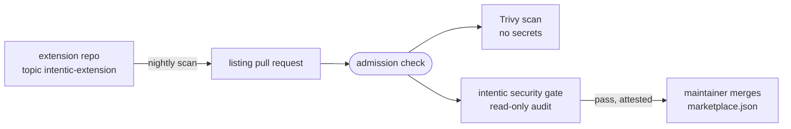

# intentic extension registry

The curated list of intentic extensions, plus the workflows that discover new ones nightly and admit their code only after a read-only security audit.

- [.claude-plugin/marketplace.json](.claude-plugin/marketplace.json) is the curated list. The scan commits derived facts to `.claude-plugin/registry.generated.json` on the default branch without review.
- [scan.yml](.github/workflows/scan.yml) runs nightly or by hand and opens one pull request per newly found extension. Entries arrive as `trust: "listed"`; `verified` is a later human edit. A closed proposal returns the next night, so keep an entry out by listing it as `blocked` with a reason.
- [extension-admission.yml](.github/workflows/extension-admission.yml) is the `admission` check on every pull request. It never checks out or runs pull request code. Trivy scans the exact source in a job with no secrets, the intentic gate audits it, and a pass is committed back onto the pull request so the check runs again on the attested head.
- The gate is an intentic sandbox built from [.intentic/registry-gate.sandbox.toml](.intentic/registry-gate.sandbox.toml). It clones this repository, runs the `extension-security-gate` workflow in [.intentic/config/workflows.json](.intentic/config/workflows.json), and holds no connection but its model.

## Setup

1. Set the repository variable `REGISTRY_SCAN_VERSION` to one exact published version of [@intentic/registry-scan](https://www.npmjs.com/package/@intentic/registry-scan).
2. Install a GitHub App on this repository; set `REGISTRY_APP_ID` as a variable and `REGISTRY_APP_PRIVATE_KEY` as a secret. Its commits and pull requests trigger the admission check, which the workflow token's would not.
3. Start the gate sandbox and store its address as the secret `INTENTIC_EXTENSION_GATE_URL`.
4. Create a `listing` label, and make `admission` a required check on the default branch.
