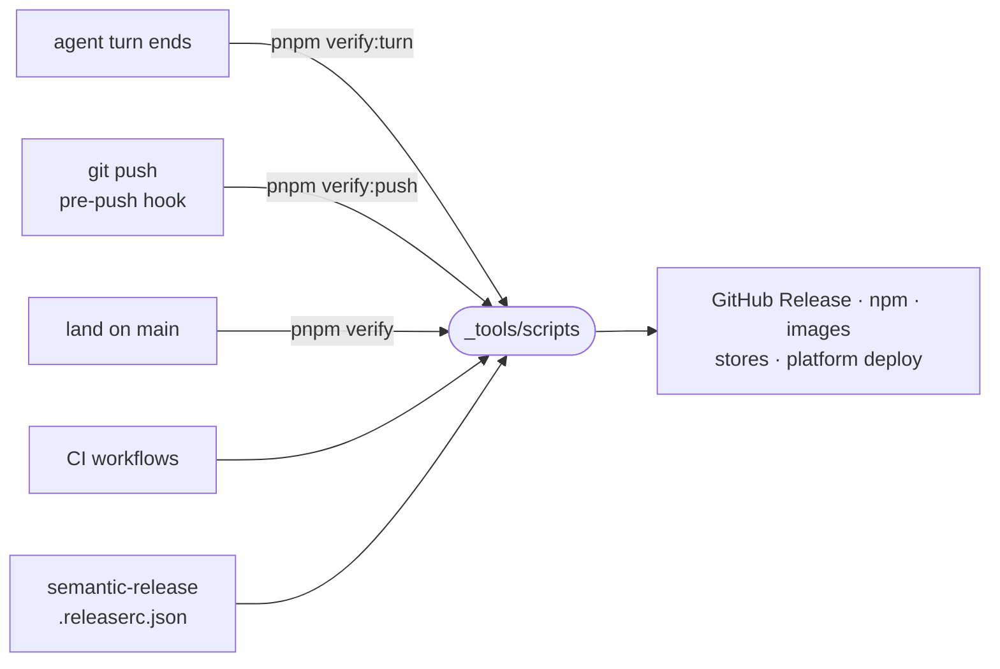

# scripts

Repo-wide maintainer scripts: the verify gates, builds, releases, image and platform publishing, and CI helpers, started from root `package.json` scripts, git hooks and workflows.



- Three gates, one per moment. `verify:turn` judges only what a turn touched against its main-line base: checks, lint on changed files, the assertion ratchet, and typecheck plus tests over the affected packages. `verify` runs the whole repo after a land and records its verdict per tree (`lib/tree-verdict.mjs`). `verify:push` runs the cheap tiers and replays that verdict for the same tree, leaving an unmeasured tree to CI unless given `--suite`.
- Every gate runs each independent step and prints all failures in one digest (`lib/steps.mjs`), sized to fit what a turn's Stop quotes back.
- A release is semantic-release on `main`: `release-prepare.sh` checks the artifacts CI built, then `publish-github.sh`, `release-images.sh` and `ship-stable.sh`, which moves `stable` last. `rollback-stable.sh`, run from the manual `rollback.yml` workflow, moves it back.
- Versions are stamped in CI only (`release/set-versions.sh`); the repository keeps `0.0.0`. `lib/packages.sh` is the one list of published npm packages.

## Layout

| Directory | What lives there |
| --- | --- |
| [verify/](verify) | the turn, push and full-repo gates, affected packages, failure units, flake re-runs, test worker sizing |
| [release/](release) | semantic-release hooks, npm, GitHub, Microsoft Store and Chrome Web Store publishing, stable promotion and rollback |
| [build/](build) | cross-compiled binaries (`ic`, machine agents, Windows launcher), signing, declaration emit, output cleaning, `move-files.mjs` |
| [image/](image) | sandbox image trees and Dockerfile composition, image publish, smoke tests, multi-arch manifests, tag promotion |
| [platform/](platform) | api and web image release, the platform and ingress deploys |
| [desktop/](desktop) | desktop installer builds and install/update checks, `try-onboarding.mjs` |
| [ci/](ci) | git hooks, runner setup, provider CLI installs, CI failure audit, SDLC scoreboard |
| [engines/](engines) | agent engine version pins and the bumper behind `engines.yml` |
| [lib/](lib) | shared shell and JS helpers: repo root, git, GitHub, registry retries, the publish set, gate steps |
| [fonts.mjs](fonts.mjs) | downloads the served webfonts and writes their `@font-face` rules |

## Commands

```sh
pnpm verify:turn          # what this turn touched
pnpm verify:push          # the push gate; also the pre-push hook
pnpm verify               # the whole repo
pnpm build:sandbox        # a local sandbox image, intentic-sandbox:dev
pnpm try:onboarding       # rehearse the Windows onboarding from this branch
pnpm ci:audit             # group recent CI failures by step
```
