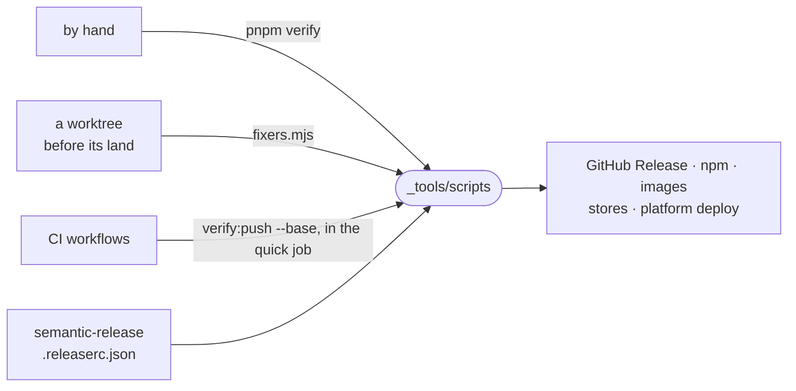

# scripts

Repo-wide maintainer scripts: the verify checks, builds, releases, image and platform publishing, and CI helpers, started from root `package.json` scripts, the commit-msg hook and workflows.


```mermaid
flowchart LR
    hand["by hand"] -->|"pnpm verify"| scripts(["_tools/scripts"])
    worktree["a worktree<br/>before its land"] -->|"fixers.mjs"| scripts
    ci["CI workflows"] -->|"verify:push --base, in the quick job"| scripts
    semrel["semantic-release<br/>.releaserc.json"] --> scripts
    scripts --> out["GitHub Release · npm · images<br/>stores · platform deploy"]
```

- The machine fixers run on a conversation's own worktree before its land, so what they write rides that land:
  `node _tools/scripts/verify/fixers.mjs --worktree <dir> --paths a,b` (or `--paths-file <file>`, or `--since <rev>`)
  runs rustfmt on the touched crates, tightens the baselines the change beat, and rewrites the contract lock and the
  stored shapes when the change reached their sources. Each is idempotent. It prints `{"ran":[…],"wrote":[…]}` and
  exits 0. Nothing runs them on the main tree unasked.
- Two verify scripts, and none of them holds back a land, a commit or a push. `verify` measures the whole repository
  the way CI's verify groups do, when someone runs it by hand, and applies no fixer. `verify:push` is the push check:
  CI's `quick` job runs it on every push (`--base <sha>`, the commit the push is measured against), and by hand it
  measures the branch against its upstream. It runs the checks with a `tidy` finding counted only when the range added
  it, the assertion ratchet over the range's test files and the linter over the files it changed, and by hand also the
  manifest/lockfile lockstep and rustfmt on the crates it touched; it exits non-zero on a finding. What a range brought
  in is read one way (`verify/measure-change.mjs`: oxlint's lines, and the tidy checks judged against the range's base
  with its `Allow:` trailers).
- `verify` waits for the sandbox's heavy slot however it is started (`lib/heavy-slot.mjs`), and sizes its workers and
  task counts to the memory free when they start (`verify/test-workers.mjs`). Every bun test process, in `suites` and
  in the re-runs of failures alone, is held under a memory ceiling (`lib/memory-ceiling.mjs`) that kills and names a
  runaway suite.
- Every verify script runs each independent step and prints all failures in one digest at the end of its output (`lib/steps.mjs`).
- A release is semantic-release on `main`: `release-prepare.sh` checks the artifacts CI built, then `publish-github.sh`, `release-images.sh` and `ship-stable.sh`, which moves `stable` last. `rollback-stable.sh`, run from the manual `rollback.yml` workflow, moves it back and marks the release it left withdrawn (a pre-release whose notes open with `Withdrawn: <reason>`, which sandboxes running it are told).
- Versions are stamped in CI only (`release/set-versions.sh`); the repository keeps `0.0.0`. `lib/packages.sh` is the one list of published npm packages.

## Layout

| Directory | What lives there |
| --- | --- |
| [verify/](verify) | `verify` and `verify:push`, the fixers, affected packages, failure units, re-runs of flaky and failing tests, test worker sizing |
| [release/](release) | semantic-release hooks, npm, GitHub, Microsoft Store and Chrome Web Store publishing, stable promotion and rollback |
| [build/](build) | cross-compiled binaries (`ic`, machine agents, Windows launcher), signing, declaration emit, output cleaning, `move-files.mjs` |
| [image/](image) | sandbox image trees and Dockerfile composition, image publish, smoke tests, multi-arch manifests, tag promotion |
| [platform/](platform) | api and web image release, the platform and ingress deploys |
| [db/](db) | the check `db:up` and `db:reset` run before migrating (`verify-target.mjs`): that `DATABASE_URL` reaches the compose service's own Postgres |
| [desktop/](desktop) | desktop installer builds and install/update checks, `try-onboarding.mjs` |
| [ci/](ci) | git hooks, runner setup, provider CLI installs, CI failure audit, SDLC scoreboard |
| [engines/](engines) | agent engine version pins and the bumper behind `engines.yml` |
| [lib/](lib) | shared shell and JS helpers: repo root, git, GitHub, registry retries, the publish set, gate steps |
| [fonts.mjs](fonts.mjs) | downloads the served webfonts and writes their `@font-face` rules |

## Commands

```sh
pnpm verify               # the whole repo, the way CI's verify groups measure it
pnpm verify:push          # the push check, the branch against its upstream; CI's quick job runs it with --base
pnpm build:sandbox        # a local sandbox image, intentic-sandbox:dev
pnpm try:onboarding       # rehearse the Windows onboarding from this branch
pnpm ci:audit             # group recent CI failures by step
```
