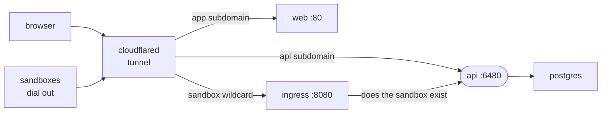

# Self-hosted platform

A Docker Compose stack that runs the intentic platform on a host of your own: Postgres, the api, the web app and the sandbox edge, published through a Cloudflare tunnel.

- It runs sign-in, the sandbox registry and setup; the sandboxes themselves run elsewhere.
- Every optional setting passes through empty, and the api reads empty as unset, so defaults live only in [config.ts](../../../_platform/api/src/config.ts). Compose forwards only what it names: a new config field needs its line in [docker-compose.yml](docker-compose.yml) too.
- Optional lanes switch on with their credentials: the free trial, hosted sandboxes on Fly, the paid hosted plan, the `/admin` surface (`ADMIN_EMAILS`), invite email and tracing. [.env.example](.env.example) explains each one.
- Without the `ingress` service and `INGRESS_SIGNING_KEY`, no sandbox can be made reachable and setup offers only the attach lane. This file runs the edge on one host; a platform with hosted sandboxes runs it on Fly instead ([ingress](../../../_platform/ingress)).

## Setup

1. `cp .env.example .env`. Generate `BETTER_AUTH_SECRET` and `SECRETS_KEY` with `openssl rand -base64 48`, and keep `POSTGRES_PASSWORD` URL-safe.
2. Google sign-in uses the client whose id is `GOOGLE_CLIENT_ID` in [constants](../../constants/src/index.ts). Put its id and secret in `.env` and authorize `WEB_ORIGIN` as a JavaScript origin and `API_URL/api/auth/callback/google` as a redirect URI.
3. Make an Ed25519 pair with `openssl genpkey -algorithm ed25519 -out ingress-key.pem` and `openssl pkey -in ingress-key.pem -pubout`. The private half goes in `INGRESS_SIGNING_KEY`, the public half in `INGRESS_PUBLIC_KEY`, each on one line with `\n` escapes inside double quotes. Set `INGRESS_ZONE` and `INGRESS_URL`.
4. Create a Cloudflare tunnel, put its token in `PLATFORM_TUNNEL_TOKEN`, and add public hostnames: `app.<zone>` → `http://web:80`, `api.<zone>` → `http://api:6480`, and both `ingress.<INGRESS_ZONE>` and `*.<INGRESS_ZONE>` → `http://ingress:8080`.
5. `docker compose up -d`. The api applies migrations before it serves.
