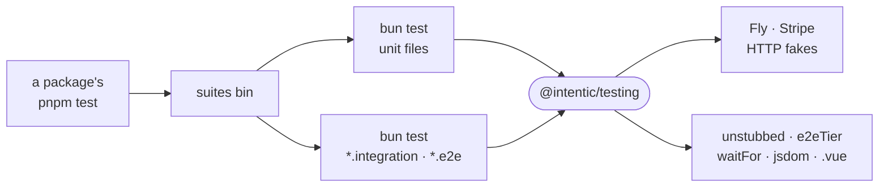

# testing

The test support every package's suites share: the `suites` runner behind each `test` script, fakes for Fly and Stripe, and helpers `bun test` lacks.



- `suites` runs two `bun test` passes because the two kinds need different budgets: unit files get a short hang-detector timeout, `*.integration.test.*` and `*.e2e.test.*` files get room for real work. Positional arguments filter by path; `SUITES_JUNIT_DIR` adds JUnit reports, from which the verify scripts read each failing test.
- Every bun process a `suites` run starts is held under a memory ceiling, 6 GiB unless `TEST_MEMORY_CEILING_MB` says otherwise (`_tools/scripts/lib/memory-ceiling.mjs`). A process past it is a suite keeping memory it never releases: the run is killed there and says so, instead of swapping a shared machine to a halt. Stopping `suites` stops its bun workers too, though they sit in process groups of their own.
- Each package's `bunfig.toml` preloads `src/bun-preload.ts`, so a file run with plain `bun test` gets the same budget.
- `unstubbed` stands in for a wide interface: any member the test did not provide throws when called, naming its full path.
- `e2eTier` gates a costly suite behind an opt-in switch plus its credentials. With the switch on and a secret missing it skips and names the secret, so a nightly run with partial credentials stays green.
- The fakes hold state and refuse what the real service refuses: `fly-fake` models exactly the Fly Machines calls the platform makes, `stripe-fake` runs a Stripe server that signs its webhooks.
- Consumed from source as a devDependency; nothing here ships.

## Key files

- [bin/suites.mjs](bin/suites.mjs) — the two-pass test runner every package's `test` script calls.
- [src/index.ts](src/index.ts) — `unstubbed`, the self-naming stand-in.
- [src/e2e.ts](src/e2e.ts) — `e2eTier`: whether a gated suite runs, and what it is missing.
- [src/bun.ts](src/bun.ts) — `waitFor` on the real clock, async timer advance, env and global stubs that restore.
- [src/fly-fake.ts](src/fly-fake.ts) — the stateful Fly Machines API over `fetch`.

## Commands

```sh
pnpm --filter @intentic/testing test
pnpm --filter <package> test <path filter>   # only the files whose path matches
```
