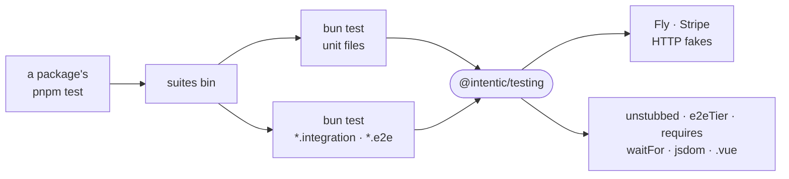

# testing

The test support every package's suites share: the `suites` runner behind each `test` script, fakes for Fly and Stripe, and helpers `bun test` lacks.


```mermaid
flowchart LR
    script["a package's<br/>pnpm test"] --> suites["suites bin"]
    suites --> unit["bun test<br/>unit files"]
    suites --> slow["bun test<br/>*.integration · *.e2e"]
    unit --> testing(["@intentic/testing"])
    slow --> testing
    testing --> fakes["Fly · Stripe<br/>HTTP fakes"]
    testing --> helpers["unstubbed · e2eTier · requires<br/>waitFor · jsdom · .vue"]
```

- `suites` runs two `bun test` passes because the two kinds need different budgets: unit files get a short hang-detector timeout, `*.integration.test.*` and `*.e2e.test.*` files get room for real work. Positional arguments filter by path; `SUITES_JUNIT_DIR` adds JUnit reports, from which the verify scripts read each failing test.
- No run discovers a test under build output: `node_modules`, `dist`, `deploy`, `.cache`, `.turbo`, `out-tsc`, the package bunfig's own `pathIgnorePatterns`, and every directory git ignores under the package. `suites` passes the whole list on every run, because a `--path-ignore-patterns` on bun's command line replaces bunfig's list instead of adding to it.
- Every bun process a `suites` run starts is held under a memory ceiling, 6 GiB unless `TEST_MEMORY_CEILING_MB` says otherwise (`_tools/scripts/lib/memory-ceiling.mjs`). A process past it is a suite keeping memory it never releases: the run is killed there and says so, instead of swapping a shared machine to a halt. Stopping `suites` stops its bun workers too, though they sit in process groups of their own.
- How many bun workers a run starts is decided as it starts. A `TEST_WORKERS` the caller sets wins. On a CI host with a test memory pool (`TEST_SLOTS_DIR`, `TEST_SLOTS`: `_tools/scripts/lib/test-memory-pool.mjs`) the run asks for a worker per 20 files, at most `TEST_WORKERS_MAX` (6), and starts the workers the slots it got pay for, one at least; a package whose workers are heavy says so in its `test` script, `suites --worker-gib=3` for the web. A run that wants three workers or more and gets less than half of them waits up to `TEST_SLOTS_WAIT` seconds for room, because bun fixes its worker count when it starts. Anywhere else a lone run sizes itself to the free memory.
- On CI (`CI=true`) `suites` reads bun's output as it passes it through and ends a run that has stopped printing (`_tools/scripts/lib/bun-progress.mjs`). Once bun has been silent for longer than the per-test timeout, no test can still be running. If every file has reported and the processes are idle, bun is stuck on its way out: the run is killed and keeps the verdict its output gave. A run silent for ten minutes is killed and fails, naming the files that never reported. Locally bun keeps the terminal.
- Each package's `bunfig.toml` preloads `src/bun-preload.ts`, so a file run with plain `bun test` gets the same budget.
- `.vue` files load through `src/bun-vue.ts`, which keeps each compiled component in `~/.cache/intentic-vue-sfc` (`VUE_SFC_CACHE_DIR` moves it), keyed by the compiler's version and the file's path and bytes. `--isolate` gives every test file a fresh module registry, so without it every component was compiled again for every file that imports it: 980 compiles of 119 components across 40 web files.
- `unstubbed` stands in for a wide interface: any member the test did not provide throws when called, naming its full path.
- `e2eTier` gates a costly suite behind an opt-in switch plus its credentials. With the switch on and a secret missing it skips and names the secret, so a nightly run with partial credentials still passes.
- `requires(condition, why)` (`@intentic/testing/requires`) is for a test that needs something of the machine: a binary, a kernel setting, a built `dist`. Locally it stands down with the missing thing in its title, and `suites` counts what stood down once the run ends. On CI (`CI` set) it registers a failing test naming the requirement instead, because CI provides the condition on purpose and a skip there is a test that stopped running unseen. Use it with `test.skipIf(!needs.runs)(needs.title("…"), …)`. A requirement CI goes without on purpose (a tool the ci-base image does not carry, a privilege its containers lack) passes `{ absentOnCi: "<why>" }`, and stands down there too, titled and counted, rather than failing. A requirement that only one CI job provides (a privileged container, a browser, the iq models) names that job's lane, `{ lane: "machine" }`: the job sets `INTENTIC_CI_LANE` to it and runs the file, and there a missing requirement fails as anywhere on CI, while every other CI job stands the test down, titled with the lane. The workflow-policy check (`_tools/checks/workflow-policy.mjs`) refuses a lane no job sets while naming the file.
- The fakes hold state and refuse what the real service refuses: `fly-fake` models exactly the Fly Machines calls the platform makes, `stripe-fake` runs a Stripe server that signs its webhooks.
- Consumed from source as a devDependency; nothing here ships.

## Key files

- [bin/suites.mjs](bin/suites.mjs) — the two-pass test runner every package's `test` script calls.
- [src/index.ts](src/index.ts) — `unstubbed`, the self-naming stand-in.
- [src/e2e.ts](src/e2e.ts) — `e2eTier`: whether a gated suite runs, and what it is missing.
- [src/requires.ts](src/requires.ts) — `requires`: a machine condition that stands a test down locally and fails it on CI.
- [src/bun.ts](src/bun.ts) — `waitFor` on the real clock, async timer advance, env and global stubs that restore.
- [src/fly-fake.ts](src/fly-fake.ts) — the stateful Fly Machines API over `fetch`.

## Commands

```sh
pnpm --filter @intentic/testing test
pnpm --filter <package> test <path filter>   # only the files whose path matches
```
