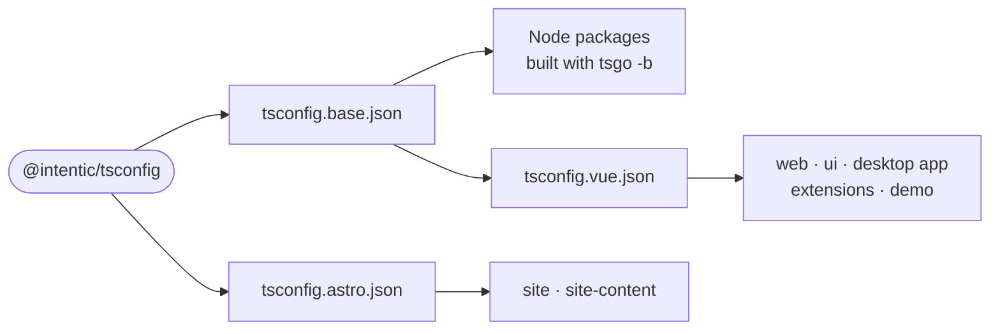

# tsconfig

The shared TypeScript compiler settings every workspace package extends: a strict NodeNext base, a Vue variant for browser code, and an Astro variant for the site.

- A package's own `tsconfig.json` names one of these in `extends` (`@intentic/tsconfig/tsconfig.base.json`) and adds only its paths, `types` and emit choices.
- The base is strict beyond `strict`: `noUncheckedIndexedAccess`, `exactOptionalPropertyTypes` and `noPropertyAccessFromIndexSignature` are on. It emits composite projects with declarations, which the root `tsconfig.libs.json` builds as one `tsgo -b` graph.
- `customConditions` holds `@intentic/src`, the export condition that points a workspace package at its `src/` instead of `dist/`, so a typecheck reads current source without building dependencies first. `suites` runs tests under the same condition.
- The Vue variant switches to bundler resolution with DOM libraries, emits no declarations, and turns `exactOptionalPropertyTypes` off.
- Nothing to build or run; packages list it as a devDependency.

## Key files

- [tsconfig.base.json](tsconfig.base.json) — the strict base every Node package extends.
- [tsconfig.vue.json](tsconfig.vue.json) — the Vue apps, the UI library and the extensions.
- [tsconfig.astro.json](tsconfig.astro.json) — the Astro site packages.
