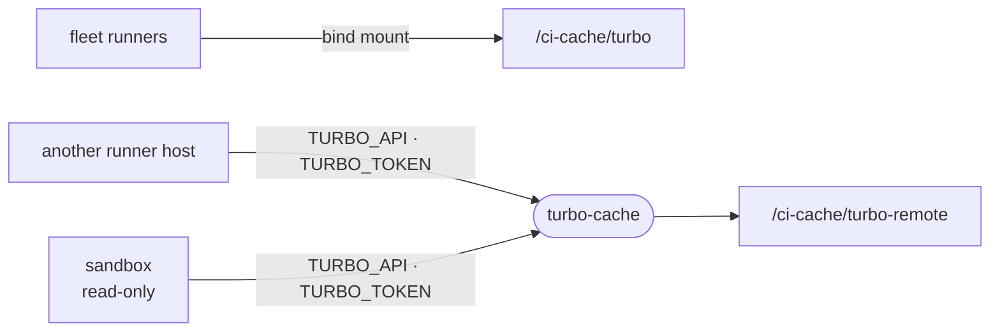

# turbo-cache

A Turborepo remote cache for the CI fleet host, so machines outside the runners' shared cache directory replay the same build artifacts.

- [docker-compose.yml](docker-compose.yml) runs one `ducktors/turborepo-remote-cache` container that stores artifacts on the host's disk beside the runners' own cache.
- Every reader and writer presents the same token: `TURBO_TOKEN` on the host, and the same value as the repository secret `TURBO_TOKEN`.
- It listens on `127.0.0.1:3000` only, so a machine elsewhere reaches it through a proxy or tunnel you put in front.
- The server never prunes. Age out old artifacts with `find /ci-cache/turbo-remote -mtime`.

## Pointing turbo at it

1. On the fleet host, in this directory: `TURBO_TOKEN=<token> docker compose up -d`.
2. In the repository settings, set the variables `TURBO_API` (the cache's URL) and `TURBO_TEAM`, and the secret `TURBO_TOKEN`. The CI, verify and release workflows hand all three to turbo; left empty, turbo uses `/ci-cache/turbo` alone.
3. Elsewhere, export the same three. A reader that must not write, such as a sandbox, also sets `TURBO_REMOTE_CACHE_READ_ONLY=1`.
