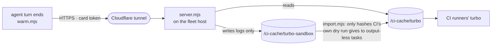

# turbo-cache

Lets CI reuse the typecheck results sandboxes already computed. When an agent's turn ends, its typecheck passes go to a cache server on the CI fleet host. When the push arrives, CI copies the ones that match its own tree into its turbo cache, so those typechecks are cache hits instead of minutes of work.

```mermaid
flowchart LR
    turn["agent turn ends<br/>warm.mjs"] -->|"HTTPS · card token"| tunnel(["Cloudflare tunnel"])
    tunnel --> server["server.mjs<br/>on the fleet host"]
    server -->|"reads"| ci[("/ci-cache/turbo")]
    server -->|"writes logs only"| sb[("/ci-cache/turbo-sandbox")]
    sb -->|"import.mjs: only hashes CI's<br/>own dry run gives to output-less tasks"| ci
    ci --> runners["CI runners' turbo"]
```

## Why it is safe to let a sandbox write

A sandbox runs an agent's code, and the fleet's cache feeds published images. So a sandbox can only ever vouch for a result. It can never supply a file.

- **Logs only.** The server keeps an upload only if every entry in it is a task log (`<pkg>/.turbo/turbo-<task>.log`). It writes a fresh tar of those logs rather than storing the bytes it was sent. It also refuses a log containing a line GitHub would run as a workflow command (`::add-mask::`, `##[…`), since CI prints replayed logs to the job's output. See [artifact.mjs](artifact.mjs).
- **Kept apart.** The server writes only to `/ci-cache/turbo-sandbox`. It mounts the runners' `/ci-cache/turbo` read-only and never replaces an entry it can already find in either directory.
- **Taken only by name.** [import.mjs](import.mjs) runs in CI before a job's turbo run, with the same arguments. It asks turbo for a dry run of the job, then copies across an entry only when CI's own hash for CI's own checkout belongs to a task that declares no outputs (`typecheck`, `test`), and only as that task's own log, re-checked and re-written. An entry a sandbox filed under a build's hash is never read.

What remains is the risk the design accepts: a sandbox could claim a typecheck passed on a tree where it fails. That sandbox already writes the code being pushed.

## How a turn's results get there

[warm.mjs](warm.mjs) is a `turn` check in `.intentic/checks.json`, so it runs as an isolated Claude Code turn ends. It needs the `turbo-cache` connector card, and does nothing without it. It never reports a finding to the agent, and it gives up after 90 seconds.

1. It skips everything if `node_modules` was not installed from this checkout's `pnpm-lock.yaml`.
2. It sends the typecheck passes turbo already holds in its local cache for the changed packages. Turbo never uploads a local hit by itself.
3. It typechecks what is still missing, with the server as turbo's remote.
4. It files each pass under the `--only` hash as well. CI's `quick` job typechecks with `--only`, which gives a package a different hash whenever the change does not select its dependencies.

The hashes match because a sandbox and CI run the same turbo on the same lockfile with the same Node. For commit `6d4c368`, a sandbox's dry run reproduced every typecheck and build hash in CI's log. Test hashes match only with `CI=true`, which `turbo.json` hashes on purpose, so tests are not warmed today.

## Deploying it

On the fleet host, in the distro the runners use:

1. Copy this directory somewhere stable (the server imports only its own files).
2. `mkdir -p /ci-cache/turbo-sandbox`.
3. `TURBO_CACHE_TOKEN=<token> TUNNEL_TOKEN=<tunnel token> docker compose up -d` with [docker-compose.yml](docker-compose.yml). The tunnel's public hostname routes to `http://turbo-cache:3000`.
4. Connect the `turbo-cache` card in each sandbox: the hostname, and the same token.

CI needs nothing beyond its import steps (`quick` in `ci.yml`, and `verify.yml`). The server ages its own directory out after 14 days, as `pnpm-setup` does for the runners' cache.

## Files

- [server.mjs](server.mjs) — turbo's `/v8/artifacts` API over the two directories.
- [artifact.mjs](artifact.mjs) — the tar reader, the logs-only rule, and the re-writer.
- [store.mjs](store.mjs) — turbo's own filesystem-cache layout (`<hash>.tar.zst` beside `<hash>-meta.json`), written atomically.
- [import.mjs](import.mjs) — CI's side. [warm.mjs](warm.mjs) — the sandbox's side. [dry-run.mjs](dry-run.mjs) — what both ask turbo.
- [turbo.test.mjs](turbo.test.mjs) — the whole path with the real turbo on a fixture: a sandbox's typecheck becomes CI's cache hit, and its build never does.
