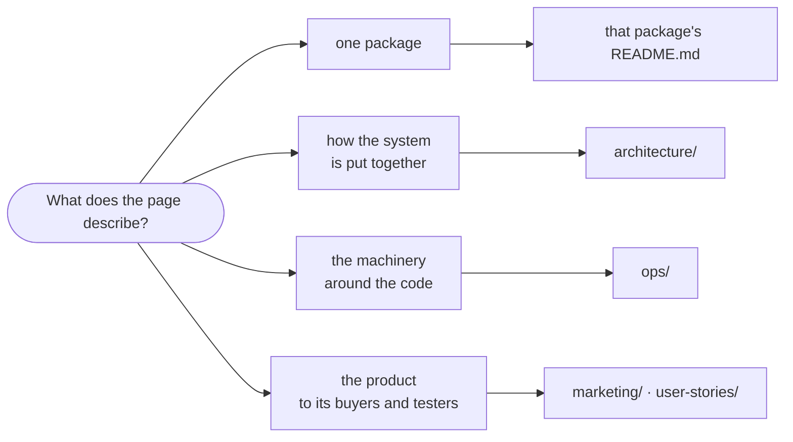

# Documentation

Where each kind of document in this repository belongs, so a new page lands beside the ones like it.

- **A package is documented by its own `README.md`**, updated in the same commit as the change that made it wrong. Nothing here repeats what a package README says.
- [`architecture/`](architecture) holds one page per subject of how the system fits together, indexed by [ARCHITECTURE.md](../ARCHITECTURE.md). `repo.json` is the authored map of parts, packages and glossary; `index.json` is generated from the package READMEs by `intentic-docs` and never edited by hand.
- [`ops/`](ops) holds how to run the machinery around the code: CI runners, release and store publishing, code signing, the CLI output protocol.
- [`marketing/`](marketing) holds positioning, messaging and the press kit. [`user-stories/`](user-stories) holds acceptance stories grouped by journey step, which the acceptance-testing surface reads. Both are product material, not engineering documentation.
- Anything about the workspace rather than this repository belongs in `/work/docs/`, outside this repository.
