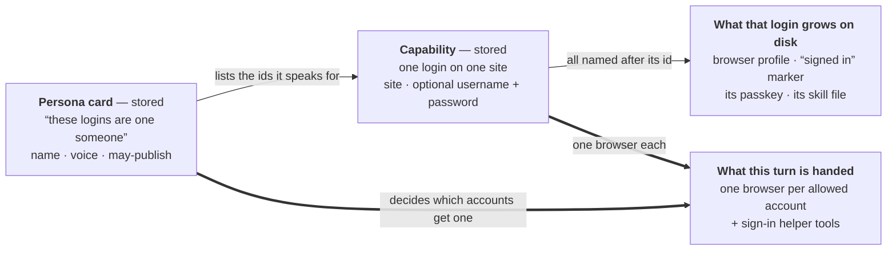
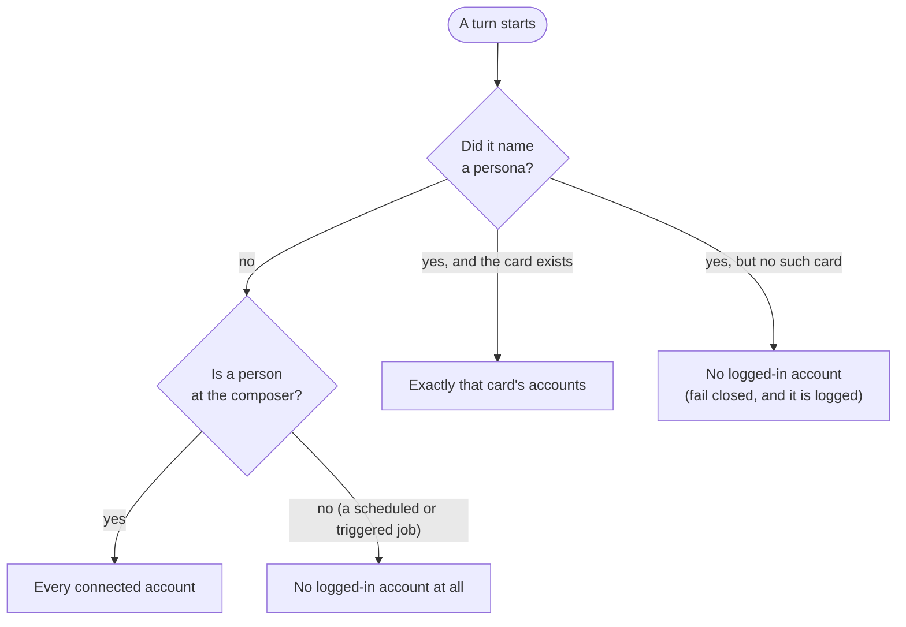

# Accounts and personas

Who the sandbox **is** when it acts outside — the model behind connected logins, the cards that group them,
and the rule that decides which of them a single turn may use.

Read this if you are about to touch anything that signs in somewhere, posts somewhere, or decides what an
unattended job is allowed to do.

## The short version

There are **two stored things** and **one derived thing**. That is the whole model.

| Word | What it really is | Where it lives |
| --- | --- | --- |
| **Capability** | One thing you connected. A GitHub token, a database, a VPN — and, for our purposes, **one login on one site**. | one entry in `.intentic/capabilities.json` |
| **Persona** | A card that says "these logins are the same someone", plus how that someone sounds and whether it may publish. | one entry in `.intentic/personas.json` (committed to git) |
| **Browser session** | *Not a thing you create.* It is the signed-in Chromium profile that a browser capability grows once somebody logs in. | files under `.intentic/browser/` |

And one word that people expect to find and **will not**: there is no **Identity** object. See
[What is deliberately not modelled](#what-is-deliberately-not-modelled).

## The one rule that keeps it simple

**Everything hangs off the capability's id.** You connect Reddit and name it `reddit-work`. That string is then:

- the folder its browser profile lives in,
- the name of the "is it signed in?" marker beside it,
- the file its passkey (its software security key) is kept in,
- the name of the skill file that teaches the agent about it,
- the prefix of every browser tool for it (`mcp__reddit-work__browser_click`),
- the id a persona card lists,
- the id an automation's persona resolves down to.

One key, used everywhere, minted once. That is why connecting the same site twice just works: `reddit-work` and
`reddit-personal` are two capabilities, two profiles, two skills, two tool sets, and removing one cannot touch
the other. Nothing is keyed by the *site* — keying by site is the version of this that breaks.

## How the pieces relate

Read it as: a capability is the account, the disk state is what that account grew, and a persona is a
**label over a group of accounts** that a turn can be pinned to.

## Connecting an account

Adding the capability does **not** sign you in. It writes the skill, makes sure the browser is in the image,
and marks the account *pending*. Signing in happens by one of two hands, into the very same profile:

- **Yours** — a live browser window streamed into the app; you click through the login like normal.
- **The agent's** — it drives that account's own browser, and the daemon types the stored username or password
  into the focused field for it. The agent never sees the password. If it signs *up*, the daemon generates the
  password and stores it on the card, so even a credential the agent caused to exist is one it never read.
  Stuck on a captcha or a phone check, it asks you to take over the live window for that one step.

Either way, the account is "connected" only when the marker file exists — a profile folder appears the moment
Chromium starts, so its presence proves nothing.

## What one turn is allowed to use

This is the part worth getting right, and it lives in one function so it cannot be re-derived differently in
five places. The question is always: *does anyone name a persona, and is anyone watching?*

The asymmetry is on purpose. A chat has a human who can see what is about to happen and stop it, so making
them pick a persona before "check our mentions" would tax every ordinary turn. A job firing at 3am has nobody,
and the mistake it can make — a public post from the wrong account — cannot be taken back. So the default flips
from *everything* to *nothing* exactly where the supervision stops.

Two details that matter:

- The narrowing happens **before** the browsers are built. An account this turn may not use gets no server, no
  Chromium and no opened profile — it is *absent*, not present-and-discouraged. That is the version that
  survives an agent misreading its instructions.
- Naming a card that does not exist denies everything. Falling back to "all accounts" would turn a typo into
  precisely the accident the layer exists to prevent — and a missing card is ordinary (a workspace cloned
  before its personas were committed).

## Two very different things both called "account"

The one confusion worth naming out loud, because the two words sit one line apart on the same form:

- **Which account pays** — the AI subscription that runs the turn (Claude, Gemini, …).
- **Which account acts** — the persona whose logins the turn may post from.

They are separate fields for a reason. Getting them swapped means pinning a nightly job to the right billing
and the wrong Reddit.

## What is deliberately not modelled

Worth knowing before you plan work on top of this:

**There is no Identity object.** A Gmail address can enter the sandbox three ways — as a website login, as a
mail inbox connector, as an AI provider sign-in — and **none of them knows about the others**. Nothing records
that a Reddit account was created *from* a particular mailbox. When the agent signs up somewhere and needs the
confirmation link, it is told in prose to go look in whatever inbox is connected; that link is guidance, not
data. If "one person, several accounts, one of them the mailbox the rest were born from" is something we want,
it is a feature to add — not a tangle to unpick.

**Personas fence browser logins only.** A persona narrows the signed-in *websites* and nothing else. Connector
credentials — GitHub, Discord, Slack, a mailbox — are handed to the shell of every turn regardless. So an
unattended job with no persona reaches no website account and still holds those tokens. The code says this is
where the next line changes when the connectors grow personas of their own.

**"May not publish" is advice, not a gate.** A persona marked draft-only adds a sentence to the turn's
instructions asking it to route outward things through the approvals queue. It shapes behaviour; it does not
block a tool. The approvals queue itself is the real mechanism.

**A persona is not a security boundary, and does not claim to be.** Its card holds no secret, which is exactly
what lets it be committed and reviewed like any other project config. What it prevents is the wrong-account
*mistake*. The place it genuinely bites is the unattended job, because there its default is nothing.

**The account's skill file stays loaded either way.** The tools for a disallowed account are gone, but the
skill that describes them is a project file and loads every turn. The failure is safe (the tool is simply not
there) and mildly confusing to read.

## Where it lives

| Piece | Files |
| --- | --- |
| The two shapes | [schemas.ts](../_sandbox/sandbox-contract/src/schemas.ts) — `CapabilitySchema` (`browser` kind) and `PersonaSchema` |
| The rule about which accounts a turn gets | [personas.ts](../_sandbox/sandbox/src/personas/personas.ts) |
| The disk state behind a login | [session-store.ts](../_sandbox/sandbox/src/browser/session-store.ts) |
| Adding / removing a site login | [handlers/browser.ts](../_sandbox/sandbox/src/capabilities/handlers/browser.ts) |
| The agent signing itself in | [accounts-tools.ts](../_sandbox/sandbox/src/browser/accounts-tools.ts) |
| Where the rule is applied to a turn | [turn-plan.ts](../_sandbox/sandbox/src/agent/turn-plan.ts) |
| The screens | [SandboxPersonas.vue](../_editor/web/src/pages/sandbox/SandboxPersonas.vue) (who this box is) · [Capabilities.vue](../_editor/web/src/pages/Capabilities.vue) (what it is signed into) |
