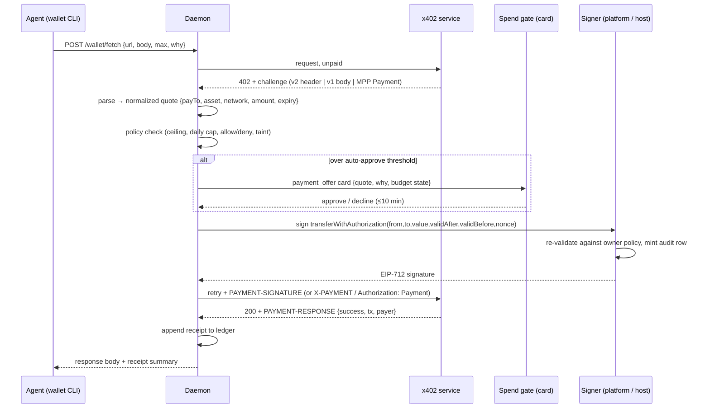
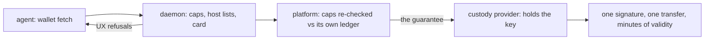

# Agent wallet: USDC spending over x402, researched against WunderCorp's BuilderStudio stack

**Status: phase 1 built** (2026-08-19). Parts 1 and 2 are the research this rests on; part 3 is the design,
and what shipped follows it: see "What was built" at the end for the file-level map and the two deliberate
substitutions. Phases 2–4 (budgets beyond the first band, discovery/reputation, other rails) are not built.

Written 2026-08-19. Companion to [services-integration-snowball.md](./services-integration-snowball.md),
whose "x402 fork" section (lines 139–195) anticipated this feature and whose conclusions this design
adopts: the spend gate is the product, the rail is a swappable back end, and the agent must never hold
keys. This note adds the missing halves: what a real vendor actually shipped, what protocol compliance
concretely requires, and the file-level design for this repo.

---

## Part 1, Research: how WunderCorp wires wallets into BuilderStudio

WunderCorp's agent-payments stack is discoverable but not marketed; none of it appears on
builderstudio.dev's landing page or FAQ. It was reconstructed from their public catalog repo
(`wundercorp/awesome-wundercorp`), their live gateway, and the client SDK they build on.

### The pieces

| Piece | What it is | Where |
|---|---|---|
| **BuilderStudio** | The agentic IDE. Its agents (Aurelius orchestrator, Hermes workers) consume paid endpoints | builderstudio.dev |
| **Wundership** | Their paid-agent services: app plan $1.00, preview package $5.00, image gen $1.00, listing-from-image $0.75, chat completions | api.wundership.com |
| **ArgentShell** | An MPP **proxy gateway** in front of Wundership: terminates 402 challenges, verifies payment credentials, forwards to origin, stamps receipts | argent.sh / mpp.argent.sh |
| **@wundercorp/argent** | A merchant-side smoke-test CLI: probes discovery docs, asserts the unpaid 402, optionally runs a paid flow, exports Postman collections | npm |
| **mppx** (by wevm, not WunderCorp) | The buyer-side SDK/CLI their rail is built for: wallet creation, automatic 402 handling, payment sessions | github.com/wevm/mppx |
| **MPPscan** | A public registry of machine-payable servers; ArgentShell is listed | mppscan.com |

### The protocol they actually use

Not x402. WunderCorp runs **MPP: the Machine Payments Protocol** (specs at paymentauth.org / mpp.dev,
IETF draft `draft-ryan-httpauth-payment`, stewarded by Tempo/wevm, with Stripe as the fiat rail). It is
the *other* HTTP-402 protocol. A live unpaid probe of their gateway returns:

```
HTTP/2 402
content-type: application/problem+json
www-authenticate: Payment id="D4cUSqDV…", realm="mpp.argent.sh",
  method="stripe", intent="charge",
  request="<base64: {"amount":"10000","currency":"usd",
    "methodDetails":{"networkId":"profile_…",
    "paymentMethodTypes":["card","link","crypto"]}}>",
  expires="2026-08-19T21:44:28Z", opaque="<base64 scope>"
```

So the challenge is carried in `WWW-Authenticate: Payment` (an HTTP auth scheme, not custom headers),
and the rail is **Stripe Shared Payment Tokens**: card, Link, and `crypto` (Stripe settles stablecoin,
which is where USDC enters their world). Their discovery document (`/machine-payments.json`) declares
the rail, prices, and per-resource metadata; agent cards and `llms.txt` cross-reference it.

### How a wallet gets wired (buyer side)

The mppx client is the design worth copying, independent of protocol:

1. **`mppx account create`**: generates a key, stores it **in the OS keychain**, never in a dotfile the
   agent process reads. Testnet accounts are auto-funded.
2. **Automatic 402 handling**: `Mppx.create({methods:[tempo({account})]})` patches global `fetch`; any
   402 with a parseable challenge is paid and retried without the model doing anything.
3. **Sessions**: for micropayments, a payment channel is opened against a canonical escrow contract and
   reused across requests (`--session auto`); custom escrows advertised by servers are **rejected unless
   explicitly opted in** (`allowCustomEscrow=true`): a deliberate trust default.
4. **Receipts**: every paid response carries a verifiable receipt; the server signs with its
   `MPP_SECRET_KEY`, and clients/gateways verify.
5. **Two rails, one challenge**, `method="stripe"` (SPT: card/Link/crypto) and `method="evm"`/`tempo`
   (onchain stablecoin) hang off the same challenge grammar; drafts exist for lightning, hedera,
   near-intents.

### Takeaways for us

- Keys live outside the agent's reach (keychain there; outside the container here).
- Payment is a **transport concern**, resolved at the fetch/proxy layer, not a model skill.
- Trust defaults are conservative (canonical escrow only, explicit opt-ins).
- Discovery is document-based and registry-indexed: an agent can find prices before spending.
- The merchant side is a gateway product; the buyer side is a signer + policy product. We are building
  the buyer side.

---

## Part 2, Compliance target: the x402 protocol

x402 (x402 Foundation under the Linux Foundation; members include AWS, Cloudflare, Anthropic, Circle) is
the rail this design targets, because it is where open supply is materializing: Cloudflare's gateway,
AWS CloudFront, Coinbase Commerce, Circle's agent stack, and Stripe (which supports x402 alongside its
own MPP). Protocol facts we must implement correctly, from the v2 specification:

### Wire format

| Direction | v2 (current) | v1 (still common in the wild) |
|---|---|---|
| Server → client, challenge | `402` + `PAYMENT-REQUIRED` header, base64 `PaymentRequired` | `402` + JSON body `{x402Version:1, accepts:[…]}` |
| Client → server, payment | `PAYMENT-SIGNATURE` header, base64 `PaymentPayload` | `X-PAYMENT` header |
| Server → client, settlement | `PAYMENT-RESPONSE` header, base64 `SettlementResponse` | `X-PAYMENT-RESPONSE` |

`PaymentRequired.accepts[]` entries: `scheme`, `network` (CAIP-2, e.g. `eip155:8453` = Base mainnet),
`amount` (atomic units: USDC has 6 decimals), `asset` (token contract), `payTo`, `maxTimeoutSeconds`,
`extra` (`{name:"USDC", version:"2"}` feeds the EIP-712 domain).

`PaymentPayload`: echoes the chosen requirement as `accepted`, plus scheme `payload`.

### The "exact" scheme on EVM (what USDC services use)

The payment is **not a transaction the buyer submits**. It is an offline **EIP-3009
`transferWithAuthorization`** authorization, signed as EIP-712 typed data:

```
TransferWithAuthorization {
  from, to, value(uint256), validAfter(uint256), validBefore(uint256), nonce(bytes32)
}
```

The merchant (or their facilitator, e.g. Coinbase's hosted one) verifies: signature, balance, exact
amount, time window, simulation: and settles onchain, paying the gas. The buyer therefore needs **no
ETH, no gas, no RPC writes**: only USDC balance and one EIP-712 signature per payment. Settlement lands
in ~2s on Base; the `SettlementResponse` carries `success`, `transaction` (tx hash), `network`, `payer`.

Client-side security duties the spec assigns us:

- 32-byte **random nonce** per authorization (replay prevention).
- Short `validBefore` (bound by the challenge's `maxTimeoutSeconds`; we additionally cap at 300s).
- Sign **exactly** the accepted requirement's `value`/`payTo`/`asset`: an authorization is a bearer
  instrument for exactly that transfer and nothing else; there is no "approve then hope".
- Never sign typed data whose fields came from anywhere but a parsed, validated challenge.

### Networks and assets (initial support)

| Network | CAIP-2 | USDC contract |
|---|---|---|
| Base mainnet | `eip155:8453` | `0x833589fCD6eDb6E08f4c7C32D4f71b54bdA02913` |
| Base Sepolia (test mode) | `eip155:84532` | `0x036CbD53842c5426634e7929541eC2318f3dCF7e` |

Solana (`exact` via `TransferChecked`) and further EVM chains are later additions behind the same
normalized quote type. There is also an **MCP transport** (`_meta["x402/payment"]`): relevant the day
we *sell* tools, not needed to buy.

### Interop stance

Internal types are v2-native (per this repo's no-legacy rule). v1 and the MPP `Payment` auth scheme are
**wire adapters only**: three parsers in, one normalized quote out. Dropping either adapter later
deletes a parser, nothing else.

---

## Part 3: Design for this sandbox

### Principles

1. **The agent never touches key material.** Same doctrine as `{{secret:…}}` and browser credentials:
   tools act on values the model cannot read. The container filesystem is explicitly not a boundary
   (secret-vault doctrine), so the key does not live in the container at all.
2. **Spending power is enforced by infrastructure, not by the model.** Policy is checked where the key
   lives; the daemon's checks are UX, the signer's checks are the guarantee. (Same posture AWS states
   for AgentCore Payments.)
3. **Consent per spend by default.** Budgets and auto-approve are explicit owner delegations, granted in
   settings, never inferred.
4. **The rail is a swappable back end.** Credits (platform services) and USDC (open web) coexist; the
   spend-gate card, ledger and meter are shared product surface.

### Custody: who holds the key

| Option | Boundary | Verdict |
|---|---|---|
| A. Platform signer, one wallet per owner | Different machine; reached with the connect token, which the agent's grant never covers | **Default.** Backed by a wallet-custody API (Coinbase CDP server wallets or Circle developer wallets) so the platform stores no raw keys either. Owner-scoped wallets, never pooled: funds are the owner's, which keeps the platform out of money-transmission territory |
| B. Owner's machine signer | The host bridge: sandbox asks, machine answers; scopes enforced machine-side in the host agent's policy | **Self-custody option.** A keystore on the owner's own computer; signing verb behind a `wallet.sign` scope with machine-side caps. Works offline from the platform |
| C. In-container vault | None: agent and daemon share the container as root | **Rejected**, per the vault's own file-header doctrine |

Both A and B present the same signer interface to the daemon:
`sign(authorization, requirement) → signature | refusal`, with **policy re-validated at the signer**
(per-payment max, daily cap, allowlist) so a compromised sandbox can at worst request what the owner
already permitted.

### The `wallet` capability

A new capability kind (the sixteen-kind registry makes the addition a compile-checked change), one
instance per sandbox, catalog card in the `business` category:

```jsonc
// .intentic/config/capabilities.json entry — agent-readable, like all manifests
{
  "id": "wallet",
  "kind": "wallet",
  "config": {
    "signer": "platform",            // or {"machine": "<host capability id>"}
    "network": "eip155:8453",        // test mode: eip155:84532
    "address": "0x…",                // public; shown to agent and owner
    "policy": {
      "perPaymentMaxUsd": "1.00",    // hard ceiling, card or not
      "autoApproveUnderUsd": "0",    // 0 = every payment raises a card
      "dailyCapUsd": "5.00",
      "allow": ["api.example.com"],  // optional; empty = any, each behind a card
      "deny": []
    }
  }
}
```

`echo` exposes everything: address and policy are not secrets; the signer credential (platform connect
path or machine bridge) is not in the manifest at all. Funding is a settings-page affair: address + QR,
live balance via read-only RPC, a low-balance nudge, and an owner-initiated withdraw (executed by the
signer, since only it can move funds).

### Agent surface: a `wallet` CLI

Primary surface is a CLI beside `services`/`capabilities` (same held-connection card pattern, same
skill-doc teaching):

```
wallet status                        # address, network, balance, budget remaining today
wallet fetch <url> [--method POST] [--body @file|json]
             [--max 0.50]           # agent's own ceiling for this call, ≤ policy ceiling
             --why "<one line>"     # shown verbatim on the card
wallet history [--json]             # the receipt ledger
```

No in-process MCP server in v1: one surface, one gate. (An `mcp__wallet__*` mirror can mount later
from the same daemon routes if tool-native ergonomics prove worth it.)

### The payment flow



Failure legs: a decline or 10-minute timeout returns a refusal the agent can relay; a settlement
failure (`success:false`) returns the server's `errorReason` and **spends nothing** (the authorization
expires unused); a 200-without-receipt is recorded as an anomaly against that endpoint.

### Policy semantics

- **Every number on the card comes from the parsed challenge and the daemon's ledger**: never from the
  model. Only `--why` is the model's, and it is labeled as such. (Verbatim the service-offer rule.)
- `perPaymentMaxUsd` is absolute: over it, the CLI refuses without raising a card.
- `autoApproveUnderUsd` + `dailyCapUsd` implement delegated spending; the daily counter lives in the
  ledger and is mirrored at the signer.
- **Unattended turns** (cron, delegated runs) cannot answer cards, so they may spend only inside the
  auto-approve band; anything above refuses with a note the owner sees later: the command-gate's
  refuse-when-unattended precedent.
- **Taint**: a turn that has ingested untrusted content keeps its wallet access, but the card renders
  the quote's origin domain prominently, and auto-approve is suspended for that turn: a fetched page
  must never be able to silently trigger even a below-threshold payment. This extends the existing
  taint-then-floor pattern that already guards credential reads.
- The outbound gate learns one rule: a plain agent-issued HTTP call answered by a 402 gets a hint frame
  pointing at the wallet CLI (the agent holds no key, so it cannot hand-roll a payment anyway).

### Ledger and UI

- Receipts append to `.intentic/records/wallet/ledger.json` (the secret-uses shape: capped, typed,
  one row per settlement with tx hash, quote, why, card outcome, turn id).
- Chat: `payment_offer` card and `payment_receipt` frame, rendered like service offers/receipts.
- Shell: a wallet meter beside the credits meter (balance, spent today / daily cap).
- Settings: wallet page, address/QR, balance, policy editor, history table with block-explorer links,
  withdraw, test-mode toggle.

### Contract and code seams (all additive, following the survey's naming)

| Layer | Change |
|---|---|
| `_sandbox/sandbox-contract/src/events.ts` | `PaymentOfferSchema`, `PaymentReceiptSchema`; `payment_offer` / `payment_receipt` arms in `AgentEventSchema` (beside `service_offer` at ~:610) |
| `_sandbox/sandbox-contract/src/schemas/plan-limits.ts` | reply arm `payment_offer{approve}`, beside `service_offer` |
| `_sandbox/sandbox-contract/src/schemas/capabilities.ts` | `wallet` added to `CapabilityKindSchema` |
| `_sandbox/sandbox/bin/wallet` | the CLI (services-CLI pattern: `node:http`, agent token, `INTENTIC_TURN_OWNER`) + `skills/wallet/SKILL.md` |
| `_sandbox/sandbox/src/auth/grants.ts` | `agentReach` += `GET /wallet/status`, `POST /wallet/fetch`, `GET /wallet/history` |
| `_sandbox/sandbox/src/wallet/` | `x402-client.ts` (three challenge parsers → normalized quote; payload builders v2/v1/MPP), `payment-offer.ts` (the gate: `createRequest` + `turnRunOf` + `agents.observe`, non-journalled, `OFFER_DEADLINE_MS` 10 min), `wallet-ledger.ts`, `wallet.routes.ts` |
| `_sandbox/sandbox/src/capabilities/handlers/wallet.ts` | the capability handler (`apply` = signer handshake + address fetch; `status` = balance probe; `echo` = full config) |
| `_platform/api/src/wallet/` | signer service: `POST /wallet/sign-transfer` (connect-token auth, policy re-check, audit), custody-API integration, withdraw endpoint; Prisma: `Wallet`, `WalletPayment` |
| `_computers/host` | optional `wallet.sign` oRPC verb + `policy.ts` scope, local keystore (option B) |
| `_editor/web` | `turnReducer.ts` + `ChatMessageView.vue` card branches; `SettingsWallet.vue`; `WalletMeter.vue` beside `AccountCredits.vue` |
| `_platform/capability-catalog` | `wallet` card, category `business`, guide covering funding and test mode |

### Compliance posture (the non-code half)

- **Owner-scoped, never pooled.** Each wallet belongs to one owner; the platform signs on instruction
  and never aggregates or forwards funds between users. Custody of keys is delegated to a regulated
  wallet-API provider (CDP / Circle) under the owner's own wallet object: the platform is an
  instruction channel, not a money transmitter. Option B removes the platform from the loop entirely.
- **USDC only, `exact` scheme only** at launch: fixed-amount, pre-disclosed, owner-approved transfers.
  No swaps, no bridging, no yield: those are the features that change regulatory character.
- **Everything is receipted**: onchain tx hash per payment, exportable ledger (CSV) for tax/reporting.
- **Test mode is first-class**: Base Sepolia with faucet funding, so the whole flow, cards, budgets,
  ledger: is exercisable with zero real money (mppx's autofund precedent).

### Phasing

1. **MVP**: platform signer (option A), Base + Base Sepolia, `exact`/EVM only, every payment carries a
   card (`autoApproveUnderUsd: 0`), ledger + settings page + funding. Success = an agent buys one real
   x402 resource end-to-end with an owner click.
2. **Budgets**: auto-approve band, daily cap, allowlists, unattended-turn semantics, wallet meter.
3. **Discovery & reputation**: index the x402 Bazaar and MPPscan into the catalog; cards on known-good
   endpoints show fleet-observed outcomes (the snowball note's "reputation watch", now with an open-web
   scope). `wallet wanted` mirrors `services wanted`.
4. **Optional rails**: MPP/Stripe-SPT client adapter (unlocks the WunderCorp-style fiat world with the
   same gate), Solana `exact`, payment sessions/channels for per-token streaming prices.

### Deliberately not built

- In-container keys or a "just this once" raw-key import path.
- Model-visible signing primitives (no `sign_typed_data` tool: only `wallet fetch`).
- Auto-pay on tainted turns, regardless of threshold.
- Spend without a receipt row: if the ledger write fails, the payment path fails closed.

---

---

## What was built

Phase 1, as designed above, with two deliberate substitutions and one simplification. Every claim below is
code in this tree, covered by the tests named at the end.

**The sandbox half** (`_sandbox/sandbox/`)

| Piece | Where |
|---|---|
| Protocol: both wire revisions → one quote, EIP-3009 authorization minting, retry header, settlement read, balance probe | `src/wallet/x402.ts` |
| The spend gate: probe → parse → policy → card → sign → retry → receipt | `src/wallet/payment-offer.ts` |
| Payment ledger (opens before signing, holds in-flight against the cap) | `src/wallet/wallet-ledger.ts` |
| Signer relay (connect token; no key crosses it) | `src/wallet/wallet-signer.ts` |
| Routes `GET /wallet/status`, `POST /wallet/fetch`, `GET /wallet/history` | `src/wallet/wallet.routes.ts`, mounted in `src/app.ts` |
| Agent surface + teaching | `bin/wallet`, `skills/wallet/SKILL.md`, `Dockerfile` |
| The capability (address written back by apply, balance on the status probe) | `src/capabilities/handlers/wallet.ts` |
| Agent-token scope for exactly those three routes | `src/auth/grants.ts` |

**The platform half** (`_platform/`)

`api/src/wallet/wallet.routes.ts` (`POST /wallet/ensure`, `POST /wallet/sign`), `api/src/wallet/wallet-custody.ts`
(the provider seam), `prisma/schema.prisma` + `migrations/20260819180000_agent_wallet/` (`Wallet`,
`WalletPayment`), config block `wallet.custodyUrl` / `wallet.custodyKey`, and the catalog card + `spend`
disclosure effect in `capability-catalog/`.

**The chat half** (`_editor/web/`): `payment_offer` / `payment_receipt` frames through `turnReducer.ts`,
the card state on `transcript.ts`, `decidePaymentOffer` in `conversation.ts`/`useChat.ts`, the card itself
in `chat/ChatMessageView.vue`, and the money-shaped disclosure row in `components/CapabilityEffects.vue`.

**Substitution 1, no chain SDK, anywhere.** The platform does not hold or handle raw keys: it authenticates
to a **custody provider** that holds the member's wallet and signs typed data on instruction. That is the
compliance posture the design already argued for, and it has a second benefit the design did not name: no
signing library enters either package, so the whole feature is plain `fetch` and `node:crypto`. Pointing
`WALLET_CUSTODY_URL` at a CDP- or Circle-shaped API is the only integration work left.

**Substitution 2: the wallet capability's own MCP mirror was dropped**, as the design's v1 already
proposed: one surface, one gate.

**Simplification: `wallet fetch` carries no streaming.** A paid response is buffered and returned whole,
because the x402 exchange is request/response; the services gate's live-progress machinery has nothing to
show here.

**What is enforced where**: the property worth restating, because it is the whole feature:



**Tests**, `_sandbox/sandbox/src/wallet/x402.test.ts` (10: both wire versions, MPP refused by name, atomic
arithmetic, validity capping, header shapes), `_sandbox/sandbox/src/wallet/payment-offer.test.ts` (16: pays
only after the click, skip/expiry/decline spend nothing, every cap, allow/deny, auto-approve band, free
endpoints pass through, settlement failure spends nothing, unwritable ledger refuses),
`_platform/api/src/wallet/wallet.routes.test.ts` (14: the same caps re-checked server-side, wrong wallet,
non-USDC asset, amount/authorization mismatch, over-long window, failed sign eats no budget, 404 when
unconfigured). Full suites green in all four touched packages.

**The taint rule is enforced.** A turn that has taken in outside content loses the auto-approve band for the
rest of that turn: the payment still happens, it just asks in chat first. The turn's existing outside-content
bit is published per conversation (`_sandbox/sandbox/src/guard/turn-taint.ts`, set in `agent/agent.ts`,
cleared on settle from `composition.ts`) so the gate, which runs in the daemon's HTTP layer rather than
inside the turn, can read the same bit the command gate reads. The unattended-turn rule needs no code: such
a turn cannot answer a card, so it is already confined to the band.

**Not built, and named so nobody assumes otherwise**: the settings page (funding QR, history table, withdraw
- today the address and balance surface on the capability card and through `wallet status`), the wallet
meter beside the credits meter, discovery/reputation over the x402 Bazaar, the MPP client adapter, Solana,
and payment channels.

## Sources

- WunderCorp catalog: github.com/wundercorp/awesome-wundercorp (ArgentShell, Aurelius entries)
- ArgentShell gateway: argent.sh (live 402 challenge captured 2026-08-19), `/machine-payments.json`, `/openapi.json`
- @wundercorp/argent README (npm registry)
- mppx SDK: github.com/wevm/mppx, wallet keychain, sessions, escrow trust defaults
- MPP specs: paymentauth.org (draft-httpauth-payment, draft-card-charge, draft-evm-charge/session, discovery)
- x402 v2 spec + HTTP/MCP transports + exact-scheme docs: github.com/coinbase/x402 `specs/`
- Ecosystem state: Coinbase x402 launch post; Circle "Autonomous payments with Circle Wallets, USDC & x402"; Stripe x402 docs; AWS AgentCore Payments GA coverage (infrastructure-enforced spend limits)
