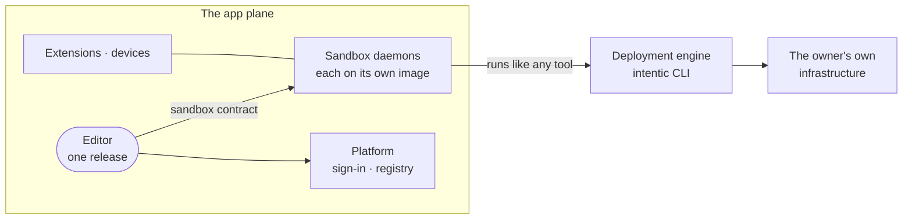

# The app plane

The app plane is the product the owner looks at and drives: the editor, the sandbox daemons it talks to, and the thin platform between them, with the deployment engine outside it.

## What is in it

- [`_editor`](../../_editor): the web app at `app.intentic.dev` and the desktop, phone and share-view shells around it.
- [`_sandbox`](../../_sandbox): the daemon, its network front, and the tools baked into the sandbox image.
- [`_platform`](../../_platform): sign-in, the sandbox registry, hosted machines and the ingress.
- [`_extensions`](../../_extensions) and [`_devices`](../../_devices): features added through the extension manifest, and the programs that let an agent reach the owner's own machines.
- [`_shared`](../../_shared): the contracts the parts above are written against. The sandbox contract ([`_shared/sandbox-contract`](../../_shared/sandbox-contract)) is the wire between editor and daemon; the api contract ([`_shared/api-contract`](../../_shared/api-contract)) is the wire between editor and platform.

## What is not

- **The deployment engine** ([`_deploy`](../../_deploy)) is a tool bundled into the sandbox image, which an agent or the daemon runs the way it runs a test runner. The infrastructure it creates belongs to the owner and never becomes part of the platform or the sandbox. See [deploy-engine.md](deploy-engine.md). Its own `control` and `application` planes (`Plane` in [`needs.ts`](../../_deploy/need-resolver/src/needs.ts)) describe the owner's infrastructure, not intentic.
- **The website** ([`_site`](../../_site)) is the public site and its playable demo, which renders the editor against fixtures.
- **Plumbing** ([`_tools`](../../_tools)): checks, test harnesses and release scripts.

## One editor, many daemons

The editor ships as one continuously released build, while each sandbox runs the daemon from whatever image it last pulled. A browser newer than the daemon it drives is the normal case, and the app plane is built for it:

- The daemon advertises the routes it implements, and a fingerprint of each one's shape, in the opening frame of `/events`. The route list is derived from the contract itself (`contractRoutes` in [`routes.ts`](../../_shared/sandbox-contract/src/protocol/routes.ts)).
- The editor compares that list with the contract it was built against ([`useDaemonRoutes.ts`](../../_editor/web/src/features/sandbox/overview/useDaemonRoutes.ts)). A feature gates on `supportsRoute`, and a route the daemon predates shows as a named gap instead of an unexplained 404.
- [`contract.lock.json`](../../_shared/sandbox-contract/contract.lock.json) records the wire surface and who may reach each route. [`contract-shrink.mjs`](../../_tools/checks/contract-shrink.mjs) reports a push that removes or narrows part of it with no commit declaring the break, without refusing the push, and the package's lock test fails in CI while the lock and the schemas disagree.
- Every way a sandbox starts composes its `docker run` from one run contract ([`_shared/sandbox-run`](../../_shared/sandbox-run)). An update recreates the container from it while the `/work` and `/history` volumes stay.
- The agent programs inside a sandbox update without a new image: each sandbox on the `blessed` channel reads [`engines.json`](../../engines.json) hourly.
