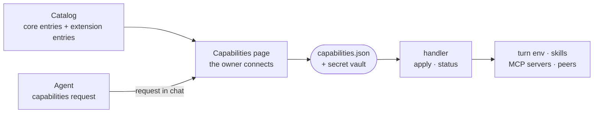

# Capabilities

A capability is anything the owner connects to a sandbox, such as a CLI account, an MCP server, a device, a browser identity or Docker, stored as one `{ id, kind, config }` entry and applied by a per-kind handler.

## The shape

- `CapabilityKindSchema` in [`capabilities.ts`](../../_shared/sandbox-contract/src/schemas/capabilities.ts) lists the kinds. Roughly: tools for the agent (`cli`, `mcp`, `plugin`, `agent`, `endpoint`, `localmodel`), accounts (`identity`, `browser`), machines (`device`, `webext`, `ssh`, `docker`), the network (`vpn`, `exit`, `netdisk`), and the sandbox's own reach (`devops`, `monorepo`, `extension`, `wallet`, `fleet`).
- The active set is `.intentic/config/capabilities.json`. Each kind has one handler in [`handlers/`](../../_sandbox/sandbox/src/capabilities/handlers), with an idempotent `apply` and a `status` probe; [`registry.ts`](../../_sandbox/sandbox/src/capabilities/registry.ts) is the total map, so a kind without a handler does not compile.

## The catalog

- [`_shared/capability-catalog`](../../_shared/capability-catalog) holds `CAPABILITY_CATALOG`, the core entries the Capabilities page offers: name, kind, category, the fields the owner fills in, a setup guide, and whether only one may exist.
- Extensions add entries through `contributes.capabilities` ([`points/capabilities.ts`](../../_shared/extension-manifest/src/points/capabilities.ts)), limited to the kinds `cli`, `browser`, `device`, `webext` and `agent`. Kinds that carry real privilege stay core-only, so a manifest cannot grant them. [`contributions.ts`](../../_sandbox/sandbox/src/capabilities/contributions.ts) merges them; the first declaration of an id wins.
- [`_extensions/connectors`](../../_extensions/connectors) is data only: each CLI connector names its fields, an environment template, a skill that teaches the agent the tool, and optionally a probe and a Dockerfile fragment. [`_extensions/devices`](../../_extensions/devices), [`_extensions/browsers`](../../_extensions/browsers) and [`_extensions/acp-agents`](../../_extensions/acp-agents) contribute the other kinds the same way.

## How agents use them

- **CLI connectors** reach the agent as environment variables and a skill, not as an MCP server. [`cli-env.ts`](../../_sandbox/sandbox/src/capabilities/cli-env.ts) expands each template with a per-instance suffix, and every turn's shell gets them.
- **Chat connectors** (Slack, Discord, Telegram, WhatsApp, IMAP, Google Workspace) are extensions whose gateway process holds the provider connection, built on [`_shared/connector-runtime`](../../_shared/connector-runtime).
- **Accounts** are browser identities. The agent drives them through the `accounts` tools ([`accounts-tools.ts`](../../_sandbox/sandbox/src/browser/tools/accounts-tools.ts)), which type a stored password into the page without it entering the model's context.
- **Machines**: a `device` (the owner's computer, through [`_devices/machine`](../../_devices/machine)) or a `webext` (their browser, through [`_devices/webext`](../../_devices/webext)) dials into the sandbox as a peer ([`peer.ts`](../../_sandbox/sandbox/src/peers/peer.ts)), and its tools are forwarded to the agent. The device enforces its own permission switches. `ssh` goes the other way: the sandbox dials the host.
- **MCP servers**, whatever serves them, reach every runtime the same way. An `mcp` card is its own endpoint; a `device` or `webext` card's peer bridge, an extension card's endpoint and the turn's browser routers are mounts at the daemon's one MCP door, `/mcp/<name>`, on a bearer that is the conversation's and reaches only what the running turn mounted ([`turn-mounts.ts`](../../_sandbox/sandbox/src/agent/tools/turn-mounts.ts)). [`turn-tools.ts`](../../_sandbox/sandbox/src/agent/tools/turn-tools.ts) composes them into the turn's one `remote` list, which Claude Code, Codex, Cursor and ACP agents all project, so a server the owner granted reaches every loop or none. What each runtime takes beyond that list is its `mcp` capability ([`agent-runtimes.ts`](../../_shared/sandbox-contract/src/models/agent-runtimes.ts)).

## Asking the owner

An agent that needs something unconnected runs the in-sandbox `capabilities` command ([`bin/capabilities`](../../_sandbox/sandbox/bin/capabilities)): `list` shows what could be connected, and `request <id> --why "…"` asks. The daemon ([`capability-offer.ts`](../../_sandbox/sandbox/src/capabilities/capability-offer.ts)) raises a request in the owner's chat and holds the call open until the owner connects it, skips it or lets it expire. The agent never connects anything itself and never sees the credential the owner enters.

## Credentials

- Secret values live in a vault file readable only by its owner ([`secret-vault.ts`](../../_sandbox/sandbox/src/capabilities/credentials/secret-vault.ts)), outside the file API and the search index. `capabilities.json` keeps the rest of the config.
- The vault keeps credentials out of reads and searches, not out of the shell: the daemon and the agent share one container.
- A stored credential leaves the daemon for extension code in two ways only, both on the extension's own token. One is `GET /capabilities/<id>/connection`, answered only for a card whose kind that extension contributes (or its own install record), and only if its manifest declares the route. The other is a listener gateway's `/listeners/<provider>/state`, answered only to the extension that declares that provider and holding only the connectors it contributes. Neither is reachable by the panel token, a control token or a signed-in person.
- What reaches the agent is chosen per kind: a CLI connector's variables do; a TOTP seed never does, only single codes ([`totp.ts`](../../_sandbox/sandbox/src/capabilities/credentials/totp.ts)); a `fleet` token stays with the daemon. A credential gate ([`credential-gate.ts`](../../_sandbox/sandbox/src/secrets/credential-gate.ts)) can require a named approver before a credential is used.
