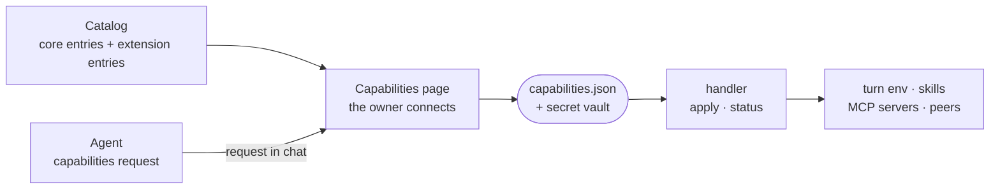

# Capabilities

A capability is anything the owner connects to a sandbox, such as a CLI account, an MCP server, a device, a browser identity or Docker, stored as one `{ id, kind, config }` entry and applied by a per-kind handler.

```mermaid
flowchart LR
    catalog["Catalog<br/>core entries + extension entries"] --> page["Capabilities page<br/>the owner connects"]
    agent["Agent<br/>capabilities request"] -->|"request in chat"| page
    page --> manifest(["capabilities.json<br/>+ secret vault"])
    manifest --> handler["handler<br/>apply · status"]
    handler --> env["turn env · skills<br/>MCP servers · peers"]
```

## The shape

- `CapabilityKindSchema` in [`capabilities.ts`](../../_shared/sandbox-contract/src/schemas/capabilities.ts) lists the kinds. Roughly: tools for the agent (`cli`, `mcp`, `plugin`, `agent`, `endpoint`, `localmodel`), accounts (`identity`, `browser`), machines (`device`, `webext`, `ssh`, `docker`), the network (`vpn`, `exit`, `netdisk`), and the sandbox's own reach (`devops`, `monorepo`, `extension`, `wallet`, `fleet`).
- The active set is `.intentic/config/capabilities.json`. Each kind has one handler in [`handlers/`](../../_sandbox/sandbox/src/capabilities/handlers), with an idempotent `apply` and a `status` probe; [`registry.ts`](../../_sandbox/sandbox/src/capabilities/registry.ts) is the total map, so a kind without a handler does not compile.

## The catalog

- [`_shared/capability-catalog`](../../_shared/capability-catalog) holds `CAPABILITY_CATALOG`, the core entries the Capabilities page offers: name, kind, category, the fields the owner fills in, a setup guide, and whether only one may exist.
- Extensions add entries through `contributes.capabilities` ([`points/capabilities.ts`](../../_shared/extension-manifest/src/points/capabilities.ts)), limited to the kinds `cli`, `browser`, `device`, `webext` and `agent`. Kinds that carry real privilege stay core-only, so a manifest cannot grant them. [`contributions.ts`](../../_sandbox/sandbox/src/capabilities/contributions.ts) merges them; the first declaration of an id wins.
- [`_extensions/connectors`](../../_extensions/connectors) is data only: each CLI connector names its fields, an environment template, a skill that teaches the agent the tool, and optionally a probe and a Dockerfile fragment. [`_extensions/devices`](../../_extensions/devices), [`_extensions/browsers`](../../_extensions/browsers) and [`_extensions/acp-agents`](../../_extensions/acp-agents) contribute the other kinds the same way.

## How agents use them

- **CLI connectors** reach the agent as environment variables and a skill. [`cli-env.ts`](../../_sandbox/sandbox/src/capabilities/cli-env.ts) expands each template with a per-instance suffix, and every turn's shell gets them. A connector that declares a `broker` (every HTTP one shipped) puts no credential there: its secret-bearing variables hold an inert placeholder, and each route's variable holds a credential-gateway address minted for the conversation (below). A connector whose extension serves its kind tools (`contributes.tools` with `perCard`) is also an MCP server named by the card's id, handed the card's settings with each call; that is why a cli card's id may not be a name the daemon reserves for its own servers.
- **Chat connectors** (Slack, Discord, Telegram, WhatsApp, IMAP, Google Workspace) are extensions whose gateway process holds the provider connection, built on [`_shared/connector-runtime`](../../_shared/connector-runtime).
- **Accounts** are browser identities. The agent drives them through the `accounts` tools ([`accounts-tools.ts`](../../_sandbox/sandbox/src/browser/tools/accounts-tools.ts)), which type a stored password into the page without it entering the model's context, and only on the account's own site: a page whose host is not where the account signs in (its card's sign-in and home URLs, an identity's mail provider) is refused before any approval is asked.
- **Machines**: a `device` (the owner's computer, through [`_devices/machine`](../../_devices/machine)) or a `webext` (their browser, through [`_devices/webext`](../../_devices/webext)) dials into the sandbox as a peer ([`peer.ts`](../../_sandbox/sandbox/src/peers/peer.ts)), and its tools are forwarded to the agent. The device enforces its own permission switches. Renaming such a card is a label change: its enrollments move to the new name in one write, each keeping its token, and each live connection is held under the new name with its socket untouched (`rekey` in [`peer-hub.ts`](../../_sandbox/sandbox/src/peers/peer-hub.ts)). `ssh` goes the other way: the sandbox dials the host.
- **MCP servers**, whatever serves them, reach every runtime the same way. An `mcp` card is its own endpoint; a `device` or `webext` card's peer bridge, an extension's tools and the turn's browser routers are mounts at the daemon's one MCP door, `/mcp/<name>`, on a bearer of the turn's own that reaches only what that turn mounted (an ACP agent's warm session shares its conversation's, one live turn at a time) ([`turn-mounts.ts`](../../_sandbox/sandbox/src/agent/tools/turn-mounts.ts)). [`turn-tools.ts`](../../_sandbox/sandbox/src/agent/tools/turn-tools.ts) composes them into the turn's one `remote` list, which Claude Code, Codex, Cursor and ACP agents all project, so a server the owner granted reaches every loop or none. What each runtime takes beyond that list is its `mcp` capability ([`agent-runtimes.ts`](../../_shared/sandbox-contract/src/models/agent-runtimes.ts)).

- **Claude Code plugins** (the `plugin` kind) are git checkouts under `.intentic/records/plugins/<id>` that every Claude turn the persona grants loads ([`plugin.handler.ts`](../../_sandbox/sandbox/src/capabilities/handlers/plugin.handler.ts)). The install resolves the branch, tag or commit the owner named to a full commit and stores it as `commit`, so anything re-applying the stored entry (a rotated token) checks out the same code; adding the plugin again is the update. Its hooks and hooks module run only once the owner approves them, like any other workspace hook (`guard/settings-hooks.ts`).

## Asking the owner

An agent that needs something unconnected runs the in-sandbox `capabilities` command ([`bin/capabilities`](../../_sandbox/sandbox/bin/capabilities)): `list` shows what could be connected and what the workspace looks like it wants, and `request <id> --why "…"` asks, with `--target` for the site or host and `--set` for the settings it can fill in; the same command asks for a setting changed on a connected one (a device switch, a Docker engine option) or for a refused credential to be replaced (`--reconnect`). Each ask is a need ([needs.md](needs.md), [`capability-need.ts`](../../_sandbox/sandbox/src/needs/kinds/capability-need.ts)): a card in the owner's chat that outlives the turn, with the connection's own form inside it for the kinds whose form finishes the setup, and an answer that continues the conversation whenever it comes. What the turn can already reach is checked first, so a connection the persona withholds, one for another host, or one whose credential is refused is answered as exactly that. The agent never connects anything itself and never sees the credential the owner enters.

## Credentials

- Secret values live in a vault file readable only by its owner ([`secret-vault.ts`](../../_sandbox/sandbox/src/capabilities/credentials/secret-vault.ts)), outside the file API and the search index. `capabilities.json` keeps the rest of the config.
- An `ssh` card can have the sandbox make its key: `POST /capabilities/ssh-key` builds an ed25519 pair in memory ([`ssh-keys.ts`](../../_sandbox/sandbox/src/capabilities/credentials/ssh-keys.ts)), answers only the public half, and holds the private half under a one-time token ([`secret-stash.ts`](../../_sandbox/sandbox/src/capabilities/credentials/secret-stash.ts)) that the form's save redeems into the vault. The private key never reaches a browser.
- The vault keeps credentials out of reads and searches, not out of the shell: the daemon and the agent share one container.
- A stored credential leaves the daemon for extension code in two ways only, both on the extension's own token. One is `GET /capabilities/<id>/connection`, answered only for a card whose kind that extension contributes (or its own install record), and only if its manifest declares the route. The other is a listener gateway's `/listeners/<provider>/state`, answered only to the extension that declares that provider and holding only the connectors it contributes. Neither is reachable by the panel token, a control token or a signed-in person.
- What reaches the agent is chosen per kind: a CLI connector's variables do; a TOTP seed never does, only single codes ([`totp.ts`](../../_sandbox/sandbox/src/capabilities/credentials/totp.ts)); a `fleet` token stays with the daemon. A credential gate ([`credential-gate.ts`](../../_sandbox/sandbox/src/secrets/gates/credential-gate.ts)) can require a named approver before a credential is used.
- A secret can need a person in two ways, set side by side on its row of the Secrets view and listed together by `secrets gates`: a named approver (above), and its host guard ([`host-guards.ts`](../../_sandbox/sandbox/src/secrets/host-guards.ts)), an on/off setting with a list of hosts (exact or `*.domain`), kept in `secret-hosts.json` beside the gate policy and edited with `secrets hosts`. A CLI connector names its service's hosts in its manifest (`hosts`), and its credential starts with the guard on, set to them. With the guard on, where a reference becomes its value ([`host-guard-gate.ts`](../../_sandbox/sandbox/src/secrets/gates/host-guard-gate.ts)), a use goes unasked only when its text is one plain `curl`, `wget` or `git` command whose every URL is on every guarded secret's list ([`secret-destinations.ts`](../../_sandbox/sandbox/src/secrets/secret-destinations.ts)); a script, a pipe, a variable, another program or another host raises a permission card, whatever the safety judge said and whether or not it answered, and with no live conversation to ask in it is refused; an unattended turn's card waits for the owner like any other. With it off, the guard never asks, and a command using the secret is left to the judge alone, which lets it through when it cannot be reached. Anybody who may use secrets can turn a guard on or take hosts off it; turning one off or adding a host is the owner's, and the agent's `secrets hosts … add` or `… off` asks them on a card. The check reads the command, not the machine: a `.curlrc`, a git config or `/etc/hosts` can still point a named host elsewhere, a value a command writes somewhere is beyond it, and a credential handed to the agent as it is (a connector with no gateway route, or one the owner set to raw delivery) never passes through it.
- **The credential gateway** ([`src/broker/`](../../_sandbox/sandbox/src/capabilities/broker/)) is where a brokered connector's credential is attached, and the only place it is. The daemon binds it on `127.0.0.1:8790` itself, beside netd rather than behind it, so nothing the tunnel or the published port relays reaches it. A turn's address is `/<session>/…`, the session signed with a key beside the vault and naming the card, the route and the conversation; the gateway takes the upstream from the connector's live declaration (`broker.routes`: base URL, the variable carrying the address, and how the credential rides: headers, a Basic pair, a path prefix, or fields of a url-encoded token exchange), never from the request, so an address cannot be pointed anywhere else, and a settings change that moves the upstream retires it. Every request is checked there, on the request itself: the owner's host guard for the card, the card's method and path rules (`broker.rules`, first match deciding; `ask` holds the request on a permission card, guarded action `credential.request`), and its named approvers (lane `gateway`); then the placeholder and any header the credential rides in are dropped, the credential set, and the request forwarded with redirects returned rather than followed. Git is pointed at the gateway through `GIT_CONFIG_*` rewrites, folded in after the persona and approver filters so a card they removed rewrites nothing; npm gets one placeholder line in `~/.npmrc` for the gateway's host. A `{{secret:<card>/<field>}}` reference to a gateway-held credential is refused at every exit, pointing at the route variable instead. The owner's per-card policy (`credential-policy.json` beside the vault, `GET`/`PUT /secrets/policy/{id}`, the Secrets view, `secrets policy`) replaces a connector's rules or sets delivery to `raw`, handing the agent the real value for a tool that needs it; a connector with no route (a database, a mail server, a request signature) is `direct`, and both are labelled as such. 2026-10-06: chosen over an egress proxy that intercepts TLS, since the gateway's addresses need no trust-store changes and the upstream is never the client's to choose. The gateway is the enforced path for everything an agent does normally; it is a hard boundary only once the agent cannot read the vault or the daemon's memory, which today's root shell in the same container still can (the unprivileged agent domain is not built yet).
  (2026-09-29) Checked at substitution and not by the command judge: the judge is a model, and a command it could not rule on went through; a guard is the owner's rule, so neither a judge's allow nor its absence can let a guarded use past it. Per secret rather than a global "judge unreachable asks": a global switch would refuse every unattended automation that sends a credential whenever the judge is down, so the owner chooses, secret by secret, which ones always ask.
