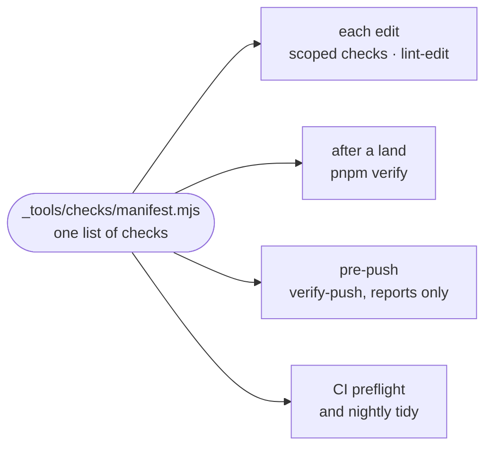

# Code conventions

The rules the repository's own checks and linter hold every change to, grouped by what they protect, with the file that enforces each.

## How a rule is enforced

- [`manifest.mjs`](../../_tools/checks/manifest.mjs) lists every check once and [`run.mjs`](../../_tools/checks/run.mjs) runs them, with node and git only. A `code` check means the tree is broken: it fails the check after a land and CI's preflight. A `tidy` check is a cost to readers: it fails the check after a land only for the lines that land added, and fails CI's nightly tidy job. The pre-push hook reports both kinds and refuses nothing.
- A `scoped` check can judge one file, so [`.intentic/checks.json`](../../.intentic/checks.json) runs it the moment an agent writes that file, together with the linter. What they find returns with the edit and never stops the turn.
- Ratcheted checks keep their standing backlog in [`_tools/checks/baselines`](../../_tools/checks/baselines), which may only shrink.

## Layout

[`layout.mjs`](../../_tools/checks/layout.mjs) keeps the tree navigable by path alone:

- **A package's directory name must be its npm name without the scope.** `_search/iq` is `@intentic/iq`. Under `_extensions/` the npm name adds an `ext-` prefix the directory drops.
- At most 30 readable files per directory under a package's `src/`. Images, fonts and media do not count, and `INDEX_DIRS` exempts directories that hold one file per member of a set, such as one `*.contract.ts` per wire group. `node _tools/checks/layout.mjs --allow <dir>` records a deliberate exception.
- No two sibling directories one character apart, and no two files in a package with the same name (barrels, route, contract and handler files, and tests excepted).
- No mention of a directory or scope the repository removed. Empty directories a rename leaves behind are deleted, not reported.

## Paths and boundaries

- [`path-literals.mjs`](../../_tools/checks/path-literals.mjs): no hand-spelled roots such as `/work` or `.intentic`, and no `../..` counted from a file's own location. Use `repoRoot()` and `packageRoot()` from `@intentic/constants/node`.
- [`shared-boundary.mjs`](../../_tools/checks/shared-boundary.mjs): nothing in `_shared/` imports another part except the `_tools/` foundation, apart from the exceptions it names.
- [`daemon-boundaries.mjs`](../../_tools/checks/daemon-boundaries.mjs): no new daemon module that takes the whole `Services` bag, and no new import cycle between daemon subsystems.
- [`contract-paths.mjs`](../../_tools/checks/contract-paths.mjs): the app and extensions call a sandbox route through the typed client, never by spelling its path.
- [`alias-targets.mjs`](../../_tools/checks/alias-targets.mjs): every resolver alias points at a file that exists.

## Words, time and text

- [`vocabulary.mjs`](../../_tools/checks/vocabulary.mjs): a retired word is not spelled again. [`vocabulary.mjs`](../../_tools/constants/src/vocabulary.mjs) in `@intentic/constants` lists each one and the word to use instead.
- [`time-zones.mjs`](../../_tools/checks/time-zones.mjs): every cron names its zone, and dates format through the UI kit's formatters.
- The i18n checks keep every visible word in a catalog ([languages.md](languages.md)).
- [`md-links.mjs`](../../_tools/checks/md-links.mjs): every relative link in Markdown resolves, and every page here is linked from [ARCHITECTURE.md](../../ARCHITECTURE.md).

## UI

One component per kind of control, so a skin restyles everything at once: `Button` ([`button-tiers.mjs`](../../_tools/checks/button-tiers.mjs)), the `ui-field-box` field ([`input-tiers.mjs`](../../_tools/checks/input-tiers.mjs)), `RowGroup` lists ([`row-tiers.mjs`](../../_tools/checks/row-tiers.mjs)), and theme tokens instead of Tailwind arbitrary values ([`tailwind-bypass.mjs`](../../_tools/checks/tailwind-bypass.mjs)). [`vue-templates.mjs`](../../_tools/checks/vue-templates.mjs) compiles every template, and [`submit-guards.mjs`](../../_tools/checks/submit-guards.mjs) refuses an Enter key that can submit twice.

## Failures

A catch names the one failure it expects and lets the rest through: `isMissing` / `undefinedIfMissing` from [`@intentic/base/errors`](../../_tools/base/src/errors.ts) for "not created yet", a status check for "not found". A read that failed is never written back as a default: the daemon's files go through `jsonFile` / `textFile` ([`json-file.ts`](../../_sandbox/sandbox/src/store/json-file.ts)), and a guard fails closed. [`silent-catch.mjs`](../../_tools/checks/silent-catch.mjs) ratchets handlers that throw an error away; a discard that is right says why with `// silent-catch: <reason>`.

## Code style

- oxlint ([`.oxlintrc.json`](../../.oxlintrc.json)) runs on every edit through [`lint-edit.mjs`](../../_tools/oxlint/lint-edit.mjs), which fixes what it can and reports only what the edit added.
- `pnpm lint:plugins` ([`.oxlintrc.plugins.json`](../../.oxlintrc.plugins.json)) adds the vendored [`anti-slop`](../../_tools/oxlint/anti-slop) type rules, cognitive complexity, and [`comments/one-line`](../../_tools/oxlint/comments/index.ts): a comment is one line stating what the code cannot.
- The rest of the house rules, such as no re-exports, `undefined` over `null`, and early returns, are in [`AGENTS.md`](../../AGENTS.md). Test conventions are in [testing.md](testing.md).
