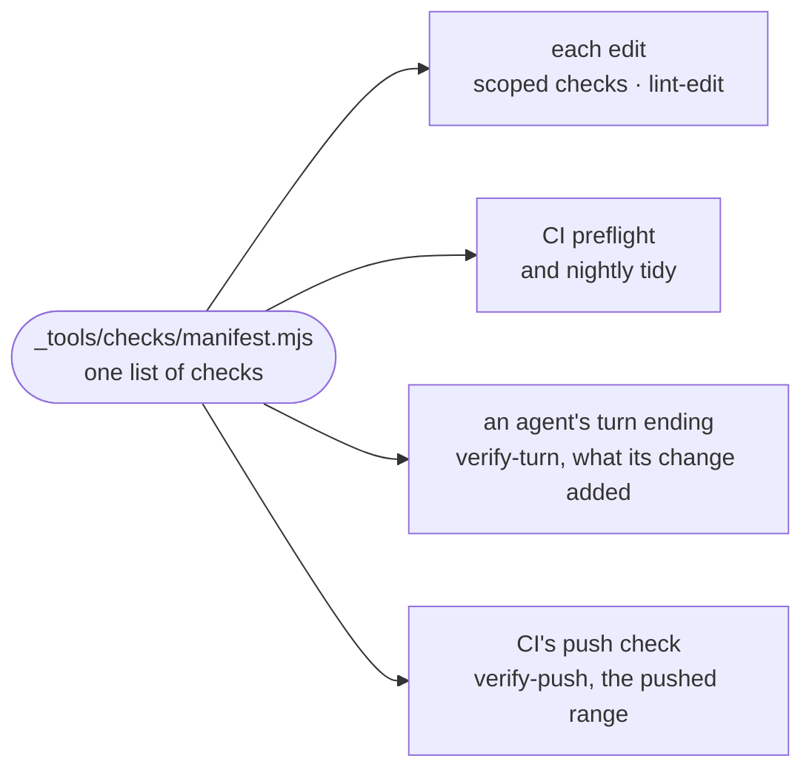

# Code conventions

The rules the repository's own checks and linter hold every change to, grouped by what they protect, with the file that enforces each.

```mermaid
flowchart LR
    list(["_tools/checks/manifest.mjs<br/>one list of checks"]) --> edit["each edit<br/>scoped checks · lint-edit"]
    list --> ci["CI preflight<br/>and nightly tidy"]
    list --> turn["an agent's turn ending<br/>verify-turn, what its change added"]
    list --> push["CI's push check<br/>verify-push, the pushed range"]
```

## How a rule is enforced

- [`manifest.mjs`](../../_tools/checks/manifest.mjs) lists every check once and [`run.mjs`](../../_tools/checks/run.mjs) runs them, with node and git only. A `code` check means the tree is broken: it fails CI's preflight and `pnpm verify`. A `tidy` check is a cost to readers: it fails CI's nightly tidy job, and CI's push check fails only the lines the pushed range added. Nothing runs them at a push itself.
- A `scoped` check can judge one file, so [`.intentic/checks.json`](../../.intentic/checks.json) runs it the moment an agent writes that file, together with the linter. What they find returns with the edit and never stops the turn.
- As an agent's turn ends in a checkout of its own, the same file's `turn` entry runs [`verify-turn.mjs`](../../_tools/scripts/verify/verify-turn.mjs): every check on the turn's tree, judged the way the push check judges a pushed range, so only what the change added is said back to the agent, once. A failure main already carries is charged to no conversation, and nothing is refused.
- Ratcheted checks keep their standing backlog in [`_tools/checks/baselines`](../../_tools/checks/baselines), which may only shrink.

## Layout

[`layout.mjs`](../../_tools/checks/layout.mjs) keeps the tree navigable by path alone:

- **A package's directory name must be its npm name without the scope.** `_search/iq` is `@intentic/iq`. Under `_extensions/` the npm name adds an `ext-` prefix the directory drops.
- At most 30 readable files per directory under a package's `src/`. Images, fonts and media do not count, and `INDEX_DIRS` exempts directories that hold one file per member of a set, such as one `*.contract.ts` per wire group. `node _tools/checks/layout.mjs --allow <dir> --reason "<why>"` records a deliberate exception with its reason.
- No two sibling directories one character apart, and no two files in a package with the same name (barrels, route, contract and handler files, and tests excepted).
- No mention of a directory or scope the repository removed. Empty directories a rename leaves behind are deleted, not reported.

## Paths and boundaries

- [`path-literals.mjs`](../../_tools/checks/path-literals.mjs): no hand-spelled roots such as `/work` or `.intentic`, and no `../..` counted from a file's own location. Use `repoRoot()` and `packageRoot()` from `@intentic/constants/node`.
- [`shared-boundary.mjs`](../../_tools/checks/shared-boundary.mjs): nothing in `_shared/` imports another part except the `_tools/` foundation, apart from the exceptions it names.
- [`daemon-boundaries.mjs`](../../_tools/checks/daemon-boundaries.mjs): no new daemon module that takes the whole `Services` bag, no new import that reaches a higher layer than its own, and no new import cycle between daemon subsystems of one layer. The layers are [`daemon-layers.mjs`](../../_tools/checks/lib/daemon-layers.mjs), lowest first (foundation, host, connections, agent, orchestration, composition), with the root files and every `*.routes.ts` and `*.testing.ts` as the surface above them all. A downward import is always allowed: no cycle can pass through one without also passing through an upward import or a same-layer cycle, each of which is already a finding. The standing cycles are [`daemon-cycles.json`](../../_tools/checks/baselines/daemon-cycles.json), each with the reason it stands; no upward import stands, so `daemon-layers.json` is absent and any new one is a finding. 2026-10-06: until then only cycles were checked, between whole directories with their route modules in them, and 53 subsystems formed one cycle, so a correct downward move read as a new cycle; rejected for direction plus same-layer cycles. The same day the 21 upward imports went (ports in `seams/` and deps interfaces, the sandbox definition moved to `definition/`) and the same-layer cycle edges went from 54 to 9.
- [`editor-boundaries.mjs`](../../_tools/checks/editor-boundaries.mjs): no static value import closes a cycle between two modules of `_editor/web/src`, which would hand the module the bundler evaluates first its partner's bindings unset. A type-only import erases and a dynamic `import()` loads later, so neither counts. Between the editor's layers ([`editor-layers.mjs`](../../_tools/checks/lib/editor-layers.mjs): foundation, client, components, workbench, features, composition), a value import of either kind that reaches a higher layer fails, and within one layer (each `features/<x>` and each `workbench/<x>` is its own unit) one that closes a new cycle fails. The client (`client/`) is the editor's clients of the platform account and the sandbox daemon; the workbench (`workbench/`) is the services and registries features are written against. A lower layer that needs what a higher one knows takes it from a registry the higher side fills, or as a value `main.ts` hands in at startup. The standing ones are baselined in [`editor-layers.json`](../../_tools/checks/baselines/editor-layers.json) and [`editor-cycles.json`](../../_tools/checks/baselines/editor-cycles.json), which may only shrink.
- [`contract-paths.mjs`](../../_tools/checks/contract-paths.mjs): the app and extensions call a sandbox route through the typed client, never by spelling its path, whether bare (`/system/session`) or joined to a base (`${target.base}/system/session`). A raw call that has to stay raw, such as the session exchange the client's own headers wait on, says why with `// allow(contract-paths): <reason>`.
- [`extension-deps.mjs`](../../_tools/checks/extension-deps.mjs) and the `_extensions/**` override in [`.oxlintrc.json`](../../.oxlintrc.json): an extension's manifest and imports reach only the extension SDK, the wire contract and `@intentic/base`, subpaths included. Its suites may also use `@intentic/testing` ([`_extensions/README.md`](../../_extensions/README.md)). The other way round, nothing outside `_extensions` depends on an extension except the web app's bundle and the files sidecar, which reaches ONLYOFFICE only through `@intentic/ext-onlyoffice/local-office`.
- [`alias-targets.mjs`](../../_tools/checks/alias-targets.mjs): every resolver alias points at a file that exists.

## Words, time and text

- [`vocabulary.mjs`](../../_tools/checks/vocabulary.mjs): a retired word is not spelled again. [`vocabulary.mjs`](../../_tools/constants/src/vocabulary.mjs) in `@intentic/constants` lists each one and the word to use instead.
- [`time-zones.mjs`](../../_tools/checks/time-zones.mjs): every cron names its zone, and dates format through the UI kit's formatters.
- [`format-tiers.mjs`](../../_tools/checks/format-tiers.mjs): every number and date the editor, the desktop shell, the share view and the extensions show goes through the kit's one formatter per concept in [`format.ts`](../../_editor/ui/src/lib/format.ts) (relative time, a span of time, money, a count exact or compact, bytes, a percentage, a date), never `toLocaleString`, a hand-built `Intl` formatter or the base library's English `sizeLabel`/`briefDuration`. Each follows the app's language rather than the browser's and has one rounding rule. A machine format says why with `// allow(format-tiers): <reason>`.
- [`clipboard-tiers.mjs`](../../_tools/checks/clipboard-tiers.mjs): the same surfaces reach the clipboard through the kit ([`clipboard.ts`](../../_editor/ui/src/lib/clipboard.ts): `writeClipboard`, `readClipboard`, `useCopied`, `clipboardOf`), never `navigator.clipboard`, which belongs to the opener's document and silently refuses a press made in a popped-out window. A real exception says why with `// allow(clipboard-tiers): <reason>`.
- The i18n checks keep every visible word in a catalog ([languages.md](languages.md)).
- [`md-links.mjs`](../../_tools/checks/md-links.mjs): every relative link in Markdown resolves, and every page here is linked from [ARCHITECTURE.md](../../ARCHITECTURE.md).

## UI

One component per kind of control, so a skin restyles everything at once: `Button` ([`button-tiers.mjs`](../../_tools/checks/button-tiers.mjs)), the `ui-field-box` field ([`input-tiers.mjs`](../../_tools/checks/input-tiers.mjs)), `RowGroup` lists ([`row-tiers.mjs`](../../_tools/checks/row-tiers.mjs)), and theme tokens instead of Tailwind arbitrary values ([`tailwind-bypass.mjs`](../../_tools/checks/tailwind-bypass.mjs)). [`vue-templates.mjs`](../../_tools/checks/vue-templates.mjs) compiles every template, and [`submit-guards.mjs`](../../_tools/checks/submit-guards.mjs) refuses an Enter key that can submit twice.

## A person's answers

- **A person's answer is kept, never held in memory only.** Every yes a person gives an agent (a grant, a release, "allow for this conversation") is written to a store the daemon reads back after a restart, and lasts until a person takes it back or the conversation it names is gone; each is listed where it can be taken back (Needs you → What you have allowed). A question nobody has answered yet waits for its answer rather than turning into a refusal, whoever started the turn: an automation, a loop or a spawned child is told nobody is watching right now, and its cards wait for the owner like any other. The refusals left are the ones with nowhere to ask: no live conversation, or a runtime that cannot pause. 2026-09-29: install grants and credential releases were in memory, so a restart asked the same person the same question again; rejected. 2026-09-30: an unattended turn's cards were refused (and its ask and plan tools withheld); rejected for waiting, which is also what they had actually done since the 2026-09-23 restructure dropped the flag.

## Failures

A catch names the one failure it expects and lets the rest through: `isMissing` / `undefinedIfMissing` from [`@intentic/base/errors`](../../_tools/base/src/errors.ts) for "not created yet", a status check for "not found". A read that failed is never written back as a default: the daemon's files go through `jsonFile` / `textFile` ([`json-file.ts`](../../_sandbox/sandbox/src/store/json-file.ts)), and a guard fails closed. [`silent-catch.mjs`](../../_tools/checks/silent-catch.mjs) ratchets handlers that throw an error away; a discard that is right says why with `// allow(silent-catch): <reason>`.

A command the daemon waits on runs through `runCheck` ([`run-check.ts`](../../_sandbox/sandbox/src/workload/run-check.ts)): its own process group, ended whole at its deadline or an abort, in a workload class, its output capped. [`process-tiers.mjs`](../../_tools/checks/process-tiers.mjs) ratchets the daemon's hand-rolled `promisify(execFile)` and bare `node:child_process` calls; a site that is right says why with `// allow(process-tiers): <reason>`.

## Code style

- oxlint ([`.oxlintrc.json`](../../.oxlintrc.json)) runs on every edit through [`lint-edit.mjs`](../../_tools/oxlint/lint-edit.mjs), which fixes what it can and reports only what the edit added.
- [`.oxlintrc.plugins.json`](../../.oxlintrc.plugins.json) adds the vendored [`anti-slop`](../../_tools/oxlint/anti-slop) type rules and cognitive complexity. Main carries a backlog of them, so [`added.mjs`](../../_tools/oxlint/added.mjs) holds them to what each edit adds. `pnpm lint:plugins` lists the backlog.
- A check's finding that is right where it stands says so with `// allow(<check>): <reason>` at the site or an `Allow: <check> — <reason>` commit trailer ([`_tools/checks`](../../_tools/checks/README.md#exceptions)). Test conventions are in [testing.md](testing.md).
